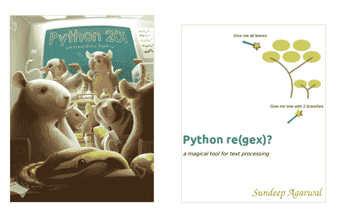

# Python 201 和 Python RegEx 包

> 原文：<https://www.blog.pythonlibrary.org/2019/01/29/python-201-and-python-regex-bundle/>

我最近有机会与《Python re(gex)的作者 Sundeep Agarwal 合作？用我的第二本书创建一个包， [Python 201:中级 Python](https://leanpub.com/python201) 。

Python 正则表达式一书涵盖了 Python 中的正则表达式。虽然只有 50 页，但它有很多例子，您可以使用这些例子来学习在自己的代码中使用正则表达式。可以去查一下 [Github repo](https://github.com/learnbyexample/py_regular_expressions) 看看书里是什么样的代码。

你可以在 [Leanpub](https://leanpub.com/b/python201_and_regex) 上找到这个包。