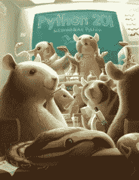

# Python 201 正式出版了！

> 原文：<https://www.blog.pythonlibrary.org/2016/09/06/python-201-is-officially-published/>

我的第二本书 **Python 201:中级 Python**(ISBN:978-0-9960628-3-1)现在已经完成，正式出版。你可以在以下地点查阅:

*   你可以通过 [Lulu](http://www.lulu.com/content/paperback-book/python-201-intermediate-python/19144035) 得到一本平装本
*   可以通过 [Gumroad](https://gum.co/py201) 和 [Leanpub](https://leanpub.com/python201/) 获得 PDF、mobi 和 epub 版本
*   [亚马逊 Kindle](https://www.amazon.com/dp/B01LMUAYSO)

平装本将于本周晚些时候或本月在亚马逊和其他在线零售商上出售，这取决于 Lulu 需要多长时间才能将它推出。我还在为 iTunes 制作 iBook 版本，但目前还没有完成。