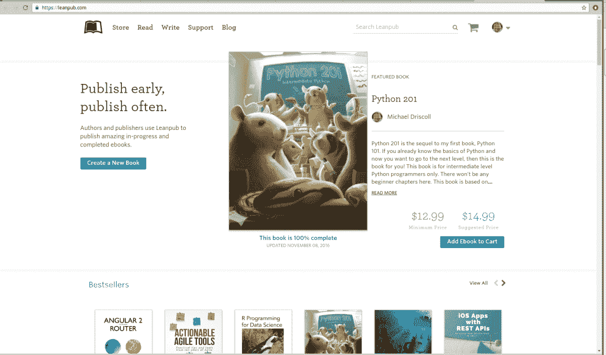

# Python 201 是今天 Leanpub 上的特色书籍

> 原文：<https://www.blog.pythonlibrary.org/2016/11/08/python-201-is-the-featured-book-on-leanpub-today/>

Leanpub 今天在他们的主页上展示了我的第二本书:

使用以下链接，你可以在明天之前以 50%的价格买到这本书:[http://leanpub.com/python201/c/50percent](http://leanpub.com/python201/c/50percent)

**Python 201** 涵盖了以下主题:

### **第一部分-中间模块**

*   第 1 章 argparse 模块
*   第 2 章-收集模块
*   第 3 章-上下文库模块(上下文管理器)
*   第 4 章 functools 模块(函数重载、缓存等)
*   第 5 章-所有关于进口
*   第 6 章 importlib 模块
*   第 7 章 itertools 模块
*   第 8 章-re 模块(Python 中正则表达式的介绍)
*   第 9 章-输入模块(类型提示)

### **第二部分——零零碎碎**

*   第 10 章——生成器/迭代器
*   第 11 章-映射、过滤、减少
*   第 12 章-统一码
*   第 13 章-基准测试
*   第 14 章-加密
*   第 15 章-连接到数据库
*   第 16 章-超级
*   第 17 章-描述符(魔术方法)
*   第 18 章-范围(本地、全局和新的非本地)

### 第三部分-网络

*   第 19 章-网页抓取
*   第 20 章-使用 web APIs
*   第 21 章- ftplib
*   第 22 章- urllib / httplib(客户端/服务器)

### 第四部分-测试

*   第 23 章- Doctest
*   第 24 章-单元测试
*   第 25 章-嘲弄
*   第 26 章- coverage.py