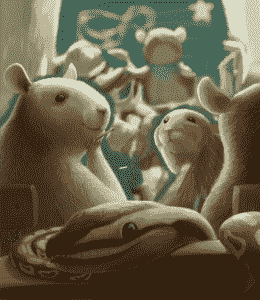

# Python 201 Kickstarter 活动更新-新封面预览

> 原文：<https://www.blog.pythonlibrary.org/2016/03/23/python-201-kickstarter-campaign-update-new-cover-preview/>

我的新书《Python 201》的 Kickstarter 活动已经进行了一半，我的第一个挑战目标也已经过半。如果你知道有人想提高他们的 Python 技能，请务必在你选择的社交网站上发布该活动的链接。由于我的支持者的投入，我还增加了几个新的奖励等级。

你现在可以得到一件 T 恤衫+一本 Python 201 的平装本，或者你可以选择 EVERYTHING 级别的支持，这将得到 T 恤衫、一本 Python 201 和 101 的平装本、电子书和 Python 101 截屏。

最后，我联系了我的插画师，她给我发来了这本书封面的快速预览，我想分享一下:

请注意，这只是封面的粗略版本，但整个事情应该在下周的某个时候完成。

再次感谢您的支持！迈克