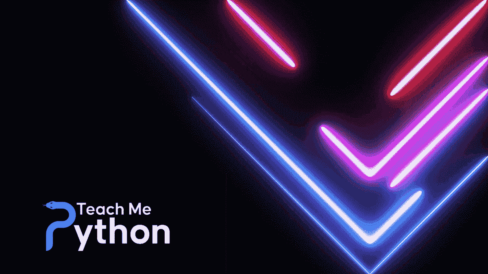

# 蟒蛇皮黑色星期五/网络星期一销售 2022

> 原文：<https://www.blog.pythonlibrary.org/2022/11/22/python-black-friday-cyber-monday-sales-2022/>

又到了一年中可以买到 Python 书籍和课程的时候了！

您可以使用以下优惠券代码在 [Gumroad](https://driscollis.gumroad.com/) 上的任何一本我自己出版的书上减去**$ 10**:**black 2022**

这段代码也适用于我最新的未完成的书[Python 问答书](https://driscollis.gumroad.com/l/pyquiz)。在 Python 测试手册中，您可以学到许多巧妙的技巧和诀窍。目前，它在**有超过 40 个问答**，但是在【2023 年 3 月发布时将会有 100 多个。立即获取早期副本！

## 

## 教我 Python 黑色星期五特卖

[教我 Python](http://teachmepython.com/) 也在进行黑色星期五大甩卖。结账时使用 **black22** 即可获得**八折优惠**！

## Trey Hunner Python 销售

在特雷·亨纳的“T2 蟒蛇大餐”上，你每年可以节省 108 美元。特雷还在他的[网站](https://treyhunner.com/2022/11/python-black-friday-and-cyber-monday-sales-2022/)上跟踪其他与 Python 相关的节日销售！

## 鲁文·勒纳的 Python 类

鲁文·勒纳的内容太惊艳了！你可以在本周以 40%的价格获得 Reuven 的各种 Python 课程。使用[此链接访问优惠券代码为 BF2022](https://store.lerner.co.il/?coupon=BF2022) 的 Reuven 商店。

## 其他 Python 销售

*   **Sundeep Agarwal(又名[@ learn _ by example](https://twitter.com/learn_byexample))**:Sundeep[所有书籍捆绑 64 折](https://learnbyexample.gumroad.com/l/all-books/FestiveOffer)(才 10 美金！)，通过示例学习 Python 包打八折(3 美元！)，而且[练习 Python 项目](https://learnbyexample.gumroad.com/l/py_projects/FestiveOffer)是免费的！
*   **[实用书架](https://pragprog.com/)** :购买 [Brian Okken 的 PyTest book](https://pragprog.com/titles/bopytest2/python-testing-with-pytest-second-edition/) 或任何其他带有优惠券代码的实用书架书籍`turkeysale2022`可享受 40%的优惠
*   **[奥莱利媒体](https://www.oreilly.com/online-learning/cyber-monday-2022.html)** 订阅凭优惠券可减 200 美元[网络周刊 22](https://www.oreilly.com/online-learning/cyber-monday-2022.html)
*   本周，DataCamp 的年费打五折！

## Django 销售公司

[亚当·约翰逊](https://twitter.com/AdamChainz)整理了一份伟大的 [**Django 相关的黑色星期五和网络星期一销售**](https://adamj.eu/tech/2022/11/21/django-black-friday-deals-2022/) 。