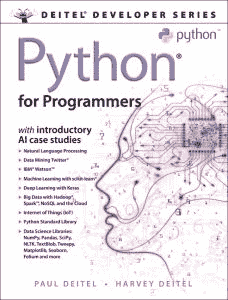

# 面向程序员的 Python 电子书赠品

> 原文：<https://www.blog.pythonlibrary.org/2019/03/26/python-for-programmers-ebook-giveaway/>

## 更新:这本书的所有副本现已被认领！感谢您的检查！

Pearson 最近联系我，介绍他们的新 Python 书籍[程序员 Python:大数据和人工智能案例研究](http://www.pearsoned.co.nz/9780135224335)

我有 5 本电子书要赠送。你需要做的就是在推特上发布这篇文章，给我贴上标签 [@driscollis](https://twitter.com/driscollis) ，然后在推特上直接给我发一条带有链接的消息，或者通过这个博客上的[联系表格](https://www.blog.pythonlibrary.org/contact/)把链接发给我。

以下是他们网站上关于这本书的更多信息:

> 面向具有任何高级语言背景的开发人员编写的《面向程序员的 Python 和数据科学入门》深入探讨了 Python 语言和 Python APIs，将 Deitels 的签名实时代码方法应用于编程教学。Paul Deitel 和 Harvey M. Deitel 博士在经过全面测试的程序环境中介绍概念，包括语法阴影、代码突出显示、逐行代码遍历和程序输出。它们包含数百个完整的 Python 程序，近 20，000 行经过验证的 Python 代码，以及数百个帮助您构建健壮应用程序的技巧。您将从使用早期的类和对象方法介绍 Python 开始，然后快速转向更高级的主题。
> 
> 在整个过程中，您将享受到 Deitels 对面向对象编程的经典处理。完成后，您将拥有构建工业级 Python 应用程序所需的一切。