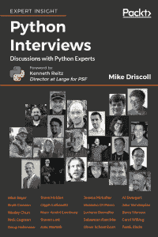

# Python 访谈书发布！

> 原文：<https://www.blog.pythonlibrary.org/2018/03/01/python-interviews-book-released/>

我的 [Python 访谈](https://www.packtpub.com/web-development/python-interviews)书现在正式发布了！在这篇文章中，您会发现 20 篇来自不同领域的 Python 专家的访谈。

我还有一个来自 Packt 的特殊代码，它将为多达 1000 名读者提供电子书 40%的折扣。结账时只需套用以下代码: **PIMD40** 。此码有效期至 2018 年 3 月 16 日。

注:该书目前仅在 Packt 发售，但将于 2018 年 3 月 9 日在[亚马逊](http://amzn.to/2GSTJjp)和其他零售点发售。

Packt 有向开源项目捐款的历史，并希望从这本书中向 Python 软件基金会捐款。因此，Packt 在 3 月份卖出的每一本书，他们都会通过自己的电子商务网站和亚马逊的折扣代码向 PSF 捐赠。亚马逊的折扣代码是 **30PYTHON** (这个代码可能要到 3 月 9 日才能生效)