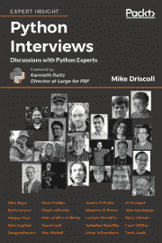

# Python 访谈摘录:塞巴斯蒂安·拉什卡

> 原文：<https://www.blog.pythonlibrary.org/2018/03/05/python-interviews-excerpt-sebastian-raschka/>

以下是摘自我的书 [Python 访谈](https://www.packtpub.com/web-development/python-interviews)

[塞巴斯蒂安·拉什卡](https://sebastianraschka.com)2017 年获得密歇根州立大学定量生物学和生物化学及分子生物学博士学位。Sebastian 是 Python 机器学习的畅销书作者，该书获得了 2016 年 ACM 最佳计算奖。

Driscoll : Python 是目前人工智能和机器学习中使用的语言之一。你能解释是什么使它如此受欢迎吗？

**拉什卡**:我觉得主要有两个原因，这两个原因很有关系。第一个原因是 Python 超级容易阅读和学习。

我认为，大多数从事机器学习和人工智能工作的人都希望专注于以最便捷的方式尝试他们的想法。重点是研究和应用，编程只是让你达到目的的工具。一门编程语言学起来越容易，对于更多数学和统计导向的人来说，入门门槛就越低。

Python 还具有超强的可读性，这有助于与机器学习和人工智能的现状保持同步，例如在阅读算法和思想的代码实现时。尝试人工智能和机器学习的新想法通常需要实现相对复杂的算法，语言越透明，就越容易调试。

第二个主要原因是，虽然 Python 本身是一种简单的语言，但我们在它的基础上有许多很棒的库，使我们的工作更容易。没有人愿意花时间从零开始重新实现基本算法(除非是在研究机器学习和人工智能的背景下)。现有的大量 Python 库有助于我们专注于比重新发明轮子更令人兴奋的事情。

顺便说一下，Python 也是一种优秀的包装语言，可以与更高效的 C/C++实现和 CUDA/cuDNN 一起工作，这就是为什么现有的机器学习和深度学习库在 Python 中运行得非常高效。这对于从事机器学习和 AI 领域的工作也是超级重要的。

总而言之，我想说 Python 是一种伟大的语言，它让研究人员和从业者专注于机器学习和人工智能，并且比其他语言更少分心。

Driscoll :那么 Python 只是在正确的时间成为正确的工具，还是有其他原因让它在人工智能和机器学习中变得如此重要？

拉什卡:我认为这是一个先有鸡还是先有蛋的问题。

要解开它，我会说 Python 使用方便，这导致了它的广泛采用。社区在科学计算的背景下开发了许多有用的包。许多机器学习和人工智能开发人员更喜欢 Python 作为科学计算的通用编程语言，他们已经在它的基础上开发了库，如 Theano，MXNet，TensorFlow 和 PyTorch。

有趣的是，我一直活跃在机器学习和深度学习社区，有一件事我经常听到:“Torch 库很棒，但它是用 Lua 编写的，我不想花时间学习另一种语言。”请注意，我们现在有 PyTorch。

在[书](https://www.packtpub.com/web-development/python-interviews)里看剩下的采访。使用以下代码从 Packt 网站购买可以获得 **40 折**:**pimd 40**。此码有效期至**2018 年 3 月 16 日**。