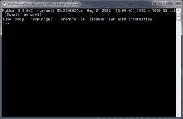

# Python on Windows:如何设置以帮助核心开发

> 原文：<https://www.blog.pythonlibrary.org/2012/05/21/python-on-windows-how-to-get-set-up-to-help-with-core-development/>

我正在阅读 Hynek Schlawack 关于成为 Python 核心开发人员的精彩文章,并决定弄清楚在我的机器上进行设置有多难，以便我可以准备好自己进行核心开发，如果我有幸成为团队的一员的话。因为我在 Windows 上运行的时间最长，所以我只想谈谈我是如何为这个操作系统做准备的。我一直在考虑尝试帮助核心开发一段时间，所以现在是最好的时机。让我们看看设置过程有多简单或多难！

### 你需要什么

作为一名 Windows 上的 Python 开发者，你需要一个 [Mercurial 客户端](http://mercurial.selenic.com/downloads/)来下载 Python，更新和创建补丁。您可以使用命令行工具，也可以使用 TortoiseHg，这是一个 shell GUI。正确配置后，您可以执行

 `hg clone http://hg.python.org/cpython` 

或者使用 Tortoise 来检查存储库。这将使您获得最新的 Python 3.x 版本。如果你想帮助发布一个维护版本，那么你需要阅读[文档](http://docs.python.org/devguide/setup.html#setup)。你需要的最后一个主要工具是编译器，最新的 Python 需要的工具是 Microsoft Visual Studio 2010。幸运的是，你不需要购买整个东西。事实上，你只需获得 Visual C++ 2010 的[速成版](http://www.microsoft.com/visualstudio/en-us/products/2010-editions/visual-cpp-express)，就万事大吉了。注意，这个工具并不是轻量级的，最终会占用超过 1gb 的磁盘空间。可悲，但却是事实。

### 在 Windows 7 上编译 Python

你可能已经猜到了，我们将在 Windows 7 上编译 Python。我也有 Windows XP，但这个操作系统现在几乎已经死了，所以我不打算讨论它。我怀疑这有什么不同。不管怎样，根据开发指南[文档](http://docs.python.org/devguide/setup.html#windows)，你需要进入你刚刚在你的机器上创建的 repo 并进入 **PCBuild** 文件夹。然后找到 **pcbuild.sln** 文件，并在新的 Visual Studio C++应用程序中运行它。你可能会看到一个关于 Express 版本不支持解决方案的警告，但是请忽略它。一旦项目被加载，进入**调试**菜单并选择**构建解决方案**。奇怪的是，官方文件说进入**构建**菜单，而不是调试菜单，但是我的副本没有构建菜单可供选择。

当我运行构建时，最终得到了以下结果:

 `========== Build: 20 succeeded, 8 failed, 0 up-to-date, 3 skipped ==========` 

查看日志，看起来它无法找到 sqlite3 和 tcl 的头文件，并且它的 bzip 库有一些问题。它还抱怨我没有安装 ActivePerl / openssh。然而，它仍然编译 Python，我在我的 PCBuild 文件夹中有一个新的 **python_d.exe** 文件，我可以运行它。我通过双击它来运行它，但是你也可以使用 F5 在 Visual Studio 中运行它，或者转到**调试**菜单并点击**开始调试**。

我想在这一点上，我已经准备好弄清楚如何创建一个补丁。如果我这样做了，我可能会尝试修补那些混乱的文档，这样人们就不会花时间去寻找一个不存在的菜单。然后我会写一篇关于如何提交补丁和使用 Python 的问题跟踪系统的文章。

### 相关阅读

*   Python 101: [在 Windows 上设置 Python](https://www.blog.pythonlibrary.org/2011/11/24/python-101-setting-up-python-on-windows/)
*   [Python-Core 开发简介](http://jessenoller.com/2009/02/04/a-brief-introduction-to-python-core-development-completely-different/)
*   投稿[文章](http://jessenoller.com/2011/05/05/on-contribution/)
*   [Python 核心导师计划](http://jessenoller.com/2011/04/05/python-core-mentorship-up-and-running/)