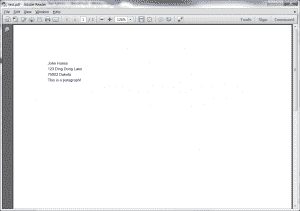

# Python:使用 pdfdocument 创建 PDF

> 原文：<https://www.blog.pythonlibrary.org/2013/10/17/python-pdf-creation-with-pdfdocument/>

我使用 Reportlab 用 Python 做了很多 PDF 报告的创建。偶尔我也会加入 PyPDF。所以我一直在寻找其他成熟的 Python PDF 工具。PDFDocument 并不完全成熟，但是有点意思。PDFDocument 项目实际上是 Reportlab 的包装器。可以在 [github](https://github.com/matthiask/pdfdocument) 上获取。我发现这个项目很容易使用，但相当有限。让我们花几分钟来看看它是如何工作的。

### 深入 pdf 文档

学习新事物的最好方法通常是去尝试。这条规则的唯一例外是，如果它是易碎的并且很贵。那你可能想看看手册。既然开源软件不是这样的，那我们就试一试吧！

*注意:要运行这段代码，您需要下载并将其安装到您的本地 Python 安装或 virtualenv* 中

```py

from pdfdocument.document import PDFDocument

#----------------------------------------------------------------------
def createPDF(path):
    """
    Create a simple PDF
    """
    pdf = PDFDocument(path)
    pdf.init_report()
    addr = {'first_name':"John", 'last_name':"Hanes",
            'address':"123 Ding Dong Lane", 
            'zip_code':"75002", 'city':"Dakota"}
    pdf.address(addr)
    pdf.p("This is a paragraph!")
    pdf.generate()

if __name__ == "__main__":
    createPDF("test.pdf")

```

如果一切顺利，您应该最终得到一个看起来像下面这样的 PDF 文档:

[](https://www.blog.pythonlibrary.org/wp-content/uploads/2013/10/pdfdocument_example.png)

你可以在这里下载 PDF 文件:[test.pdf](https://www.blog.pythonlibrary.org/wp-content/uploads/2013/10/test.pdf)。

您可能会注意到，出于某种原因，PDFDocument 将邮政编码放在城市的前面。您还会注意到，您不能添加州值，因此邮寄该文档可能会有困难。奇怪的是，所有这些都被硬编码到包中。在 [github](https://github.com/matthiask/pdfdocument/blob/master/pdfdocument/document.py) 上的最新版本(截止到 2013 年 10 月 17 日)在 address 方法里可以看到，接近下课了。我必须创建许多需要额外地址行的报告，这也不支持。仅供参考:如果你用 Python 报告做了大量的邮件工作，这个项目可能不适合你。

根据文档，您可以使用 PDFDocument 通过 PDF 模板创建信函和报告。用法如下所示:

```py

pdf.init_report()
# Or:
pdf.init_letter()

```

还支持在顶部包含红十字和水印的“机密”报告。还有一些特殊的换行使样式更改更容易，例如设置粗体、heading1、small 等字体属性。最后，有一些 helper 方法可以让 Django 集成更容易。

### 包扎

虽然我不觉得这个项目很有用，但你也许可以在自己的工作或爱好项目中找到一些用处。或者，您可能会发现下面相关文章中的某个项目对您有用。

### 相关文章

*   关于[pdf 文档](http://jugad2.blogspot.com/2013/01/pdfdocument-reportlab-wrapper.html)的另一篇文章
*   Python PDF 系列"[meta PDF 简介](https://www.blog.pythonlibrary.org/2012/07/21/python-pdf-series-an-intro-to-metapdf/)
*   PyPdf: [如何将 Pdf 写入内存](https://www.blog.pythonlibrary.org/2013/07/16/pypdf-how-to-write-a-pdf-to-memory/)
*   [pdf rw 简介](https://www.blog.pythonlibrary.org/2012/07/07/a-quick-intro-to-pdfrw/)
*   pyfpdf 简介-一个简单的 Python PDF 生成库