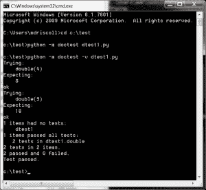
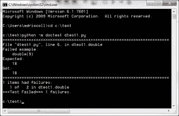
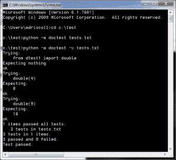
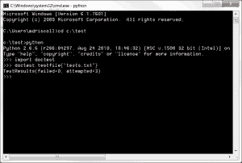

# 用 doctest 进行 Python 测试

> 原文：<https://www.blog.pythonlibrary.org/2014/03/17/python-testing-with-doctest/>

Python 在其标准库中包含了几个用于测试的模块: **doctest** 和 **unittest** 。在这篇文章中，我们将会看到**文档测试**。doctest 模块将在代码中搜索类似于交互式 Python 会话的文本片段。然后，它将执行这些会话，以验证它们完全按照编写的那样工作。这意味着，如果您在 docstring 中编写了一个示例，显示了带有尾随空格或制表符的输出，那么函数的实际输出也必须带有尾随空格。大多数时候，docstring 是您想要放置测试的地方。将涵盖 doctest 的以下方面:

*   如何从终端运行 doctest
*   如何在模块内部使用 doctest
*   如何从单独的文件运行 doctest

我们开始吧！

* * *

### 通过终端运行 doctest

我们将从创建一个非常简单的函数开始，这个函数将使赋予它的值翻倍。我们将在函数的 docstring 中包含几个测试。代码如下:

```py

#----------------------------------------------------------------------
def double(a):
    """
    >>> double(4)
    8
    >>> double(9)
    18
    """
    return a*2

```

现在我们只需要在 **doctest** 中运行这段代码。打开终端(或命令行),将目录切换到包含脚本的文件夹。我将我的副本保存为 **dtest1.py** 。下面是我所做的截图:

[](https://www.blog.pythonlibrary.org/wp-content/uploads/2014/03/doctest.png)

您会注意到，在第一个示例中，我执行了以下内容:

```py

python -m doctest dtest1.py

```

运行测试，但屏幕上没有显示任何内容。当您看不到任何打印内容时，这意味着所有测试都成功通过。第二个示例显示了以下命令:

```py

python -m doctest -v dtest1.py

```

“-v”意味着我们想要详细的输出，这正是我们所收到的。再次打开代码，在 docstring 中的“18”后面添加一个空格。然后重新运行测试。以下是我收到的输出:

[](https://www.blog.pythonlibrary.org/wp-content/uploads/2014/03/doctest_error.png)

错误消息说它期望“18 ”,而它得到了“18”。这是怎么回事？我们在 docstring 的“18”后面添加了一个空格，所以 doctest 实际上希望数字“18”后面跟一个空格。另外，注意不要将字典作为 docstring 示例中的输出。字典可以按任何顺序排列，所以它与实际输出匹配的可能性不是很大。

* * *

### 在模块内运行 doctest

让我们稍微修改一下这个例子，这样我们可以导入 **doctest** 模块并使用它的 **testmod** 函数。

```py

#----------------------------------------------------------------------
def double(a):
    """
    >>> double(4)
    8
    >>> double(9)
    18
    """
    return a*2

#----------------------------------------------------------------------
if __name__ == "__main__":
    import doctest
    doctest.testmod(verbose=True)

```

这里我们导入 doctest 并调用 doctest.testmod，我们给它传递关键字参数 **verbose=True** ，这样我们可以看到一些输出。否则，这个脚本将运行，没有任何输出，表明测试运行成功。

如果您不想对 verbose 选项进行硬编码，也可以在命令行上进行:

```py

python dtest2.py -v

```

现在我们准备学习如何将测试放到一个单独的文件中。

* * *

### 从单独的文件运行 doctest

doctest 模块还支持将测试放到一个单独的文件中。这允许我们从代码中分离出测试。让我们从前面的例子中剥离测试，并将它们放入一个名为 **tests.txt** 的文本文件中:

```py

The following are tests for dtest2.py

>>> from dtest2 import double
>>> double(4)
8
>>> double(9)
18

```

让我们在命令行上运行这个测试文件。方法如下:

[](https://www.blog.pythonlibrary.org/wp-content/uploads/2014/03/doctest_from_file.png)

您会注意到用文本文件调用 doctest 的语法与用 Python 文件调用它的语法是一样的。结果也一样。在这种情况下，有三个测试而不是两个，因为我们还导入了一个模块。您还可以运行 Python 解释器中文本文件中的测试。这里有一个例子:

[](https://www.blog.pythonlibrary.org/wp-content/uploads/2014/03/doctest_from_file_intepreter.png)

这里我们只是导入 doctest 并调用它的 **testfile** 方法。注意，您还需要将文件名或路径传递给 testfile 函数。它将返回一个 **TestResults** 对象，该对象包含有多少测试被尝试以及有多少测试失败。

* * *

### 包扎

至此，您应该能够理解如何在自己的代码中有效地使用 doctest 模块。您应该去阅读一下 [doctest 文档](http://docs.python.org/2/library/doctest.html),因为那里有关于选项标志和异常的额外信息，您可能会觉得有用。开心快乐编码！

* * *

### 下载代码

*   [testing.zip](https://www.blog.pythonlibrary.org/wp-content/uploads/2014/03/testing.zip)

* * *

### 相关阅读

*   关于 [doctest 模块](http://docs.python.org/2/library/doctest.html)的 Python 文档
*   python 102:[TDD 和单元测试简介](https://www.blog.pythonlibrary.org/2011/03/09/python-102-an-intro-to-tdd-and-unittest/)
*   Python 测试博客: [doctest 简介](http://pythontesting.net/framework/doctest/doctest-introduction/)
*   PyMOTW - [doctest](http://pymotw.com/2/doctest/)