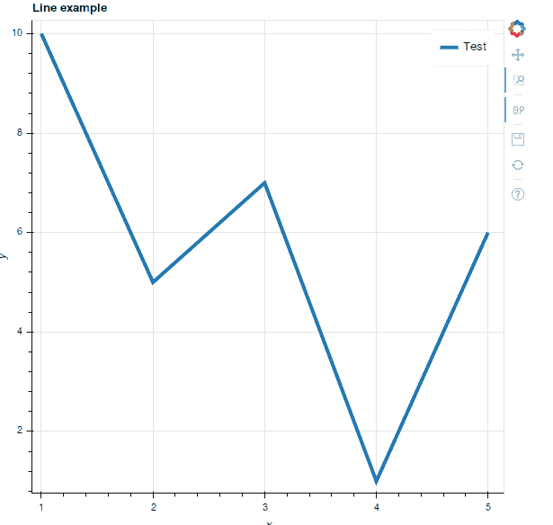
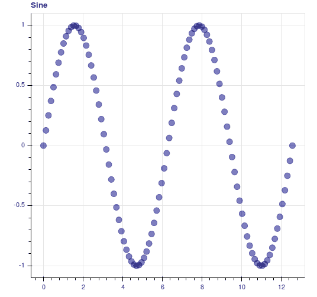

# Python:使用散景的可视化

> 原文：<https://www.blog.pythonlibrary.org/2016/07/27/python-visualization-with-bokeh/>

[散景包](http://bokeh.pydata.org/en/latest/)是一个交互式可视化库，它使用 web 浏览器进行演示。它的目标是提供 D3.js 风格的图形，看起来优雅且易于构建。散景支持大型和流式数据集。您可能会使用这个库来创建绘图/图形。它的主要竞争对手之一似乎是[。](https://plot.ly/)

注意:这不会是一个关于散景库的深入教程，因为它能够处理的不同图形和可视化的数量相当大。相反，本文的目的是让您体验一下这个有趣的库能做什么。

让我们花点时间来安装它。最简单的方法是使用 pip 或 conda。以下是 pip 的使用方法:

```py

pip install bokeh

```

这将安装散景及其所有依赖项。因此，您可能希望将散景安装到 virtualenv 中，但这取决于您。现在让我们看一个简单的例子。将下面的代码保存到一个您认为合适的文件中。

```py

from bokeh.plotting import figure, output_file, show

output_file("/path/to/test.html")

x = range(1, 6)
y = [10, 5, 7, 1, 6]
plot = figure(title='Line example', x_axis_label='x', y_axis_label='y')
plot.line(x, y, legend='Test', line_width=4)
show(plot)

```

这里我们只是从散景库中导入一些项目。我们只是告诉它在哪里保存输出。您会注意到输出是 HTML。然后，我们为 x 轴和 y 轴创建一些值，这样我们就可以创建绘图。然后我们实际上创建了图形对象，并给它一个标题和两个轴的标签。最后，我们绘制直线，给它一个图例和线宽，并显示图形。show 命令实际上会在默认浏览器中打开您的绘图。您最终应该会看到这样的内容:



散景也支持 Jupyter 笔记本，唯一的变化是你需要使用**输出 _ 笔记本**而不是**输出 _ 文件**。

散景[快速入门指南](http://bokeh.pydata.org/en/latest/docs/user_guide/quickstart.html#userguide-quickstart)在网格图上有一系列正弦波的简洁示例。我将这个例子简化为一个正弦波。请注意，您需要安装 NumPy，以下示例才能正常工作:

```py

import numpy as np

from bokeh.layouts import gridplot
from bokeh.plotting import figure, output_file, show

N = 100
x = np.linspace(0, 4*np.pi, N)
y0 = np.sin(x)

output_file('sinewave.html')

sine = figure(width=500, plot_height=500, title='Sine')
sine.circle(x, y0, size=10, color="navy", alpha=0.5)

p = gridplot([[sine]], toolbar_location=None)

show(p)

```

这个例子和上一个例子的主要区别在于，我们使用 NumPy 来生成数据点，并且我们将图形放在一个 **gridplot** 中，而不仅仅是绘制图形本身。当您运行这段代码时，您应该会得到一个类似如下的图:



如果你不喜欢圆形，那么你会很高兴知道散景支持其他形状，如方形、三角形和其他几种形状。

* * *

### 包扎

Bokeh 项目非常有趣，它提供了一个简单易用的 API 来创建图表、绘图和其他数据可视化。文档整理得很好，包括许多展示这个包能为您做什么的例子。浏览一下文档是非常值得的，这样您就可以看到其他一些图形是什么样子，以及生成如此好的结果的代码示例有多短。我唯一的不满是，散景没有办法以编程方式保存图像文件。这似乎是一个长期的问题，他们几年来一直试图解决这个问题。希望他们能尽快找到支持该特性的方法。否则我觉得真的很酷！