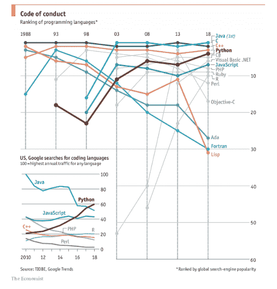

# python:2018 年全球最受欢迎的语言

> 原文：<https://www.blog.pythonlibrary.org/2018/10/09/python-worlds-most-popular-language-in-2018/>

根据经济学家的说法，Python“正在成为世界上最流行的编码语言”。

下面的图表显示了这种语言的受欢迎程度:

那篇文章中有很多有趣的信息，在这篇与文章相关的 [Reddit 帖子](https://www.reddit.com/r/Python/comments/9lwk7u/python_is_becoming_the_worlds_most_popular_coding)中也有一些有趣的对话。