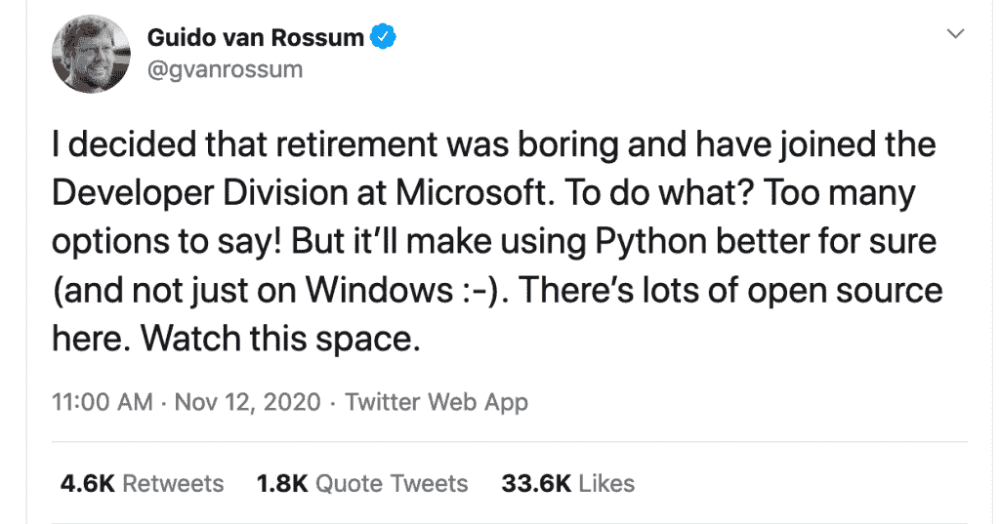

# Python 的创造者 Guido Van Rossom 加入微软

> 原文：<https://www.blog.pythonlibrary.org/2020/11/13/pythons-creator-guido-van-rossom-joins-microsoft/>

吉多·范·罗苏姆昨天宣布，他即将退休，加入微软的开发者部门:

Reddit 社区对这一消息反应不一。

我个人希望是积极的事情。虽然我曾希望 Guido 在谷歌时会将 Python 引入 Android 开发，但这并没有发生，我希望他能在微软以其他方式推广 Python。或许 Python 可以作为 Visual Basic for Applications(VBA)for Microsoft Office 的一种替代方案。如果能够使用 Python 直接编写 MS Office 脚本，而不是使用 COM 方法，那就太棒了。

有很多抱怨说在 Windows 上用 Python 开发比 Linux 和 Mac 更难。如果 Guido 能够在微软发挥他的影响力，也许这种情况会继续改变。与 10 年前相比，现在在 Windows 上开始使用 Python 当然要容易得多。所以我对它寄予厚望，希望它只会变得更好！

微软的影响力很大。如果他们开始比以前更多地推广 Python 和开源，那么我认为这是一件积极的事情。