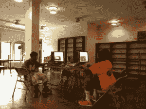
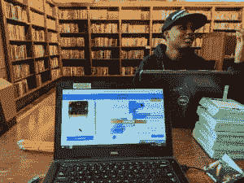

# 本周 PyDev:Qumisha Goss

> 原文：<https://www.blog.pythonlibrary.org/2018/06/18/qumisha-goss/>

本周，我们欢迎 Qumisha Goss([@ QatalystGoss](https://twitter.com/qatalystgoss))成为我们本周的 PyDev。q 是来自底特律的图书管理员，他在今年的美国 PyCon 上做了我所见过的最好的主题演讲之一。出于某种原因，上传那天早上的主题演讲的人没有将主题演讲相互分开，也没有将上午的闪电谈话分开，所以你必须通过官方视频寻找大约 2/3 的方式才能找到 Q 的主题演讲:

[https://www.youtube.com/embed/VJ0vibC_Hl0?feature=oembed](https://www.youtube.com/embed/VJ0vibC_Hl0?feature=oembed)

我个人认为你应该花点时间看看这个视频。但是如果你没有时间，你仍然可以阅读这个对这个了不起的人的简短采访。

你能告诉我们一些关于你自己的情况吗(爱好、教育等)

我叫奎米莎·戈斯，是底特律公共图书馆的图书管理员。我在卡尔文学院学习历史和古典研究。我痴迷于神话，然后是罗马帝国的工程学。我想成为工程师，然后成为档案管理员，现在我是图书管理员。

**你为什么开始使用 Python？**

在我被鼓励在图书馆开设儿童编程课程后，我开始使用 python。我开始使用“一小时代码”和 Code.org 资源，但是当孩子们对此感到厌烦时，我自学了 Python 来教他们一些更难、更有弹性的东西。

你还知道哪些编程语言，你最喜欢哪一种？

Python 实际上是我唯一使用过 SQL 的语言，尽管是为了常规的图书馆业务。

你现在在做什么项目？

目前，我正在参加帕克曼程序员暑期项目。今年夏天，这个项目被称为“代码:种植”,我们将鼓励孩子们到户外种植一个花园，然后通过制作延时相机和对土壤湿度传感器进行编程，使用代码来监控他们的花园。

哪些 Python 库是你最喜欢的(核心或第三方)？

*   因为我和孩子们一起工作。
*   sqllcemy(SQL 语法)

在开源项目中，你学到了哪三件最重要的事情？

*   Python 社区非常令人鼓舞
*   没有人什么都知道
*   寻求帮助并得到帮助是没问题的。

你从事开源工作的动机是什么？

我个人认为学习应该是免费和开放的，开源为一些通常没有机会获得所需资源的人提供了公平竞争的机会。

你还有什么想说的吗？

我们在图书馆用物理计算做了很多工作，因为我们发现除了计算机之外，有一些东西可以让他们接触，这有助于学习过程。所以我们经常用树莓 Pis 和 Micro bits。

感谢您接受采访！