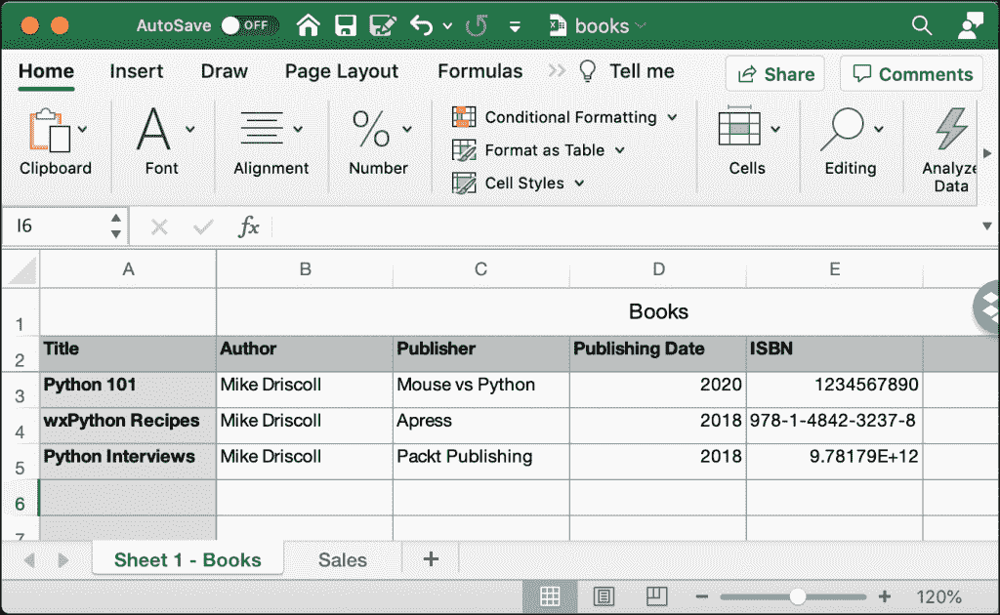
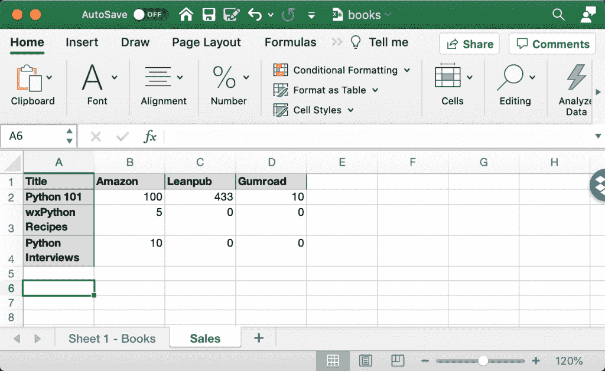

# 用 OpenPyXL 和 Python 读取电子表格

> 原文：<https://www.blog.pythonlibrary.org/2021/07/20/reading-spreadsheets-with-openpyxl-and-python/>

您将对 Microsoft Excel 文档执行一些基本操作。其中最基本的是从 Excel 文件中读取数据。您将学习如何从 Excel 电子表格中获取数据。

编者按:本文基于《用 Python 自动化 Excel》一书中的一章。你可以在 [Gumroad](https://gum.co/openpyxl) **或者 [Kickstarter](https://www.kickstarter.com/projects/driscollis/automating-excel-with-python) 上订购一份。**

在开始使用 Python 自动化 Excel 之前，您应该了解一些常用术语:

*   电子表格或工作簿–文件本身(。xls 或者。xlsx)。
*   工作表–工作簿中的一张内容表。电子表格可以包含多个工作表。
*   列–以字母标记的垂直数据行，以“A”开头。
*   行–用数字标记的水平数据行，从 1 开始。
*   单元格–列和行的组合，如“A1”。

现在你对词汇有了一些基本的理解，你可以继续了。

在本章中，您将学习如何执行以下任务:

*   打开电子表格
*   读取特定单元格
*   从特定行读取单元格
*   从特定列读取单元格
*   从多行或多列读取单元格
*   从区域中读取单元格
*   读取所有工作表中的所有单元格

您可以从学习如何在下一节打开工作簿开始！

## 打开电子表格

您需要的第一个项目是一个 Microsoft Excel 文件。你可以使用这个 [**GitHub 代码库**](https://github.com/driscollis/automating_excel_with_python) 里的文件。在**第 2 章**文件夹中有一个名为`books.xlsx`的文件，您将在这里使用。

里面有两张纸。以下是第一张表单的屏幕截图:



为了完整起见，下面是第二张表单的截图:



注意:这些表格中的数据并不准确，但它们有助于学习如何使用 OpenPyXL。

现在您已经准备好开始编码了！打开您最喜欢的 Python 编辑器，创建一个名为`open_workbook.py`的新文件。然后将以下代码添加到您的文件中:

```py
# open_workbook.py

from openpyxl import load_workbook

def open_workbook(path):
    workbook = load_workbook(filename=path)
    print(f"Worksheet names: {workbook.sheetnames}")
    sheet = workbook.active
    print(sheet)
    print(f"The title of the Worksheet is: {sheet.title}")

if __name__ == "__main__":
    open_workbook("books.xlsx")
```

这段代码的第一步是从`openpyxl`包中导入`load_workbook()`。`load_workbook()`函数将加载你的 Excel 文件，并以 Python 对象的形式返回。然后，您可以像对待 Python 中的任何其他对象一样，与该 Python 对象进行交互。

您可以通过访问`sheetnames`属性获得 Excel 文件中的工作表列表。该列表包含 Excel 文件中从左到右的工作表标题。您的代码将打印出这个列表。

接下来，获取当前活动的工作表。如果您的工作簿只有一个工作表，则该工作表将是活动工作表。如果您的工作簿有多个工作表，就像这个工作表一样，那么最后一个工作表将是活动的工作表。

函数的最后两行打印出`Worksheet`对象和活动工作表的标题。

但是，如果您想选择一个特定的工作表来工作呢？要了解如何完成这一点，创建一个新文件并将其命名为`read_specific_sheet.py`。

然后输入以下代码:

```py
# read_specific_sheet.py

from openpyxl import load_workbook

def open_workbook(path, sheet_name):
    workbook = load_workbook(filename=path)
    if sheet_name in workbook.sheetnames:
        sheet = workbook[sheet_name]
        print(f"The title of the Worksheet is: {sheet.title}")
        print(f"Cells that contain data: {sheet.calculate_dimension()}")

if __name__ == "__main__":
    open_workbook("books.xlsx", sheet_name="Sales")
```

您的函数`open_workbook()`现在接受一个`sheet_name`。`sheet_name`是与要读取的工作表标题相匹配的字符串。您检查一下`sheet_name`是否在代码的`workbook.sheetnames`中。如果是，您可以通过使用`workbook[sheet_name]`访问该工作表来选择它。

然后打印出工作表的标题，以验证您是否有正确的工作表。你也叫新东西:`calculate_dimension()`。该方法返回工作表中包含数据的单元格。在这种情况下，它将打印出“A1:D4”中有数据。

现在，您已经准备好继续学习如何从细胞本身读取数据。

## 读取特定单元格

使用 OpenPyXL 读取单元格有很多不同的方法。首先，您将学习如何读取特定单元格的内容。

在 Python 编辑器中创建一个新文件，并将其命名为`reading_specific_cells.py`。然后输入以下代码:

```py
# reading_specific_cells.py

from openpyxl import load_workbook

def get_cell_info(path):
    workbook = load_workbook(filename=path)
    sheet = workbook.active
    print(sheet)
    print(f'The title of the Worksheet is: {sheet.title}')
    print(f'The value of A2 is {sheet["A2"].value}')
    print(f'The value of A3 is {sheet["A3"].value}')
    cell = sheet['B3']
    print(f'The variable "cell" is {cell.value}')

if __name__ == '__main__':
    get_cell_info('books.xlsx')
```

在本例中，有三个硬编码单元:A2、A3 和 B3。您可以通过使用类似字典的访问来访问它们的值:`sheet["A2"].value`。或者，您可以将`sheet["A2"]`赋给一个变量，然后执行类似于`cell.value`的操作来获取单元格的值。

您可以在上面的代码中看到这两种方法。

运行此代码时，您应该会看到以下输出:

```py
<Worksheet "Sales">
The title of the Worksheet is: Sales
The value of A2 is 'Python 101'
The value of A3 is 'wxPython Recipes'
The variable "cell" is 5
```

此输出显示了如何使用 Python 轻松地从 Excel 中提取特定的单元格值。

现在您已经准备好学习如何从特定的单元格行中读取数据了！

## 从特定行读取单元格

在大多数情况下，您可能希望一次读取工作表中的多个单元格。OpenPyXL 还提供了一种一次获取整行的方法。

继续创建一个新文件。可以命名为`reading_row_cells.py`。然后将以下代码添加到您的程序中:

```py
# reading_row_cells.py

from openpyxl import load_workbook

def iterating_row(path, sheet_name, row):
    workbook = load_workbook(filename=path)
    if sheet_name not in workbook.sheetnames:
        print(f"'{sheet_name}' not found. Quitting.")
        return

    sheet = workbook[sheet_name]
    for cell in sheet[row]:
        print(f"{cell.column_letter}{cell.row} = {cell.value}")

if __name__ == "__main__":
    iterating_row("books.xlsx", sheet_name="Sheet 1 - Books",
                  row=2)
```

在这个例子中，你传入行号 **2** 。您可以迭代行中的值，如下所示:

```py
for cell in sheet[row]:
    ...
```

这使得从一行中获取值变得非常简单。当您运行这段代码时，您将得到以下输出:

```py
A2 = Title
B2 = Author
C2 = Publisher
D2 = Publishing Date
E2 = ISBN
F2 = None
G2 = None
```

最后两个值都是**无**。如果您不想得到 None 值，您应该在打印之前添加一些额外的处理来检查该值是否为 None。你可以试着通过练习自己找出答案。

现在，您已经准备好学习如何从特定列中获取单元格了！

## 从特定列读取单元格

从特定列读取数据也是一个常见的用例，您应该知道如何完成。例如，您可能有一个只包含汇总的列，而您只需要提取该特定列。

要了解如何做到这一点，请创建一个新文件并将其命名为`reading_column_cells.py`。然后输入以下代码:

```py
# reading_column_cells.py

from openpyxl import load_workbook

def iterating_column(path, sheet_name, col):
    workbook = load_workbook(filename=path)
    if sheet_name not in workbook.sheetnames:
        print(f"'{sheet_name}' not found. Quitting.")
        return

    sheet = workbook[sheet_name]
    for cell in sheet[col]:
        print(f"{cell.column_letter}{cell.row} = {cell.value}")

if __name__ == "__main__":
    iterating_column("books.xlsx", sheet_name="Sheet 1 - Books",
                    col="A")

```

这段代码与上一节中的代码非常相似。这里的不同之处在于，您用`sheet[col]`替换了`sheet[row]`，并对其进行迭代。

在本例中，您将列设置为“A”。当您运行此代码时，您将获得以下输出:

```py
A1 = Books
A2 = Title
A3 = Python 101
A4 = wxPython Recipes
A5 = Python Interviews
A6 = None
A7 = None
A8 = None
A9 = None
A10 = None
A11 = None
A12 = None
A13 = None
A14 = None
A15 = None
A16 = None
A17 = None
A18 = None
A19 = None
A20 = None
A21 = None
A22 = None
A23 = None

```

同样，一些列没有数据(即“无”)。您可以编辑此代码以忽略空单元格，只处理有内容的单元格。

现在让我们看看如何迭代多列或多行！

## 从多行或多列读取单元格

OpenPyXL 的工作表对象提供了两种方法来遍历行和列。这是两种方法:

*   `iter_rows()`
*   `iter_cols()`

这些方法在 OpenPyXL 的文档中有很好的记录。这两种方法都采用以下参数:

*   `min_col`(int)-最小的列索引(从 1 开始的索引)
*   `min_row`(int)–最小行索引(从 1 开始的索引)
*   `max_col`(int)-最大列索引(从 1 开始的索引)
*   `max_row`(int)–最大行索引(从 1 开始的索引)
*   `values_only`(bool)-是否只返回单元格值

使用 min 和 max 行和列参数来告诉 OpenPyXL 要迭代哪些行和列。通过将`values_only`设置为 True，可以让 OpenPyXL 返回单元格中的数据。如果设置为 False，`iter_rows()`和`iter_cols()`将返回单元格对象。

看看实际代码是如何工作的总是好的。记住这一点，创建一个名为`iterating_over_cells_in_rows.py`的新文件，并向其中添加以下代码:

```py
# iterating_over_cells_in_rows.py

from openpyxl import load_workbook

def iterating_over_values(path, sheet_name):
    workbook = load_workbook(filename=path)
    if sheet_name not in workbook.sheetnames:
        print(f"'{sheet_name}' not found. Quitting.")
        return

    sheet = workbook[sheet_name]
    for value in sheet.iter_rows(
        min_row=1, max_row=3, min_col=1, max_col=3,
        values_only=True):
        print(value)

if __name__ == "__main__":
    iterating_over_values("books.xlsx", sheet_name="Sheet 1 - Books")
```

在这里，您像在前面的示例中一样加载工作簿。您获得想要从中提取数据的工作表名称，然后使用`iter_rows()`获得数据行。在本例中，将最小行数设置为 1，最大行数设置为 3。这意味着您将获取您指定的 Excel 表中的前三行。

然后，您还要将列设置为 1(最小)到 3(最大)。最后，你把`values_only`设置成`True`。

当您运行此代码时，您将获得以下输出:

```py
('Books', None, None)
('Title', 'Author', 'Publisher')
('Python 101', 'Mike Driscoll', 'Mouse vs Python') 
```

您的程序将打印出 Excel 电子表格中前三行的前三列。您的程序将这些行打印为元组，其中包含三项。您将使用`iter_rows()`作为一种快速的方法，通过 Python 迭代 Excel 电子表格中的行和列。

现在，您已经准备好学习如何读取特定范围内的单元格。

## 从区域中读取单元格

Excel 允许您使用以下格式指定单元格区域:(col)(row):(col)(row)。换句话说，你可以用 **A1** 说你想从 A 列 1 行开始。如果你想指定一个范围，你可以使用这样的东西: **A1:B6** 。这告诉 Excel 您正在选择从 **A1** 开始到 **B6** 的单元格。

继续创建一个名为`read_cells_from_range.py`的新文件。然后向其中添加以下代码:

```py
# read_cells_from_range.py

import openpyxl
from openpyxl import load_workbook

def iterating_over_values(path, sheet_name, cell_range):
    workbook = load_workbook(filename=path)
    if sheet_name not in workbook.sheetnames:
        print(f"'{sheet_name}' not found. Quitting.")
        return

    sheet = workbook[sheet_name]
    for column in sheet[cell_range]:
        for cell in column:
            if isinstance(cell, openpyxl.cell.cell.MergedCell):
                # Skip this cell
                continue
            print(f"{cell.column_letter}{cell.row} = {cell.value}")

if __name__ == "__main__":
    iterating_over_values("books.xlsx", sheet_name="Sheet 1 - Books",
                          cell_range="A1:B6")

```

在这里，您传入您的`cell_range`并使用下面的嵌套`for`循环迭代该范围:

```py
for column in sheet[cell_range]:
    for cell in column:
```

您检查您正在提取的单元格是否是一个`MergedCell`。如果是，你跳过它。否则，打印出单元格名称及其值。

运行此代码时，您应该会看到以下输出:

```py
A1 = Books
A2 = Title
B2 = Author
A3 = Python 101
B3 = Mike Driscoll
A4 = wxPython Recipes
B4 = Mike Driscoll
A5 = Python Interviews
B5 = Mike Driscoll
A6 = None
B6 = None
```

这很有效。您应该花点时间尝试一些其他的范围变化，看看它如何改变输出。

注意:虽然“Sheet 1 - Books”的图像看起来像是单元格 A1 不同于合并的单元格 B1-G1，但 A1 实际上是该合并单元格的一部分。

您将创建的最后一个代码示例将读取 Excel 文档中的所有数据！

## 读取所有工作表中的所有单元格

Microsoft Excel 不像 CSV 文件或常规文本文件那样容易阅读。这是因为 Excel 需要存储每个单元格的数据，包括位置、格式和值，这些值可以是数字、日期、图像、链接等。因此，读取一个 Excel 文件需要做更多的工作！然而，openpyxl 为我们做了所有这些艰苦的工作。

遍历 Excel 文件的自然方法是从左到右读取工作表，在每个工作表中，从上到下逐行读取。这就是您将在本节中学习的内容。

您将把在前面章节中学到的知识应用到这里。创建一个新文件，命名为`read_all_data.py`。然后输入以下代码:

```py
# read_all_data.py

import openpyxl
from openpyxl import load_workbook

def read_all_data(path):
    workbook = load_workbook(filename=path)
    for sheet_name in workbook.sheetnames:
        sheet = workbook[sheet_name]
        print(f"Title = {sheet.title}")
        for row in sheet.rows:
            for cell in row:
                if isinstance(cell, openpyxl.cell.cell.MergedCell):
                    # Skip this cell
                    continue

                print(f"{cell.column_letter}{cell.row} = {cell.value}")

if __name__ == "__main__":
    read_all_data("books.xlsx")

```

这里，您像以前一样加载工作簿，但是这次您在`sheetnames`上循环。您可以在选择时打印出每个工作表的名称。您使用嵌套的`for`循环遍历行和单元格，从电子表格中提取数据。

再一次，你跳过了`MergedCells`，因为它们的值是`None`——实际值在与`MergedCell`合并的普通单元格中。如果运行这段代码，您会看到它打印出了两个工作表中的所有数据。

您可以通过使用`iter_rows()`来稍微简化这段代码。打开一个新文件，命名为`read_all_data_values.py`。然后输入以下内容:

```py
# read_all_data_values.py

import openpyxl
from openpyxl import load_workbook

def read_all_data(path):
    workbook = load_workbook(filename=path)
    for sheet_name in workbook.sheetnames:
        sheet = workbook[sheet_name]
        print(f"Title = {sheet.title}")
        for value in sheet.iter_rows(values_only=True):
            print(value)

if __name__ == "__main__":
    read_all_data("books.xlsx")

```

在这段代码中，您再次循环 Excel 文档中的工作表名称。然而，不是在行和列上循环，而是使用`iter_rows()`只在行上循环。您将`values_only`设置为`True`，这将为每一行返回一组值。您也不需要为`iter_rows()`设置最小和最大行数或列数，因为您想要获得所有数据。

当您运行这段代码时，您会看到它打印出每个工作表的名称，然后是该工作表中的所有数据，逐行打印。在您自己的 Excel 工作表中尝试一下，看看这段代码能做什么！

## 包扎

OpenPyXL 允许您以多种不同的方式读取 Excel 工作表及其数据。您可以用最少的代码从电子表格中快速提取值。

在本章中，您学习了如何执行以下操作:

*   打开电子表格
*   读取特定单元格
*   从特定行读取单元格
*   从特定列读取单元格
*   从多行或多列读取单元格
*   从区域中读取单元格
*   读取所有工作表中的所有单元格

现在您已经准备好学习如何使用 OpenPyXL 创建 Excel 电子表格。这是本系列下一篇文章的主题！