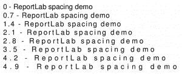
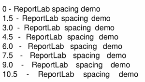
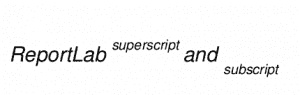

# ReportLab 101:文本对象

> 原文：<https://www.blog.pythonlibrary.org/2018/02/06/reportlab-101-the-textobject/>

ReportLab 工具包为您提供了多种在 pdf 上生成文本的方法。我见过的最流行的例子是使用画布方法或使用鸭嘴兽。你最有可能看到的画布方法是**拉绳**。这里有一个例子:

```py

from reportlab.pdfgen import canvas

c = canvas.Canvas("hello.pdf")
c.drawString(100, 100, "Welcome to Reportlab!")
c.showPage()
c.save()

```

基本上就是在给定的 x/y 坐标上画一个字符串。使用鸭嘴兽要复杂得多:

```py

from reportlab.lib.pagesizes import letter
from reportlab.platypus import SimpleDocTemplate, Paragraph
from reportlab.lib.styles import getSampleStyleSheet

def hello():
    doc = SimpleDocTemplate("hello_platypus.pdf",
                            pagesize=letter,
                            rightMargin=72,
                            leftMargin=72,
                            topMargin=72,
                            bottomMargin=18)
    styles = getSampleStyleSheet()

    flowables = []

    text = "Hello, I'm a Paragraph"
    para = Paragraph(text, style=styles["Normal"])
    flowables.append(para)

    doc.build(flowables)

if __name__ == '__main__':
    hello()

```

你会注意到，大多数时候当你使用鸭嘴兽的时候，你会需要使用一个模板，一个样式和一个段落或者其他可流动的东西。但是让我们回到画布上。它实际上有另一种生成文本的方法，ReportLab 调用 **textobject** 。坦白地说，我从来不需要这些，因为 ReportLab 的**段落**类可以让你更好地控制文本的呈现。但是如果你依赖于使用低级画布来生成你的 PDF，那么你会想知道 textobject 会使 PDF 生成更快，因为它不使用对**拉绳**的单独调用。

* * *

### 文本对象

以我的经验来看，学习新东西的最好方法就是试着写一些简单的演示。所以让我们写一些代码，看看 textobject 是如何工作的:

```py

# textobject_demo.py

from reportlab.lib import colors
from reportlab.lib.pagesizes import letter
from reportlab.pdfgen import canvas

def textobject_demo():
    my_canvas = canvas.Canvas("txt_obj.pdf",
                              pagesize=letter)
    # Create textobject
    textobject = my_canvas.beginText()

    # Set text location (x, y)
    textobject.setTextOrigin(10, 730)

    # Set font face and size
    textobject.setFont('Times-Roman', 12)

    # Write a line of text + carriage return
    textobject.textLine(text='Python rocks!')

    # Change text color
    textobject.setFillColor(colors.red)

    # Write red text
    textobject.textLine(text='Python rocks in red!')

    # Write text to the canvas
    my_canvas.drawText(textobject)

    my_canvas.save()

if __name__ == '__main__':
    textobject_demo()

```

这里我们了解到，要创建一个 **textobject** ，我们需要调用画布的 **beginText** 方法。如果你碰巧打印出了 textobject，你会发现它在技术上是**reportlab . pdf gen . textobject . pdftextobject**的一个实例。无论如何，现在我们有了一个 textobject，我们可以通过调用 **setTextOrigin** 来设置它的光标位置。然后我们像之前看到的那样设置字体和大小。下一个新项目是对 **textLine** 的调用，这将允许您向缓冲区写入一个字符串，外加一个基本上是回车的内容。该方法的 docstring 声明它使“文本光标下移”，但在我看来这相当于回车。还有一个 **textLines** 方法，允许您写出多行字符串。

接下来我们要做的是通过调用 **setFillColor** 来设置字体颜色。在本例中，我们将下一个文本字符串设置为红色。最后一步是调用 **drawText** ，它将实际绘制你的 textobject 中的任何内容。如果你跳过调用 **drawText** ，那么你的文本将不会被写出，你可能会得到一个空的 PDF 文档。

从 textobject 中可以调用许多其他方法。例如，如果你想移动光标的位置，而不是下一行，你可以调用 **moveCursor** 。让我们来看看:

```py

from reportlab.lib.pagesizes import letter
from reportlab.pdfgen import canvas

def textobject_cursor():
    canvas_obj = canvas.Canvas("textobj_cursor.pdf", pagesize=letter)

    # Create textobject
    textobject = canvas_obj.beginText()

    # Set text location (x, y)
    textobject.setTextOrigin(10, 730)

    for indent in range(4):
        textobject.textLine('ReportLab cursor demo')
        textobject.moveCursor(15, 15)

    canvas_obj.drawText(textobject)
    canvas_obj.save()

if __name__ == '__main__':
    textobject_cursor()

```

在这里，我们只是建立了一个循环，它将打印出相同的字符串四次，但是在四个不同的位置。您会注意到，在循环的每次迭代中，我们将光标向右移动 15 点，向下移动 15 点。是的，当使用一个文本对象时，一个正的 y 数将使你向下移动。

现在，假设你想改变字符间距；你需要做的就是调用 **setCharSpace** 。事实上，你可以用 textobject 做很多有趣的间距技巧，比如使用 **setWordSpace** 改变 word 之间的间距，或者通过调用 **setLeading** 改变行与行之间的间距。让我们来看看如何改变文本的间距:

```py

from reportlab.lib.pagesizes import letter
from reportlab.pdfgen import canvas

def textobject_char_spacing():
    canvas_obj = canvas.Canvas("textobj_char_spacing.pdf",
                               pagesize=letter)

    # Create textobject
    textobject = canvas_obj.beginText()

    # Set text location (x, y)
    textobject.setTextOrigin(10, 730)

    spacing = 0
    for indent in range(8):
        textobject.setCharSpace(spacing)
        line = '{} - ReportLab spacing demo'.format(spacing)
        textobject.textLine(line)
        spacing += 0.7

    canvas_obj.drawText(textobject)
    canvas_obj.save()

if __name__ == '__main__':
    textobject_char_spacing()

```

在本例中，我们将循环因子增加到 8 次迭代，并在每次循环中调用 **setCharSpace()** 。我们从零间距开始，然后在每次迭代中增加 0.7。您可以在这里看到结果:



现在让我们看看应用单词间距如何影响我们的文本:

```py

from reportlab.lib.pagesizes import letter
from reportlab.pdfgen import canvas

def wordspacer():
    canvas_obj = canvas.Canvas("textobj_word_spacing.pdf",
                               pagesize=letter)

    # Create textobject
    textobject = canvas_obj.beginText()

    # Set text location (x, y)
    textobject.setTextOrigin(10, 730)

    word_spacing = 0
    for indent in range(8):
        textobject.setWordSpace(word_spacing)
        line = '{} - ReportLab spacing demo'.format(word_spacing)
        textobject.textLine(line)
        word_spacing += 1.5

    canvas_obj.drawText(textobject)
    canvas_obj.save()

if __name__ == '__main__':      
    wordspacer()

```

这个例子与前一个非常相似，但是你会注意到我们调用的是 **setWordSpace()** 而不是 **setCharSpace()** ，在这个例子中我们将间距增加了 1.5 倍。生成的文本如下所示:



如果你想创建一个上标或下标，那么你需要在你的文本对象上调用**setRise**。让我们创建一个演示，演示如何在 ReportLab 中设置上升:

```py

from reportlab.lib.pagesizes import letter
from reportlab.pdfgen import canvas

def apply_scripting(textobject, text, rise):
    textobject.setFont("Helvetica-Oblique", 8)
    textobject.setRise(rise)
    textobject.textOut(text)
    textobject.setFont("Helvetica-Oblique", 12)
    textobject.setRise(0)

def main():
    canvas_obj = canvas.Canvas("textobj_rising.pdf",
                               pagesize=letter)

    # Create textobject
    textobject = canvas_obj.beginText()
    textobject.setFont("Helvetica-Oblique", 12)

    # Set text location (x, y)
    textobject.setTextOrigin(10, 730)

    textobject.textOut('ReportLab ')
    apply_scripting(textobject, 'superscript ', 7)

    textobject.textOut('and ')

    apply_scripting(textobject, 'subscript ', -7)

    canvas_obj.drawText(textobject)
    canvas_obj.save()

if __name__ == '__main__':
    main()

```

这里我们创建了几个函数， **apply_scripting** 和 **main** 。主函数将创建我们的画布和我们需要的所有其他部分。然后我们写出一些普通的文本。接下来的几行是我们应用上标(正)和下标(负)的地方。注意，我们需要将上标和下标之间的升程设置回零，以使单词“and”出现在正确的位置。一旦应用了一个上升的值，它将从该点开始继续应用。因此，您需要将它重置为零，以确保文本保持在正常位置。您还会注意到，我们将上标和下标的字体大小设置为小于常规文本。以下是运行此示例的结果:



查看 ReportLab 的用户指南，了解您可以做的更多有趣的事情，或者查看源代码本身。

* * *

### 包扎

我们在本教程中介绍了很多信息，但是您现在应该对如何在画布上使用 ReportLab 的 textobject 有了很好的理解。它非常有用，可以让你的文本格式变得非常简单。另一个很大的好处是它比多次调用 **drawText()** 要快。有机会一定要试一试！

注意:本教程是基于我最近的一本书的一部分， [ReportLab:用 Python 处理 PDF](https://www.kickstarter.com/projects/34257246/reportlab-pdf-processing-with-python)

* * *

### 相关阅读

*   简单的分步指南[报告实验室教程](https://www.blog.pythonlibrary.org/2010/03/08/a-simple-step-by-step-reportlab-tutorial/)