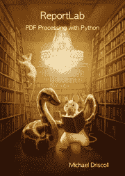

# ReportLab 101 -使用文本对象(视频)

> 原文：<https://www.blog.pythonlibrary.org/2020/11/17/reportlab-101-using-the-textobject-video/>

在本视频教程中，您将学习如何使用 ReportLab 的 textobject 在画布上操作和格式化文本。

[https://www.youtube.com/embed/B5OgK99pTCU?feature=oembed](https://www.youtube.com/embed/B5OgK99pTCU?feature=oembed)

如果你喜欢在书面教程中学习，你可以看看我的另一个教程， [ReportLab 101:文本对象](https://www.blog.pythonlibrary.org/2018/02/06/reportlab-101-the-textobject/)

#### 购买报告实验室书籍

你可以在 ReportLab 上找到一整本书并支持这个网站。在[亚马逊](https://amzn.to/2JTos53)和 [Leanpub](https://leanpub.com/reportlab) 上有售。