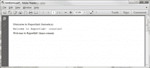

# Reportlab -关于字体的一切

> 原文：<https://www.blog.pythonlibrary.org/2013/07/19/reportlab-all-about-fonts/>

有没有想过如何在 Reportlab 中嵌入自定义字体？或者你只是想切换字体或改变字体的颜色。在本教程中，我们将看看所有这些问题。您需要出去下载一份 Reportlab，因为它不是标准 Python 安装的一部分。可以去 [PyPI](https://pypi.python.org/pypi/reportlab) 或者官方 Reportlab [网站](http://www.reportlab.com/software/installation/)领取礼包。Reportlab 仅适用于 Python 2.5-2.7，因此请记住这一点。一旦你准备好了，我们可以继续。

## 如何在 pdf 中嵌入字体

我们将在这个例子中使用名为 free3of9 的条形码字体。你可以在很多网站上找到它，包括这个 [one](http://www.squaregear.net/fonts/free3of9.shtml) 。我以前在制作中使用过这种字体。需要注意的是，Reportlab 其实自己也可以做条形码，所以你真的完全不需要这个字体。然而，出于演示的目的，我们将在本例中使用它。在你下载了字体并把它放在某个地方后，我们可以继续。你准备好了吗？然后让我们看一些代码:

```py

from reportlab.lib.pagesizes import letter
from reportlab.lib.styles import getSampleStyleSheet
from reportlab.pdfbase import pdfmetrics
from reportlab.pdfbase.ttfonts import TTFont
from reportlab.pdfgen import canvas
from reportlab.platypus import Paragraph
from reportlab.lib.units import mm

#----------------------------------------------------------------------
def createBarcode(path):
    """
    Demo to show how to embed a barcode font
    """
    style = getSampleStyleSheet()
    width, height = letter
    c = canvas.Canvas(path, pagesize=letter)
    barcode_font = r"/full/path/to/free3of9.ttf"
    pdfmetrics.registerFont(TTFont("Free 3 of 9 Regular", barcode_font))

    barcode_string = '%s'
    barcode_string = barcode_string % "1234567890"

    p = Paragraph(barcode_string, style=style["Normal"])
    p.wrapOn(c, width, height)
    p.drawOn(c, 20, 750, mm)

    c.save()

if __name__ == "__main__":
    createBarcode(r"/path/to/barcode.pdf")

```

首先，我们需要从 Reportlab 的不同部分导入几个项目。接下来，我们需要执行以下调用，向 Reportlab 注册字体:

```py

pdfmetrics.registerFont(TTFont("Free 3 of 9 Regular", barcode_font))

```

偶尔由于某些原因这不起作用。也许 ttf 文件定义不当或已损坏。我真的不知道。但是如果你幸运的话，这种字体可能带有 afm 和 pfb 文件。如果是这样，你可以这样注册。我发现这一点时，我正在玩我用来创建支票的 MICR 字体的演示副本。如果你愿意，你可以得到[试用版](http://www.micre13b.com/)。

为了使用它，我不得不这样做:

```py

# add micr font
afm = 'path/to/MICRCheckPrixa.afm'
pfb = 'path/to/MICRCheckPrixa.pfb'
face = pdfmetrics.EmbeddedType1Face(afm, pfb)
faceName = "MICRCheckPrixa"
pdfmetrics.registerTypeFace(face)
justFont = pdfmetrics.Font(faceName, faceName, 'WinAnsiEncoding')
pdfmetrics.registerFont(justFont)

```

大多数时候，第一种方法是有效的。但是，您应该了解这种后备方法，以防遇到 TrueType 字体的奇怪问题。现在我们准备学习 Reportlab 的标准字体。

### 如何在 Reportlab 中切换字体

Reportlab 内部支持多种字体。您可以将它们视为标准字体或默认字体。我们将基于他们的一个例子创建一段简单的代码，创建一个包含不同字体的文档。代码如下:

```py

import sys
from reportlab.pdfbase import pdfmetrics
from reportlab.pdfgen import canvas
import string

def standardFonts():
    """
    Create a PDF with all the standard fonts
    """
    for enc in ['MacRoman', 'WinAnsi']:
        canv = canvas.Canvas(
                'StandardFonts_%s.pdf' % enc,
                )
        canv.setPageCompression(0)

        x = 0
        y = 744
        for faceName in pdfmetrics.standardFonts:
            if faceName in ['Symbol', 'ZapfDingbats']:
                encLabel = faceName+'Encoding'
            else:
                encLabel = enc + 'Encoding'

            fontName = faceName + '-' + encLabel
            pdfmetrics.registerFont(pdfmetrics.Font(fontName,
                                        faceName,
                                        encLabel)
                        )

            canv.setFont('Times-Bold', 18)
            canv.drawString(80, y, fontName)

            y -= 20

            alpha = "abcdefghijklmnopqrstuvwxyz"
            canv.setFont(fontName, 14)
            canv.drawString(x+85, y, alpha)

            y -= 20

        canv.save()

if __name__ == "__main__":
    standardFonts()

```

该脚本将创建两个 pdf:standard fonts _ macroman . pdf 和 StandardFonts_WinAnsi.pdf。正如您所看到的，我们只是使用一对嵌套的 for 循环来提取各种字体，并将它们注册到 Reportlab。这显示了一种设置字体的方法。实际上还有另一种方法，我们不需要注册字体。Reportlab 支持一些 XML 标记，因此您可以使用这些标记来设置字体。让我们来看看这段代码:

```py

from reportlab.lib.pagesizes import letter
from reportlab.lib.styles import getSampleStyleSheet
from reportlab.lib.units import mm
from reportlab.pdfgen import canvas
from reportlab.platypus import Paragraph

#----------------------------------------------------------------------
def settingFontsDemo(path):
    """
    Demo to show how to use fonts in Paragraphs
    """
    p_font = 12
    c = canvas.Canvas(path, pagesize=letter)

    ptext = """Welcome to Reportlab! (helvetica)
    """ % p_font
    createParagraph(c, ptext, 20, 750)

    ptext = """Welcome to Reportlab! (courier)
    """ % p_font
    createParagraph(c, ptext, 20, 730)

    ptext = """Welcome to Reportlab! (times-roman)
    """ % p_font
    createParagraph(c, ptext, 20, 710)

    c.save()

#----------------------------------------------------------------------
def createParagraph(c, text, x, y):
    """"""
    style = getSampleStyleSheet()
    width, height = letter
    p = Paragraph(text, style=style["Normal"])
    p.wrapOn(c, width, height)
    p.drawOn(c, x, y, mm)

if __name__ == "__main__":
    settingFontsDemo("/path/to/fontDemo.pdf")

```

如果您运行上面的代码，您应该会得到如下所示的内容:

[](https://www.blog.pythonlibrary.org/wp-content/uploads/2013/07/reportlab_font_demo.png)

如您所见，我们所要做的就是使用一个字体标签并指定字体名称。我还没有找到 Reportlab 支持的默认字体的完整列表，所以您必须自己尝试。然而，我认为这是主要的三个，加上一些变种。您还会注意到，Reportlab 不区分字体名称的大小写。注意:我们使用 **createParagraph** 方法只是为了减少代码重复。

现在我们准备讨论改变字体颜色！

### 如何在 Reportlab 中更改字体颜色

如果您使用我们在上一个示例中使用的标记方法，在 Reportlab 中更改字体的颜色是非常容易的。你所要做的就是添加字体定义并指定一种颜色。我们将只修改本例的最后一段代码:

```py

from reportlab.lib.pagesizes import letter
from reportlab.lib.styles import getSampleStyleSheet
from reportlab.lib.units import mm
from reportlab.pdfgen import canvas
from reportlab.platypus import Paragraph

#----------------------------------------------------------------------
def colorFontsDemo(path):
    """
    Demo to show how to use fonts in Paragraphs
    """
    p_font = 12
    c = canvas.Canvas(path, pagesize=letter)

    ptext = """Welcome to Reportlab! (helvetica)
    """ % p_font
    createParagraph(c, ptext, 20, 750)

    ptext = """Welcome to Reportlab! (courier)
    """ % p_font
    createParagraph(c, ptext, 20, 730)

    ptext = """Welcome to Reportlab! (times-roman)
    """ % p_font
    createParagraph(c, ptext, 20, 710)

    c.save()

#----------------------------------------------------------------------
def createParagraph(c, text, x, y):
    """"""
    style = getSampleStyleSheet()
    width, height = letter
    p = Paragraph(text, style=style["Normal"])
    p.wrapOn(c, width, height)
    p.drawOn(c, x, y, mm)

if __name__ == "__main__":
    colorFontsDemo(r"/path/to/fontColorDemo.pdf")

```

如果您运行上面的代码，您将得到一个与上一个非常相似的文档，除了每一行都是不同的颜色。

### 包扎

现在您知道如何在 Reportlab 中操作字体了。如果你想学习额外的格式化技巧，我推荐你看看 Reportlab 用户指南的**段落 XML 标记标签**部分，在第 6 章。您将了解如何加粗、下划线、斜体和删除线，以及如何做上标和下标。《用户指南》中还有关于字体的附加信息，尤其是关于为画布对象设定字体的信息。祝你好运，编码快乐！

### 相关文章

*   [一个简单的分步报告实验室教程](https://www.blog.pythonlibrary.org/2010/03/08/a-simple-step-by-step-reportlab-tutorial/)
*   Reportlab - [如何使用 Python 在 pdf 中创建条形码](https://www.blog.pythonlibrary.org/2013/03/25/reportlab-how-to-create-barcodes-in-your-pdfs-with-python/)
*   Reportlab: [混合固定内容和流动内容](https://www.blog.pythonlibrary.org/2012/06/27/reportlab-mixing-fixed-content-and-flowables/)
*   Reportlab 表格- [使用 Python 在 pdf 中创建表格](https://www.blog.pythonlibrary.org/2010/09/21/reportlab-tables-creating-tables-in-pdfs-with-python/)

### 下载源代码

*   [rlabFonts.zip](https://www.blog.pythonlibrary.org/wp-content/uploads/2013/07/rlabFonts.zip)