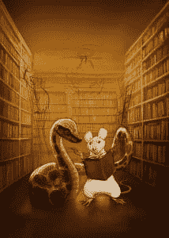

# ReportLab 图书封面故事

> 原文：<https://www.blog.pythonlibrary.org/2018/02/12/reportlab-book-cover-story/>

我真的喜欢为我的书设计有趣的封面。我也喜欢为每本书寻找新的艺术家，这样他们看起来都很独特。不过，我确实计划在某个时候重用一两个艺术家。

无论如何，为了 ReportLab 的书，我偶然发现了 Therese Larsson 的网站,我真的很喜欢她在艺术作品中的灯光设计。她来自瑞典，曾在一些大公司工作过，包括迪士尼、谷歌和阿迪达斯。你可以阅读更多关于她在 T2 的行为。

最后，我委托她制作封面，并描述了我想要的东西。这是最初的草图:

ReportLab 封面草图

 我认为这是我的愿景的一个非常好的版本，所以我批准了这个概念。下一个正在制作的封面是这样的:

虽然仍然有点粗糙，但我真的很喜欢它的进展，即使在这个早期版本的封面上，你也可以看出灯光是整洁的。

在这个版本中，我们已经完成了大部分的主要角色，场景也很好的组合在一起。

在这里，我们给我们的主要角色添加了更多的细节，还添加了一个背景鼠标。

这是封面的最终版本(没有标题)。我还是很喜欢封面出来的样子。我迫不及待地想看到它出版！

如果你想支持这本书的发展，请查看 Kickstarter ！