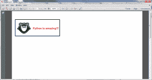
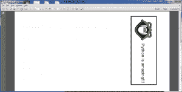

# Reportlab:如何创建横向页面

> 原文：<https://www.blog.pythonlibrary.org/2014/01/03/reportlab-create-landscape-pages/>

前几天，我需要用 Reportlab 完成一个有趣的任务。我需要创建一个横向的 PDF，保存时必须旋转 90 度。为了使文档的布局更容易，我创建了一个带有标志的类，它允许我以横向保存文档或将其翻转为纵向。在本文中，我们将看看我的代码，看看它需要什么。如果你愿意跟随，我推荐你下载一份 [Reportlab](http://www.reportlab.com/) 和 [pyPdf](http://pybrary.net/pyPdf/) (或者[pyPdf F2](https://github.com/mstamy2/PyPDF2))。

### Reportlab 页面方向

[](https://www.blog.pythonlibrary.org/wp-content/uploads/2014/01/reportlab_landscape.png)

至少有两种方法可以告诉 Reportlab 使用横向方向。第一个是一个叫做 **landscape** 的便利函数，你可以从 **reportlab.lib.pagesizes** 导入它。你可以这样使用它:

```py
from reportlab.lib.pagesizes import landscape, letter
from reportlab.pdfgen import canvas

self.c = canvas
self.c.setPageSize( landscape(letter) )

```

设置横向的另一种方法是直接设置页面大小:

```py
from reportlab.lib.pagesizes import landscape
from reportlab.pdfgen import canvas
from reportlab.lib.units import inch

self.c = canvas
self.c.setPageSize( (11*inch, 8.5*inch) )

```

您可以通过这样做来使它更通用:

```py
from reportlab.lib.pagesizes import landscape
from reportlab.pdfgen import canvas
from reportlab.lib.units import inch

width, height = letter

self.c = canvas
self.c.setPageSize( (height, width) )

```

这可能更有意义，尤其是如果您想使用其他流行的页面大小，如 A4。现在，让我们花点时间来看一个完整的例子:

```py

import pyPdf
import StringIO

from reportlab.lib import utils
from reportlab.lib.pagesizes import landscape, letter
from reportlab.platypus import (Image, SimpleDocTemplate, 
                                Paragraph, Spacer)
from reportlab.lib.styles import getSampleStyleSheet
from reportlab.lib.units import inch, mm

########################################################################
class LandscapeMaker(object):
    """
    Demo to show how to work with Reportlab in Landscape orientation
    """

    #----------------------------------------------------------------------
    def __init__(self, rotate=False):
        """Constructor"""
        self.logo_path = "snakehead.jpg"
        self.pdf_file = "rotated.pdf"
        self.rotate = rotate
        self.story = [Spacer(0, 0.1*inch)]
        self.styles = getSampleStyleSheet()

        self.width, self.height = letter

    #----------------------------------------------------------------------
    def coord(self, x, y, unit=1):
        """
        Helper class to help position flowables in Canvas objects
        (http://stackoverflow.com/questions/4726011/wrap-text-in-a-table-reportlab)
        """
        x, y = x * unit, self.height -  y * unit
        return x, y

    #----------------------------------------------------------------------
    def create_pdf(self, canvas, doc):
        """
        Create the PDF
        """
        self.c = canvas
        self.c.setPageSize( landscape(letter) )

        # add a logo and set size
        logo = self.scaleImage(self.logo_path, maxSize=90)
        logo.wrapOn(self.c, self.width, self.height)
        logo.drawOn(self.c, *self.coord(10, 113, mm))

        # draw a box around the logo
        self.c.setLineWidth(2)
        self.c.rect(20, 460, width=270, height=100)

        ptext = "**Python is amazing!!!**"
        p = Paragraph(ptext, style=self.styles["Normal"])
        p.wrapOn(self.c, self.width, self.height)
        p.drawOn(self.c, *self.coord(45, 101, mm))

    #----------------------------------------------------------------------
    def save(self):
        """
        Save the PDF
        """
        if not self.rotate:
            self.doc = SimpleDocTemplate(self.pdf_file, pagesize=letter,
                                         leftMargin=0.8*inch)
        else:
            fileObj = StringIO.StringIO()
            self.doc = SimpleDocTemplate(fileObj, pagesize=letter,
                                         leftMargin=0.8*inch)

        self.doc.build(self.story, 
                       onFirstPage=self.create_pdf)

        if self.rotate:
            fileObj.seek(0)
            pdf = pyPdf.PdfFileReader(fileObj)
            output = pyPdf.PdfFileWriter()
            for page in range(pdf.getNumPages()):
                pdf_page = pdf.getPage(page)
                pdf_page.rotateClockwise(90)
                output.addPage(pdf_page)

            output.write(file(self.pdf_file, "wb"))

    #----------------------------------------------------------------------
    def scaleImage(self, img_path, maxSize=None):
        """
        Scales the image
        """
        img = utils.ImageReader(img_path)
        img.fp.close()

        if not maxSize:
            maxSize = 125

        iw, ih = img.getSize()

        if iw > ih:
            newW = maxSize
            newH = maxSize * ih / iw
        else:
            newH = maxSize
            newW = maxSize * iw / ih

        return Image(img_path, newW, newH)

#----------------------------------------------------------------------
if __name__ == "__main__":
    pdf = LandscapeMaker()
    pdf.save()
    print "PDF created!"

```

如果您运行上面的代码(并且您有一个要使用的徽标)，您将看到与文章开头的截图非常相似的内容。由于文本和图像是水平的，这使得文档的布局更加容易。让我们花几分钟来解析代码。在 **init** 中，我们设置了几个项目，如 logo、PDF 文件的名称、是否旋转以及其他几个项目。 **coord** 方法是我在 StackOverflow 上发现的，它有助于更容易地定位流。 **create_pdf** 方法是最神奇的地方。它调用我们导入的**风景**函数。这个函数还在文档上绘制徽标、矩形和单词。

下一个方法是**保存**方法。如果我们不做旋转，我们创建一个 SimpleDocTemplate，把 PDF 文件名传递给它，然后构建文档。另一方面，如果我们打开旋转，那么我们使用 Python 的 StringIO 库创建一个 file 对象，这样我们就可以在内存中操作 PDF。基本上，我们将数据写入内存，然后我们寻找到 faux 文件的开头，这样我们就可以用 pyPdf 读取它。接下来，我们创建一个 pyPdf writer 对象。最后，我们逐页遍历内存中的 PDF，并在写出之前旋转每一页。

最后一个方法是 wxPython 小组给我的一个方便的方法，我用它来缩放图像。很多时候，你会发现自己的图像对于你的目的来说太大了，你需要缩小它们来适应。这就是这个方法的全部功能。

一旦你得到了你想要的一切，你可以把最后的代码改成如下:

```py
#----------------------------------------------------------------------
if __name__ == "__main__":
    pdf = LandscapeMaker(rotate=True)
    pdf.save()
    print "PDF created!"

```

这将导致脚本进行旋转，输出应该如下所示:

[](https://www.blog.pythonlibrary.org/wp-content/uploads/2014/01/reportlab_landscape_rotated.png)

### 包扎

在 Python 和 Reportlab 中创建和编辑横向方向的 pdf 实际上非常容易。在这一点上，你应该能够做到泰然自若！祝你好运，编码快乐！

### 相关文章

*   reportlab "[关于字体的一切](https://www.blog.pythonlibrary.org/2013/07/19/reportlab-all-about-fonts/)
*   [一个简单的分步报告实验室教程](https://www.blog.pythonlibrary.org/2010/03/08/a-simple-step-by-step-reportlab-tutorial/)
*   Reportlab: [如何添加页码](https://www.blog.pythonlibrary.org/2013/08/12/reportlab-how-to-add-page-numbers/)
*   Reportlab 表格-使用 Python 在 pdf 中创建表格
*   Reportlab: [混合固定内容和流动内容](https://www.blog.pythonlibrary.org/2012/06/27/reportlab-mixing-fixed-content-and-flowables/)