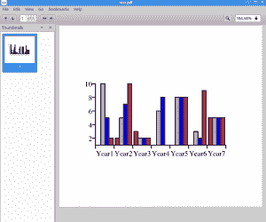
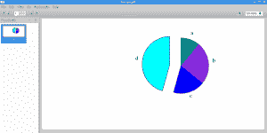
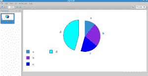

# Reportlab -如何添加图表/图形

> 原文：<https://www.blog.pythonlibrary.org/2016/02/18/reportlab-how-to-add-charts-graphs/>

Reportlab 是用 Python 创建 pdf 的非常好的工具。一个鲜为人知的事实是，他们现在支持添加图表或图形到您的 PDF。以前，如果您想要该功能，您必须自己完成所有的绘图代码。不幸的是，Reportlab 指南并没有真正解释如何使用他们的图表，支持哪些类型的图表，或者它们的参数/属性等是什么。尽管他们在他们的[网站](http://www.reportlab.com/chartgallery/bar)上有一些示例代码片段。在本文中，我们将通过几个简单的例子向您展示如何使用 Reportlab 的图表功能。

### 创建条形图



一个常见的需求是能够创建一个条形图。Reportlab 提供的例子非常酷，但是非常冗长。让我们看一个简单的例子:

```py
from reportlab.lib.colors import PCMYKColor
from reportlab.graphics.shapes import Drawing
from reportlab.graphics.charts.barcharts import VerticalBarChart

#----------------------------------------------------------------------
def create_bar_graph():
    """
    Creates a bar graph in a PDF
    """
    d = Drawing(280, 250)
    bar = VerticalBarChart()
    bar.x = 50
    bar.y = 85
    data = [[1,2,3,None,None,None,5],
            [10,5,2,6,8,3,5],
            [5,7,2,8,8,2,5],
            [2,10,2,1,8,9,5],
            ]
    bar.data = data
    bar.categoryAxis.categoryNames = ['Year1', 'Year2', 'Year3',
                                      'Year4', 'Year5', 'Year6',
                                      'Year7']

    bar.bars[0].fillColor   = PCMYKColor(0,100,100,40,alpha=85)
    bar.bars[1].fillColor   = PCMYKColor(23,51,0,4,alpha=85)
    bar.bars.fillColor       = PCMYKColor(100,0,90,50,alpha=85)

    d.add(bar, '')

    d.save(formats=['pdf'], outDir='.', fnRoot='test')

if __name__ == '__main__':
    create_bar_graph()

```

这里我们从 Reportlab 包中导入一些我们需要的项目。我们最关心的是**绘图**和**垂直条形图**。绘图类允许我们创建一个画布来绘图。当我们创建它时，我们必须指定所谓的画布有多大。然后我们创建一个 VerticalBarChart 的实例，并通过 x/y 坐标告诉它应该在什么位置。接下来，我们将一些数据和一些类别名称添加到图表中，这些名称位于 x 轴上。最后，我们使用 Reportlab 的 PCMYKColor 类为条形图中的各个条形设置一些颜色，并将图表添加到绘图中。

最后，我们将条形图保存到磁盘。格式有点怪，但是根据源代码，你可以告诉它把图表保存成多种格式(pdf，eps，svg，ps，各种图片格式)。您还需要通过 **fnRoot** 告诉它将文件保存到哪个目录，并可选地告诉它文件名应该是什么。在创建条形图时，您可以设置和调整许多其他属性，但我们不会在这里讨论它们。查看前面提到的一些 Reportlab 示例。

如果您运行上面的代码，您应该会看到一个 PDF，其内容类似于本节开头的屏幕截图。现在让我们继续学习如何创建饼图！

* * *

### 创建饼图



使用 Reportlab 创建饼图稍微容易一些。我们来看看吧！

```py
from reportlab.graphics.shapes import Drawing
from reportlab.graphics.charts.piecharts import Pie

#----------------------------------------------------------------------
def create_pie_chart():
    """"""
    d = Drawing()
    pie = Pie()
    pie.x = 200
    pie.y = 65
    pie_data = [10, 20, 30, 40]
    pie.labels = [letter for letter in 'abcd']
    pie.slices.strokeWidth = 0.5
    pie.slices[3].popout = 20
    d.add(pie)
    d.save(formats=['pdf'], outDir='.', fnRoot='test-pie')

if __name__ == '__main__':
    create_pie_chart()

```

这里我们只从 Reportlab 导入两个项目，即前面提到的**绘图**类和**饼图**图表类。和以前一样，我们创建了 Drawing 类的一个实例，这次是 Pie 类。同样，我们也通过设置 x/y 坐标来定位饼图。数据更有趣一点，因为饼图代表百分比，所以它必须加起来是 100，所以要确保你的值加起来是合适的。接下来我们添加一些标签，并告诉它线条的宽度应该是多少。为了好玩，我们告诉它从饼图中弹出第 4 个元素(注意:它是从零开始的)。最后，我们将图表添加到绘图中并保存它。

* * *

### 添加图例



图例在图表中很常见。幸运的是，Reportlab 提供了一种相当简单的方法来添加图例。让我们修改我们的饼图代码，并添加一个图例！

```py
from reportlab.graphics.charts.legends import Legend
from reportlab.graphics.charts.piecharts import Pie
from reportlab.graphics.shapes import Drawing
from reportlab.lib.validators import Auto

#----------------------------------------------------------------------
def add_legend(draw_obj, chart, data):
    """"""
    legend = Legend()
    legend.alignment = 'right'
    legend.x = 10
    legend.y = 70
    legend.colorNamePairs = Auto(obj=chart)
    draw_obj.add(legend)

#----------------------------------------------------------------------
def create_pie_chart(legend=False):
    """"""
    data = [10, 20, 30, 40]
    d = Drawing()
    pie = Pie()
    # required by Auto
    pie._seriesCount = 4

    if legend:
        add_legend(d, pie, data)

    pie.x = 150
    pie.y = 65
    pie_data = data
    pie.labels = [letter for letter in 'abcd']
    pie.slices.strokeWidth = 0.5
    pie.slices[3].popout = 20
    d.add(pie)
    d.save(formats=['pdf'], outDir='.', fnRoot='test-pie')

if __name__ == '__main__':
    create_pie_chart(True)

```

这一次，我们导入了一个**传奇**类和一个**自动**类。我们还创建了一个 **add_legend** 函数，使添加图例变得更容易，并封装了代码，使其更容易更新。在这个函数中，我们设置了图例的对齐方式和位置。然后，我们使用 Reportlab 的自动验证器将图例中的正确颜色映射到条形图中。最后，我们将图例添加到绘图中，并将 PDF 保存到磁盘中。

* * *

### 包扎

Reportlab 中还有许多其他类型的图表和子图表。当谈到 Reportlab 可以对图表做什么时，本文只是触及了皮毛。例如，您可以指定条间距和宽度、字体、x 和 y 的各种轴设置、x 和 y 的标签等等。你绝对应该查看 Reportlab 的官方样本，以了解如何使用他们的软件包。您可能还需要深入源代码，弄清楚一些部分是如何组合在一起的，以及各种参数的含义。这是一个非常强大的包，但是文档有点粗糙。

* * *

### 相关阅读

*   简单的分步指南[报告实验室教程](https://www.blog.pythonlibrary.org/2010/03/08/a-simple-step-by-step-reportlab-tutorial/)
*   [Reportlab -关于字体的一切](https://www.blog.pythonlibrary.org/2013/07/19/reportlab-all-about-fonts/)
*   [Reportlab 表格-使用 Python 创建 pdf 格式的表格](https://www.blog.pythonlibrary.org/2010/09/21/reportlab-tables-creating-tables-in-pdfs-with-python/)