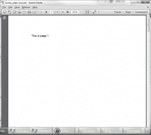
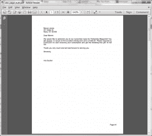
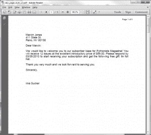

# Reportlab:如何添加页码

> 原文：<https://www.blog.pythonlibrary.org/2013/08/12/reportlab-how-to-add-page-numbers/>

您是否曾经需要在实验室生成的 PDF 报告中添加页码，但不知道如何添加？你来对地方了。我们将看看在三种不同的情况下如何添加页码:

1.  如何仅用画布对象添加页码
2.  如何使用 SimpleDocTemplate 添加页码
3.  如何添加“第#页，共#页”(即第 1 页，共 10 页)

你准备好了吗？让我们开始吧！

### 仅用画布添加页码

[](https://www.blog.pythonlibrary.org/wp-content/uploads/2013/08/canvas_page_num.png)

canvas 对象有一个非常简单的方法来获取内置的页码。这里有一个例子:

```py

from reportlab.pdfgen import canvas

#----------------------------------------------------------------------
def createMultiPage():
    """
    Create a multi-page document
    """
    c = canvas.Canvas("canvas_page_num.pdf")

    for i in range(5):
        page_num = c.getPageNumber()
        text = "This is page %s" % page_num
        c.drawString(100, 750, text)
        c.showPage()
    c.save()

#----------------------------------------------------------------------
if __name__ == "__main__":
    createMultiPage()

```

如您所见，您所要做的就是调用 canvas 对象的 **getPageNumber** ()来获取页面的页码。在上面的代码中，我们创建了一个五页文档，每页有一个文本字符串。现在我们准备继续学习如何用 Reportlab 的模板添加页码。

### 如何在 Reportlab 的文档模板中添加页码

[](https://www.blog.pythonlibrary.org/wp-content/uploads/2013/08/doc_page_num.png)

在本例中，我们将使用 Reportlab 的 SimpleDocTemplate。其实真的很好用。我们将从[上一篇文章](https://www.blog.pythonlibrary.org/2010/03/08/a-simple-step-by-step-reportlab-tutorial/)中提取一些代码来帮助填充文档，使它看起来比上一篇文章更有趣。代码如下:

```py

from reportlab.lib.enums import TA_JUSTIFY
from reportlab.lib.pagesizes import letter
from reportlab.platypus import SimpleDocTemplate, Paragraph, Spacer, Image, PageBreak
from reportlab.lib.styles import getSampleStyleSheet, ParagraphStyle
from reportlab.lib.units import mm

#----------------------------------------------------------------------
def addPageNumber(canvas, doc):
    """
    Add the page number
    """
    page_num = canvas.getPageNumber()
    text = "Page #%s" % page_num
    canvas.drawRightString(200*mm, 20*mm, text)

#----------------------------------------------------------------------
def createMultiPage():
    """
    Create a multi-page document
    """
    doc = SimpleDocTemplate("doc_page_num.pdf",pagesize=letter,
                            rightMargin=72,leftMargin=72,
                            topMargin=72,bottomMargin=18)
    styles = getSampleStyleSheet()
    styles.add(ParagraphStyle(name='Justify', alignment=TA_JUSTIFY))

    Story = []

    magName = "Pythonista"
    issueNum = 12
    subPrice = "99.00"
    limitedDate = "03/05/2010"
    freeGift = "tin foil hat"
    full_name = "Marvin Jones"
    address_parts = ["411 State St.", "Reno, NV 80158"]

    for page in range(5):
        # Create return address
        ptext = '%s' % full_name
        Story.append(Paragraph(ptext, styles["Normal"]))       
        for part in address_parts:
            ptext = '%s' % part.strip()
            Story.append(Paragraph(ptext, styles["Normal"]))

        Story.append(Spacer(1, 12))
        ptext = 'Dear %s:' % full_name.split()[0].strip()
        Story.append(Paragraph(ptext, styles["Normal"]))
        Story.append(Spacer(1, 12))

        ptext = """We would like to welcome you to our subscriber base 
        for %s Magazine! You will receive %s issues at the excellent introductory 
        price of $%s. Please respond by %s to start receiving your subscription 
        and get the following free gift: %s.""" 
        ptext = ptext % (magName, issueNum, subPrice, limitedDate, freeGift)
        Story.append(Paragraph(ptext, styles["Justify"]))
        Story.append(Spacer(1, 12))

        ptext = 'Thank you very much and we look forward to serving you.'
        Story.append(Paragraph(ptext, styles["Justify"]))
        Story.append(Spacer(1, 12))
        ptext = 'Sincerely,'
        Story.append(Paragraph(ptext, styles["Normal"]))
        Story.append(Spacer(1, 48))
        ptext = 'Ima Sucker'
        Story.append(Paragraph(ptext, styles["Normal"]))
        Story.append(Spacer(1, 12))
        Story.append(PageBreak())

    doc.build(Story, onFirstPage=addPageNumber, onLaterPages=addPageNumber)

#----------------------------------------------------------------------
if __name__ == "__main__":
    createMultiPage()

```

在这种情况下，我们需要创建一个我们可以调用的简单的 **addPageNumber** 函数。接下来，我们使用 Reportlab flowables 创建一个多页文档，在本例中，它是一系列段落对象。我们还实例化了一个 SimpleDocTemplate，并调用它的 **build** 方法。在这个调用中，我们告诉它为第一页和所有其他页面调用我们的 **addPageNumber** 函数。这允许我们动态地给每个页面添加一个页码！

### 如何在 Reportlab 中添加“总页数”

[](https://www.blog.pythonlibrary.org/wp-content/uploads/2013/08/doc_page_num2.png)

Reportlab 没有内置的方法来添加页码，例如“第 1 页，共 5 页”或其他内容。所以我去看看是否有人解决了这个难题，并在 ActiveState 上找到了两个食谱。你可以在这里或者在这里阅读关于他们的[。我们将从这些食谱中提取例子，并将它们与上一节中的代码结合起来。](http://code.activestate.com/recipes/546511-page-x-of-y-with-reportlab/)

```py

from reportlab.lib.enums import TA_JUSTIFY
from reportlab.lib.pagesizes import letter
from reportlab.pdfgen import canvas
from reportlab.platypus import SimpleDocTemplate, Paragraph, Spacer, Image, PageBreak
from reportlab.lib.styles import getSampleStyleSheet, ParagraphStyle
from reportlab.lib.units import mm

########################################################################
class PageNumCanvas(canvas.Canvas):
    """
    http://code.activestate.com/recipes/546511-page-x-of-y-with-reportlab/
    http://code.activestate.com/recipes/576832/
    """

    #----------------------------------------------------------------------
    def __init__(self, *args, **kwargs):
        """Constructor"""
        canvas.Canvas.__init__(self, *args, **kwargs)
        self.pages = []

    #----------------------------------------------------------------------
    def showPage(self):
        """
        On a page break, add information to the list
        """
        self.pages.append(dict(self.__dict__))
        self._startPage()

    #----------------------------------------------------------------------
    def save(self):
        """
        Add the page number to each page (page x of y)
        """
        page_count = len(self.pages)

        for page in self.pages:
            self.__dict__.update(page)
            self.draw_page_number(page_count)
            canvas.Canvas.showPage(self)

        canvas.Canvas.save(self)

    #----------------------------------------------------------------------
    def draw_page_number(self, page_count):
        """
        Add the page number
        """
        page = "Page %s of %s" % (self._pageNumber, page_count)
        self.setFont("Helvetica", 9)
        self.drawRightString(195*mm, 272*mm, page)

#----------------------------------------------------------------------
def createMultiPage():
    """
    Create a multi-page document
    """
    doc = SimpleDocTemplate("doc_page_num_v2.pdf",pagesize=letter,
                            rightMargin=72,leftMargin=72,
                            topMargin=72,bottomMargin=18)
    styles = getSampleStyleSheet()
    styles.add(ParagraphStyle(name='Justify', alignment=TA_JUSTIFY))

    Story = []

    magName = "Pythonista"
    issueNum = 12
    subPrice = "99.00"
    limitedDate = "03/05/2010"
    freeGift = "tin foil hat"
    full_name = "Marvin Jones"
    address_parts = ["411 State St.", "Reno, NV 80158"]

    for page in range(5):
        # Create return address
        ptext = '%s' % full_name
        Story.append(Paragraph(ptext, styles["Normal"]))       
        for part in address_parts:
            ptext = '%s' % part.strip()
            Story.append(Paragraph(ptext, styles["Normal"]))

        Story.append(Spacer(1, 12))
        ptext = 'Dear %s:' % full_name.split()[0].strip()
        Story.append(Paragraph(ptext, styles["Normal"]))
        Story.append(Spacer(1, 12))

        ptext = """We would like to welcome you to our subscriber base 
        for %s Magazine! You will receive %s issues at the excellent introductory 
        price of $%s. Please respond by %s to start receiving your subscription 
        and get the following free gift: %s.""" 
        ptext = ptext % (magName, issueNum, subPrice, limitedDate, freeGift)
        Story.append(Paragraph(ptext, styles["Justify"]))
        Story.append(Spacer(1, 12))

        ptext = 'Thank you very much and we look forward to serving you.'
        Story.append(Paragraph(ptext, styles["Justify"]))
        Story.append(Spacer(1, 12))
        ptext = 'Sincerely,'
        Story.append(Paragraph(ptext, styles["Normal"]))
        Story.append(Spacer(1, 48))
        ptext = 'Ima Sucker'
        Story.append(Paragraph(ptext, styles["Normal"]))
        Story.append(Spacer(1, 12))
        Story.append(PageBreak())

    doc.build(Story, canvasmaker=PageNumCanvas)

#----------------------------------------------------------------------
if __name__ == "__main__":
    createMultiPage()

```

让我们快速看一下我们的变化。首先我们子类化 **canvas。Canvas** 并覆盖它的两个方法来跟踪列表中创建的页面数量。然后，当文档保存自身时，它会遍历列表中的所有页面，并为每个页面添加适当的。为了让文档使用这个画布，我们将该类传递给 **canvasmaker** 参数，您将在 **createMultiPage** 函数的最后一行中看到: **doc.build(Story，canvasmaker=PageNumCanvas)** 。就是这样！

### 包扎

今天，您已经学习了几种向 Reportlab PDFs 添加页码的方法。现在出去开始编写一些简洁的代码吧！

### 下载源代码

*   [rep_pagenum.zip](https://www.blog.pythonlibrary.org/wp-content/uploads/2013/08/rep_pagenum.zip)