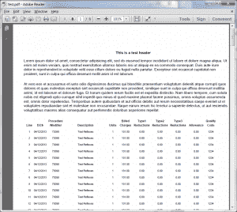

# Reportlab:如何组合静态内容和多页表

> 原文：<https://www.blog.pythonlibrary.org/2013/08/09/reportlab-how-to-combine-static-content-and-multipage-tables/>

这个星期，我试图弄清楚如何让 Reportlab 做一些我以前从未尝试过的事情。也就是说，我想创建大约半页的静态文本，然后有一个行项目表，它可能会填充页面的其余部分，并在此后继续 N 页。问题是将 Reportlab 的 canvas 对象与 flowables 混合在一起可能会很混乱。Reportlab 在其用户指南中略微谈到了使用模板，但它只展示了如何添加页眉和页脚类型信息。这实际上是我需要的所有信息，但我花了很长时间才意识到这一点。我在 [Reportlab 邮件列表](http://two.pairlist.net/pipermail/reportlab-users/2013-August/010829.html)上询问如何做这类事情。在我写这篇文章的时候，没有人告诉我该怎么做。总之，我自己想出来的，现在我要给你看！如果你想继续下去，你可能需要自己去拿一份免费的[报告实验室](http://www.reportlab.com/)。

### 钻研代码

[](https://www.blog.pythonlibrary.org/wp-content/uploads/2013/08/reportlab_multipage.png)

我不得不钻研 Reportlab 的源代码，以找出如何完成这项有趣的活动。你真正需要做的是在你的类中创建一个方法来完成你所有的静态画布绘制。完成后，创建一个带有 Reportlab 间隔符的 list 对象，告诉 Reportlab 它需要跳过您绘制的区域。然后，您可以创建表格对象并将其添加到列表中。最后，您只需要构建您的文档。是的，如果你是 Reportlab 的新手，你可能会觉得这些听起来像希腊语。向您展示更简单，所以请查看下面的代码:

```py

from reportlab.lib.pagesizes import letter
from reportlab.lib.styles import getSampleStyleSheet, ParagraphStyle, TA_CENTER
from reportlab.lib.units import inch, mm
from reportlab.pdfgen import canvas
from reportlab.platypus import Paragraph, Table, SimpleDocTemplate, Spacer

########################################################################
class Test(object):
    """"""

    #----------------------------------------------------------------------
    def __init__(self):
        """Constructor"""
        self.width, self.height = letter
        self.styles = getSampleStyleSheet()

    #----------------------------------------------------------------------
    def coord(self, x, y, unit=1):
        """
        http://stackoverflow.com/questions/4726011/wrap-text-in-a-table-reportlab
        Helper class to help position flowables in Canvas objects
        """
        x, y = x * unit, self.height -  y * unit
        return x, y

    #----------------------------------------------------------------------
    def run(self):
        """
        Run the report
        """
        self.doc = SimpleDocTemplate("test.pdf")
        self.story = [Spacer(1, 2.5*inch)]
        self.createLineItems()

        self.doc.build(self.story, onFirstPage=self.createDocument)
        print "finished!"

    #----------------------------------------------------------------------
    def createDocument(self, canvas, doc):
        """
        Create the document
        """
        self.c = canvas
        normal = self.styles["Normal"]

        header_text = "This is a test header"
        p = Paragraph(header_text, normal)
        p.wrapOn(self.c, self.width, self.height)
        p.drawOn(self.c, *self.coord(100, 12, mm))

        ptext = """Lorem ipsum dolor sit amet, consectetur adipisicing elit,
        sed do eiusmod tempor incididunt ut labore et dolore magna aliqua. 
        Ut enim ad minim veniam, quis nostrud exercitation ullamco laboris 
        nisi ut aliquip ex ea commodo consequat. Duis aute irure dolor in
        reprehenderit in voluptate velit esse cillum dolore eu fugiat nulla
        pariatur. Excepteur sint occaecat cupidatat non proident, sunt in 
        culpa qui officia deserunt mollit anim id est laborum."""

        p = Paragraph(ptext, style=normal)
        p.wrapOn(self.c, self.width-50, self.height)
        p.drawOn(self.c, 30, 700)

        ptext = """
        At vero eos et accusamus et iusto odio dignissimos ducimus qui 
        blanditiis praesentium voluptatum deleniti atque corrupti quos dolores 
        et quas molestias excepturi sint occaecati cupiditate non provident, 
        similique sunt in culpa qui officia deserunt mollitia animi, id est laborum
        et dolorum fuga. Et harum quidem rerum facilis est et expedita distinctio. 
        Nam libero tempore, cum soluta nobis est eligendi optio cumque nihil impedit
        quo minus id quod maxime placeat facere possimus, omnis voluptas assumenda est,
        omnis dolor repellendus. Temporibus autem quibusdam et aut officiis debitis aut 
        rerum necessitatibus saepe eveniet ut et voluptates repudiandae sint et 
        molestiae non recusandae. Itaque earum rerum hic tenetur a sapiente delectus,
        ut aut reiciendis voluptatibus maiores alias consequatur aut perferendis
        doloribus asperiores repellat.
        """
        p = Paragraph(ptext, style=normal)
        p.wrapOn(self.c, self.width-50, self.height)
        p.drawOn(self.c, 30, 600)

    #----------------------------------------------------------------------
    def createLineItems(self):
        """
        Create the line items
        """
        text_data = ["Line", "DOS", "Procedure
/Modifier",
                     "Description", "Units", "Billed
Charges",
                     "Type1
Reductions", "Type2
Reductions",
                     "Type3
Reductions", "Allowance",
                     "Qualify
Code"]
        d = []
        font_size = 8
        centered = ParagraphStyle(name="centered", alignment=TA_CENTER)
        for text in text_data:
            ptext = "**%s**" % (font_size, text)
            p = Paragraph(ptext, centered)
            d.append(p)

        data = [d]

        line_num = 1

        formatted_line_data = []

        for x in range(200):
            line_data = [str(line_num), "04/12/2013", "73090", 
                         "Test Reflexes", "1", "131.00", "0.00", 
                         "0.00", "0.00", "0.00", "1234"]

            for item in line_data:
                ptext = "%s" % (font_size-1, item)
                p = Paragraph(ptext, centered)
                formatted_line_data.append(p)
            data.append(formatted_line_data)
            formatted_line_data = []
            line_num += 1

        table = Table(data, colWidths=[20, 40, 45, 120, 30, 40, 
                                       50, 50, 50, 50, 30])

        self.story.append(table)

#----------------------------------------------------------------------
if __name__ == "__main__":
    t = Test()
    t.run()

```

现在我们需要花一点时间回顾一下这里发生了什么。首先，我们从 Reportlab 导入一大堆不同的项目。接下来，我们创建测试类。我们初始化一些东西，然后我们开始得到好的东西。 **coord** 方法是我在 [StackOverflow](http://stackoverflow.com/questions/4726011/wrap-text-in-a-table-reportlab) 上发现的有趣的东西，它对在画布对象上定位 flowables 有很大帮助。我们将跳过这个方法，直接进入**运行**。在这里，我们创建了文档对象和故事列表。你会注意到我们已经在里面放了一个 2.5 英寸宽的垫片。这是为画布保留的空间量。接下来，我们调用我们的 **createLineItems** 方法，该方法创建一个 200 行的表格对象，并将其添加到我们的故事中。

然后我们调用 doc 对象的 **build** 方法，告诉它执行 **createDocument** 。正如你可能已经猜到的， **build** 实际上会创建 PDF 本身。createDocument 方法包含画布绘制代码。一旦一切都完成了，我们就向 stdout 输出一条消息，让用户知道他们的新文档已经可以查看了！

### 包扎

至此，您已经具备了编写静态内容和流动内容混搭所需的知识。您可能想知道，您还可以向 build 方法传递 onLastPages 参数，告诉它调用您自己的另一个方法。大多数显示 onFirstPage 和 onLastPages 的示例将它们用于页眉和页脚。也许这是他们的主要目的，但你可以为自己所用。如果你去挖掘源代码，你会发现你也可以传递一个页面模板列表，这可以使真正复杂的布局变得容易得多。无论如何，我希望这篇文章对您有所帮助，并且您能够在自己的代码中使用这些新信息。玩得开心！

### 相关文章

*   Reportlab: [混合固定内容和流动内容](https://www.blog.pythonlibrary.org/2012/06/27/reportlab-mixing-fixed-content-and-flowables/)
*   Reportlab 表格-使用 Python 在 pdf 中创建表格
*   >简单的分步报告实验室教程