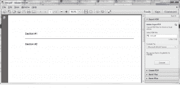
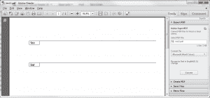

# Reportlab:如何创建自定义流

> 原文：<https://www.blog.pythonlibrary.org/2014/03/10/reportlab-how-to-create-custom-flowables/>

Reportlab 是一个非常灵活的用于 Python 的 PDF 创建包。您可以使用绝对定位或使用**可流动的**对象(如段落、表格或框架)来布局您的文档。你甚至可以将两者混合在一起！在这篇文章中，我们将看看如何创建一些自定义的流。例如，如果您需要在文档中添加一条线来划分新部分的起点，该怎么办？没有真正的内置流动，所以我们将设计自己的。我们还将设计一个可流动的，有一条线和一个里面有文本的盒子。

我们开始吧！

* * *

### 产生可流动的线

创建一条可流动的线其实很简单。基本上，你只需要子类化 Reportlab 的**可流动的**类，并告诉它画线。以下是基于 Reportlab [邮件列表](http://two.pairlist.net/pipermail/reportlab-users/2005-February/003695.html)中的一个例子

```py

from reportlab.lib.pagesizes import letter
from reportlab.lib.styles import getSampleStyleSheet
from reportlab.lib.units import inch
from reportlab.platypus import (Flowable, Paragraph,
                                SimpleDocTemplate, Spacer)

########################################################################
class MCLine(Flowable):
    """
    Line flowable --- draws a line in a flowable
    http://two.pairlist.net/pipermail/reportlab-users/2005-February/003695.html
    """

    #----------------------------------------------------------------------
    def __init__(self, width, height=0):
        Flowable.__init__(self)
        self.width = width
        self.height = height

    #----------------------------------------------------------------------
    def __repr__(self):
        return "Line(w=%s)" % self.width

    #----------------------------------------------------------------------
    def draw(self):
        """
        draw the line
        """
        self.canv.line(0, self.height, self.width, self.height)

#----------------------------------------------------------------------
def create_pdf():
    """
    Create a pdf
    """
    story=[]
    doc = SimpleDocTemplate("test.pdf",pagesize=letter)
    styles=getSampleStyleSheet()
    spacer = Spacer(0, 0.25*inch)

    ptext = '%s' % "Section #1"
    story.append(Paragraph(ptext, styles["Normal"]))
    story.append(spacer)

    line = MCLine(500)
    story.append(line)
    story.append(spacer)

    ptext = '%s' % "Section #2"
    story.append(Paragraph(ptext, styles["Normal"]))

    doc.build(story)

#----------------------------------------------------------------------
if __name__ == "__main__":
    create_pdf()

```

如果您运行此代码，您应该会得到一个类似如下的 PDF:

[](https://www.blog.pythonlibrary.org/wp-content/uploads/2014/03/rep_flowable_line.png)

**create_pdf** 函数中的代码基于 Reportlab 附带的模板创建一个文档。然后，我们创建一些流并将它们添加到一个普通的 Python 列表中。我们希望在我们创建的两个假“部分”周围有一点空间，所以我们在可流动线的前后添加了一个**间隔物**。然后我们构建文档，瞧！我们有一个新制作的 PDF！

* * *

### 创建带边框的文本框+线条可流动

[](https://www.blog.pythonlibrary.org/wp-content/uploads/2014/03/rep_flowable_box.png)

最近，我需要创建一个文本框，它有一个边框和一条从顶部到右边的线，我需要能够将它作为一个可流动的文件添加到我的文档中。它看起来有点像这个 ASCII 艺术作品:

```py
-----------------------------------------
| foobar |
----------

```

这需要一点实验，但我最终想到了以下解决方案:

```py
from reportlab.lib.pagesizes import letter
from reportlab.platypus import Flowable, SimpleDocTemplate, Spacer
from reportlab.lib.units import inch

########################################################################
class BoxyLine(Flowable):
    """
    Draw a box + line + text

    -----------------------------------------
    | foobar |
    ---------

    """

    #----------------------------------------------------------------------
    def __init__(self, x=0, y=-15, width=40, height=15, text=""):
        Flowable.__init__(self)
        self.x = x
        self.y = y
        self.width = width
        self.height = height
        self.text = text

    #----------------------------------------------------------------------
    def draw(self):
        """
        Draw the shape, text, etc
        """
        self.canv.rect(self.x, self.y, self.width, self.height)
        self.canv.line(self.x, 0, 500, 0)
        self.canv.drawString(self.x+5, self.y+3, self.text)

doc = SimpleDocTemplate("test2.pdf",pagesize=letter)
story=[]

box = BoxyLine(text="foo")
story.append(box)
story.append(Spacer(0, 1*inch))
box = BoxyLine(text="bar")
story.append(box)

doc.build(story)

```

让我们把它分解一下。首先，我们再一次将易流动类细分。这一次我们添加了一些额外的参数，这样我们可以告诉它改变框的大小和线条的宽度，以及显示一些文本。然后在 **draw** 方法中，我们将文本欺骗到正确的位置。如果您改变了框的大小，那么您可能需要更改行或文本的位置。我最后稍微增强了一下，这样我就可以使用一个**段落**对象来代替画布的**拉带**方法。这是如何工作的:

```py
from reportlab.lib.pagesizes import letter
from reportlab.lib.styles import getSampleStyleSheet
from reportlab.lib.units import inch, mm
from reportlab.platypus import (Flowable, Paragraph,
                                SimpleDocTemplate, Spacer)

########################################################################
class BoxyLine(Flowable):
    """
    Draw a box + line + text

    -----------------------------------------
    | foobar |
    ---------

    """

    #----------------------------------------------------------------------
    def __init__(self, x=0, y=-15, width=40, height=15, text=""):
        Flowable.__init__(self)
        self.x = x
        self.y = y
        self.width = width
        self.height = height
        self.text = text
        self.styles = getSampleStyleSheet()

    #----------------------------------------------------------------------
    def coord(self, x, y, unit=1):
        """
        http://stackoverflow.com/questions/4726011/wrap-text-in-a-table-reportlab
        Helper class to help position flowables in Canvas objects
        """
        x, y = x * unit, self.height -  y * unit
        return x, y

    #----------------------------------------------------------------------
    def draw(self):
        """
        Draw the shape, text, etc
        """
        self.canv.rect(self.x, self.y, self.width, self.height)
        self.canv.line(self.x, 0, 500, 0)

        p = Paragraph(self.text, style=self.styles["Normal"])
        p.wrapOn(self.canv, self.width, self.height)
        p.drawOn(self.canv, *self.coord(self.x+2, 10, mm))

doc = SimpleDocTemplate("test3.pdf",pagesize=letter)
story=[]

box = BoxyLine(text="foo")
story.append(box)
story.append(Spacer(0, 1*inch))
box = BoxyLine(text="bar")
story.append(box)

doc.build(story)

```

使用段落而不是 drawString 的主要优点是，您现在可以使用 Reportlab 的类似 HTML 的标记来控制使用的字体和字体大小:

```py
txt = "This is a 10 point font"

```

我个人认为这比使用画布的字体相关方法更简单。

* * *

### 包扎

现在您知道如何使用 Reportlab 的可流动类来创建您自己的自定义可流动类。这为您创建自己的 PDF 文档提供了额外的灵活性。

* * *

### 附加阅读

*   简单的分步指南[报告实验室教程](https://www.blog.pythonlibrary.org/2010/03/08/a-simple-step-by-step-reportlab-tutorial/)
*   Reportlab: [如何创建横向页面](https://www.blog.pythonlibrary.org/2014/01/03/reportlab-create-landscape-pages/)
*   Reportlab: [如何添加页码](https://www.blog.pythonlibrary.org/2013/08/12/reportlab-how-to-add-page-numbers/)
*   reportlab "[关于字体的一切](https://www.blog.pythonlibrary.org/2013/07/19/reportlab-all-about-fonts/)