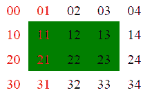
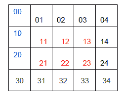

# Reportlab 表格-使用 Python 在 pdf 中创建表格

> 原文：<https://www.blog.pythonlibrary.org/2010/09/21/reportlab-tables-creating-tables-in-pdfs-with-python/>

回到今年 3 月，我在 Reportlab 上写了一篇简单的教程，report lab 是一个方便的第三方 Python 包，允许开发人员以编程方式创建 pdf。最近，我收到了一个关于如何在 Reportlab 中处理表格的请求。由于我的 Reportlab 文章如此受欢迎，我认为可能值得花大力气来弄清楚表格。在本文中，我将尝试向您展示向 Reportlab 生成的 pdf 中插入表格的基础知识。

我对 Reportlab 的几个问题之一是他们的用户指南。它展示了一些很好的例子，但是它们几乎总是不完整的。点击此处下载用户指南[并开始阅读第七章(关于表格的章节),您将很快看到以下代码片段:](http://www.reportlab.com/software/opensource/rl-toolkit/guide/)

```py

LIST_STYLE = TableStyle(
[('LINEABOVE', (0,0), (-1,0), 2, colors.green),
('LINEABOVE', (0,1), (-1,-1), 0.25, colors.black),
('LINEBELOW', (0,-1), (-1,-1), 2, colors.green),
('ALIGN', (1,1), (-1,-1), 'RIGHT')]
)
```

当然，这个代码片段是完全不可运行的，而且它周围的文本对于弄清楚如何导入**表格样式**和**颜色**也是毫无用处的。听起来你可以从流动类中得到所有的表格材料(第 76 页-第 7 章第一页)。不幸的是，没有“报告实验室”。可流动”。你要知道，所有的流动都来自一种叫做**鸭嘴兽**的东西。我们就此打住，谈谈什么是“可流动的”。用户指南是这样说的:

 *Flowables 是可以绘制的东西，它有 wrap、draw 和 split 方法。Flowable 是要绘制的对象的抽象基类，实例知道其大小，并在自己的坐标系中绘制(这需要在调用 Flowable.draw 方法时，基础 API 提供绝对坐标系)。要获得一个实例，请使用 f=Flowable()。*(第 62 页第 5.3 节)。请注意，该页面上没有显示如何获得可流动类。我只是通过搜索它们的来源才知道是怎么回事。语法如下:*from reportlab . platypus import flow*

几年前，正是这类事情让我几乎放弃使用 Reportlab。幸运的是，我的老板让我明白了这一点，并有一些真实的例子供我效仿。好了，说够了。继续学习表格教程！

## Reportlab 表入门

实际上，我们将从 Reportlab 用户指南中获取一些表格示例，并使它们可运行。我将尝试解释代码中发生了什么，但是您也可以参考指南。让我们从第 78 页标题为*表格样式单元格格式命令*的例子开始。第一个真实的例子展示了如何创建一个有多种颜色的表格，但是没有可见的网格。让我们让它运行起来！

```py

from reportlab.lib import colors
from reportlab.lib.pagesizes import letter
from reportlab.platypus import SimpleDocTemplate, Table, TableStyle
```

doc = SimpleDocTemplate(" simple _ table . pdf "，pagesize=letter)
#可流动对象的容器
元素= []

data =[' 00 '，' 01 '，' 02 '，' 03 '，' 04']，
['10 '，' 11 '，' 12 '，' 13 '，' 14']，
['20 '，' 21 '，' 22 '，' 23 '，' 24']，
['30 '，' 31 '，' 32 '，' 33 '，' 34 ']]
t =表格(数据)
t . set style([('背景'，(1，1)，(-2，-2)，TableStyle

如果您运行此代码，您应该会在 PDF 的顶部看到类似这样的内容:

[](https://www.blog.pythonlibrary.org/wp-content/uploads/2010/09/table_with_no_grid.png)

如果您查看代码，您会注意到我们有一系列的导入。我们从“reportlab.lib”中导入**颜色**，从“reportlab.lib.pagesizes”中导入**字母**，从“reportlab.platypus”中导入 **SimpleDocTemplate** 、**表格**和**表格样式**。这些导入是不言自明的，但是它们也帮助我们熟悉 Reportlab 代码的布局方式。如果我们需要其他可流动的内容，比如 Paragraph，我们可以假设它来自“reportlab.platypus ”,因为 Table 是可流动的。如果你试一试，你会发现这个假设是正确的。

接下来，我们使用 **SimpleDocTemplate** 类创建一个文档模板。第一个参数是我们想要创建的 PDF 的路径，第二个参数是页面大小。在这个例子中，我们只输入文档的名称。这将导致脚本将 PDF 放在运行它的同一个文件夹中。出于我从未见过解释的原因，你使用一个列表来保存可流动数据。在这段代码中，我们称我们的列表为“元素”。在用户指南中，他们称之为“故事”。

**数据**列表保存了将要放入我们的表中的数据。列表是列表的列表。表格将有 5 列宽(嵌套列表的长度)和 4 行高(嵌套列表的数量)。我们将这个列表传递给我们的**表**类，在内存中创建这个表，然后调用我们的表实例的 setStyle 方法来改变样式。为此，我们传递给它一个 **TableStyle** 类，其中包含我们想要应用的样式。在本例中，我们希望将第 2 行第 2 列的单元格应用到第 3 行第 2 列的单元格中。注意，列和行是从零开始的，所以 0 = 1，1 = 2，等等。还要注意，这个例子使用了(-2，-2)，而不是更容易理解的(3，2)。这说明您也可以从右下角指定设置，而不只是从左上角做所有的事情。不幸的是，从右下角开始的坐标系是从(-1，-1)开始的，这使得我们更难理解。

然后，我们将前两列中的文本颜色设置为红色。我承认，我不太清楚这是如何工作的，因为结束坐标似乎不适合背景颜色。我将让我的读者来解释。

最后，我们将表添加到元素列表中，然后调用文档实例的 **build** 方法，将元素列表作为唯一的参数。这将导致构建文档并创建 PDF。现在你有一个 PDF 表格！

## 向表格中添加网格

[](https://www.blog.pythonlibrary.org/wp-content/uploads/2010/09/table_with_grid.png)

让我们以 Reportlab 文档中的下一个示例为例，看看我们能否让它也运行起来。下一个例子展示了如何在表格中添加一个可见的网格，以及如何在单元格中定位文本。

```py

from reportlab.lib import colors
from reportlab.lib.pagesizes import letter, inch
from reportlab.platypus import SimpleDocTemplate, Table, TableStyle
```

doc = SimpleDocTemplate(" simple _ table _ grid . pdf "，pagesize=letter)
#可流动对象的容器
elements = []

data =[' 00 '，' 01 '，' 02 '，' 03 '，' 04']，
['10 '，' 11 '，' 12 '，' 13 '，' 14']，
['20 '，' 21 '，' 22 '，' 23 '，' 24']，
['30 '，' 31 '，' 32 '，' 33 '，' 34']]
t=Table(data，5 *[0.4 *英寸]，4 *[0.4 *英寸])
t.setStyle(TableStyle

elements.append(t)
#将文档写入磁盘
doc.build(elements)

我们从**页面大小**库中导入了一个新的内容:**英寸**。“英寸”只是给了我们一个简单的方法来设置 PDF 的尺寸和边距。在本例中，我们用它来设置表格的列宽和行高。下一个变化是在代码的 *setStyle* 部分，这是让表格看起来像你想要的样子的关键。 *TableStyle* 类完全控制表格的外观。例如，前两行将中间的六个单元格向右对齐，并将其涂成红色。接下来的两行将第一列中的四个单元格设置为蓝色，并将单元格顶部的文本设置为蓝色。你可以自己算出三条线。

最后两行代码绘制了内部网格和网格周围的方框。然后，我们将表添加到元素列表中，最后，构建文档。

## 创建复杂的单元格值

我们要看的最后一个主要示例是 Reportlab 用户指南中的复杂单元格值示例。这个程序向您展示了如何在单元格中插入其他 Reportlab 流动数据。让我们快速浏览一下！

```py

from reportlab.lib import colors
from reportlab.lib.pagesizes import letter, inch
from reportlab.platypus import Image, Paragraph, SimpleDocTemplate, Table
from reportlab.lib.styles import getSampleStyleSheet

doc = SimpleDocTemplate(" complex _ cell _ values . pdf "，pagesize=letter)
#可流动对象的容器
elements = []

styleSheet = getSampleStyleSheet()

I = Image(' repl ogo . gif ')
I . draw height = 1.25 * inch * I . draw height/I . draw width
I . draw width = 1.25 * inch
P0 = Paragraph(' '
**A pa<font color="red">r</font>A*graph***
<super><font color="yellow">1</font></super>' ' '，
样式表[" body text "])
P = Paragraph(' ' ' '

t=Table(data，style=[('GRID '，(1，1)，(-2，-2)，1，colors.green)，
('BOX '，(0，0)，(1，-1)，2，colors.red)，
('LINEABOVE '，(1，2)，(-2，2)，1，colors.blue)，
('LINEBEFORE '，(2，1)，(2，-2)，1，colors.pink)，
('BACKGROUND '，(0，0，(0，0，1)，colors.pink)，

elements.append(t)
#将文档写入磁盘
doc.build(elements)
```

这个片段有几个新的导入。首先，我们需要访问**图像**和**段落**，它们是**鸭嘴兽**库的一部分。我们还需要能够使用 **getSampleStyleSheet** ，所以我们从 **styles** lib 中导入它。段落是可流动的，它允许我们使用类似 HTML 的语法来设计文本和插入图像，尽管在这个例子中我们没有以这种方式插入图像。

无论如何，风格是最重要的。在本例中，我们采用了一种快捷方式，使用 Table 对象的 **style** 参数将样式直接传递给 Table 对象，而不是使用 Table 的“setStyle”方法和 TableStyle 类。如果我们那样做，结果会是一样的。此时，您应该能够自己解析样式了。唯一真正的区别是我们将段落和图像实例添加到数据列表的位置。

## 其他零碎的东西

关于与前面的例子不太相符的表，还有几件事情需要提及。Reportlab 提供了在页面上容纳不下太多行时拆分表的功能。默认情况下，这是启用的。根据文档，目前没有按列拆分的方法，所以不要尝试插入超宽的列。

该工作台还有**重复箭头**和**重复控制**参数。repeatRows 参数控制拆分时要重复多少行。repeatCols 参数当前未实现。老实说，我甚至不确定为什么要包括这个参数。它已经在那里有一段时间了，但仍然没有任何作用。

## 包扎

现在，您应该已经为使用 Reportlab 工具包创建 PDF 表格打下了良好的基础。这篇文章只是触及了 Reportlab 的皮毛，所以请务必阅读文档、测试和他们网站上的各种其他示例，以真正理解这个方便的工具包的强大功能。

## 进一步阅读

*   Reportlab [开源](http://www.reportlab.com/software/opensource/)
*   一个报告实验室

## 下载

*   [reportlab_tables.zip](https://www.blog.pythonlibrary.org/wp-content/uploads/2010/09/reportlab_tables.zip)
*   [reportlab_tables.tar](https://www.blog.pythonlibrary.org/wp-content/uploads/2010/09/reportlab_tables.tar)