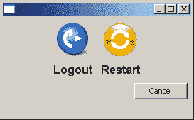

# 使用 Python 重启电脑

> 原文：<https://www.blog.pythonlibrary.org/2010/03/27/restarting-pcs-with-python/>

你有没有想过重新启动你的 Windows 电脑没有按下开始，关机或 CTRL+ALT+DEL？重启你讨厌的同事的电脑怎么样...就是那个不知道什么时候该闭嘴的人？Python 给出了答案，这个博客将告诉你如何去做！注意:我并不建议你随意重启邻居的电脑...

## 使用 PyWin32 重新启动

无论如何，当我第一次学习 Python 时，我偶然发现了一个关于如何做到这一点的 ActiveState 方法。当然，现在我似乎找不到那个配方了，但是我在这里找到了一个相似的:http://code.activestate.com/recipes/360649/.因此，我们将首先从这个方法开始，然后看一个稍微不同的方法。如果你想跟着做，那么你需要确保你有 [PyWin32 包](http://sourceforge.net/projects/pywin32/files/)。

这是我从我模糊的过去得到的食谱:

```py

# rebootServer.py

import win32security
import win32api
import sys
import time
from ntsecuritycon import *

def AdjustPrivilege(priv, enable=1):
    # Get the process token
    flags = TOKEN_ADJUST_PRIVILEGES | TOKEN_QUERY
    htoken = win32security.OpenProcessToken(win32api.GetCurrentProcess(), flags)
    # Get the ID for the system shutdown privilege.
    idd = win32security.LookupPrivilegeValue(None, priv)
    # Now obtain the privilege for this process.
    # Create a list of the privileges to be added.
    if enable:
        newPrivileges = [(idd, SE_PRIVILEGE_ENABLED)]
    else:
        newPrivileges = [(idd, 0)]
    # and make the adjustment
    win32security.AdjustTokenPrivileges(htoken, 0, newPrivileges)

def RebootServer(message='Rebooting', timeout=30, bForce=0, bReboot=1):
    AdjustPrivilege(SE_SHUTDOWN_NAME)
    try:
        win32api.InitiateSystemShutdown(None, message, timeout, bForce, bReboot)
    finally:
        # Now we remove the privilege we just added.
        AdjustPrivilege(SE_SHUTDOWN_NAME, 0)

def AbortReboot():
    AdjustPrivilege(SE_SHUTDOWN_NAME)
    try:
        win32api.AbortSystemShotdown(None)
    finally:
        AdjustPrivilege(SE_SHUTDOWN_NAME, 0)

if __name__ == '__main__':
    RebootServer()
    time.sleep(10)
    print 'Aborting shutdown'
    AbortReboot()

```

在这个代码片段中，我实际上去掉了重启远程机器的功能，因为我不想这么做。如果要重新启动网络上的计算机，请更改以下行:

```py

win32api.InitiateSystemShutdown(None, message, timeout, bForce, bReboot)

```

到

```py

win32api.InitiateSystemShutdown("someMachineName", message, timeout, bForce, bReboot)

```

或者只需向 *RebootServer* 函数添加一个主机参数，并根据需要修改 InitiateSystemShutdown。如果你只是传递 *None* 进去，那么你只是重新启动你自己的机器。 *AdjustPrivilege* 方法用于改变进程的特权，这样它就可以关闭电脑。我认为这只适用于你作为一个拥有有限权限的用户运行脚本的情况，但是我几乎从来没有这样运行过，所以我不能确定。我记得菜谱上说您需要删除您添加的特权，这就是 *finally* 语句的作用。然而，我认为一旦重启完成，这些特权无论如何都会被取消。

## 用普通的 Python 重启

启动关机的另一种方法是学习 Windows 命令行的魔力。有一个关机命令，你可以把你的运行对话框(进入开始->运行)，这将重新启动你的电脑。这里有一个我说的:shutdown -r -t 1 *注意这只会重启本地机器！*

现在我们只需要弄清楚如何让 Python 为我们调用它。可能最简单的方法是导入 *os* 模块并调用它的*系统*方法。让我们来看看:

```py

import os
os.system("shutdown -r -t 1")

```

这比 PyWin32 方法短得多，但我不知道它是否同样健壮。我在一个快速而肮脏的 wxPython 应用程序中使用了这个方法，这个应用程序是我为工作中的 Sun Ray 虚拟机创建的。Sun Ray 系统的最大问题之一是用户使用远程桌面连接到他们的虚拟机。远程桌面的一部分是隐藏关机按钮，所以用户没有简单的方法来重新启动他们的电脑，除非他们安装了某种修复程序。有时候重启机器是一件好事，所以我将上面的脚本放入下面的应用程序中:

[](https://www.blog.pythonlibrary.org/wp-content/uploads/2010/03/restarter.png)

```py

import os
import wx
from wx.lib.buttons import GenBitmapButton

########################################################################
class RestarterPanel(wx.Panel):
    """"""

    #----------------------------------------------------------------------
    def __init__(self, parent):
        """Constructor"""
        wx.Panel.__init__(self, parent=parent)

        img = wx.Bitmap("cute-logoff.png")
        logoutBtn = GenBitmapButton(self, wx.ID_ANY, img, style=wx.BORDER_NONE)
        logoutBtn.Bind(wx.EVT_BUTTON, self.onLogout)

        img = wx.Bitmap("quick_restart.png")
        restartBtn = GenBitmapButton(self, wx.ID_ANY, img, style=wx.BORDER_NONE)
        restartBtn.Bind(wx.EVT_BUTTON, self.onRestart)

        cancelBtn = wx.Button(self, label="Cancel")
        cancelBtn.Bind(wx.EVT_BUTTON, self.onCancel)

        vSizer = wx.BoxSizer(wx.VERTICAL)
        sizer = wx.BoxSizer(wx.HORIZONTAL)
        sizer.Add(self.buttonBuilder("Logout", logoutBtn), 0, wx.CENTER)
        sizer.Add(self.buttonBuilder("Restart", restartBtn), 0, wx.CENTER)
        vSizer.Add(sizer, 0, wx.CENTER)
        vSizer.Add(cancelBtn, 0, wx.ALIGN_RIGHT|wx.ALL, 5)
        self.SetSizer(vSizer)

    #----------------------------------------------------------------------
    def buttonBuilder(self, label, button):
        """
        Creates a button with a label underneath it and puts them into
        a vertical BoxSizer, which is then returned
        """
        font = wx.Font(12, wx.SWISS, wx.NORMAL, wx.BOLD)
        sizer = wx.BoxSizer(wx.VERTICAL)
        sizer.Add(button, 0, wx.ALL, 3)

        lbl = wx.StaticText(self, label=label)
        lbl.SetFont(font)
        sizer.Add(lbl, 0, wx.CENTER|wx.BOTTOM, 4)

        return sizer

    #----------------------------------------------------------------------
    def onCancel(self, event):
        """
        Close the dialog
        """
        self.GetParent().Close()

    #----------------------------------------------------------------------
    def onLogout(self, event):
        """
        Logs the current user out
        """
        os.system("shutdown -t 0 -l")

    #----------------------------------------------------------------------
    def onRestart(self, event):
        """
        Restarts the PC
        """
        os.system("shutdown -r -t 1")

########################################################################
class RestarterFrame(wx.Frame):
    """"""

    #----------------------------------------------------------------------
    def __init__(self):
        """Constructor"""
        wx.Frame.__init__(self, None, size=(273, 169))
        panel = RestarterPanel(self)
        self.Center()

########################################################################
class Main(wx.App):
    """"""

    #----------------------------------------------------------------------
    def __init__(self, redirect=False, filename=None):
        """Constructor"""
        wx.App.__init__(self, redirect, filename)
        dlg = RestarterFrame()
        dlg.Show()

#----------------------------------------------------------------------
if __name__ == "__main__":
    app = Main()
    app.MainLoop()

```

我看了这个项目的很多图标，我想我最后只是搜索了一下[关机](http://commons.wikimedia.org/wiki/File:Quick_restart.png)和[注销](http://www.iconfinder.net/icondetails/32136/128/?q=cute)图标，然后下载了我最喜欢的图标。这两个都是免费的或者有知识共享许可。

现在您知道了重启本地和远程机器的技巧。明智地使用这些知识！