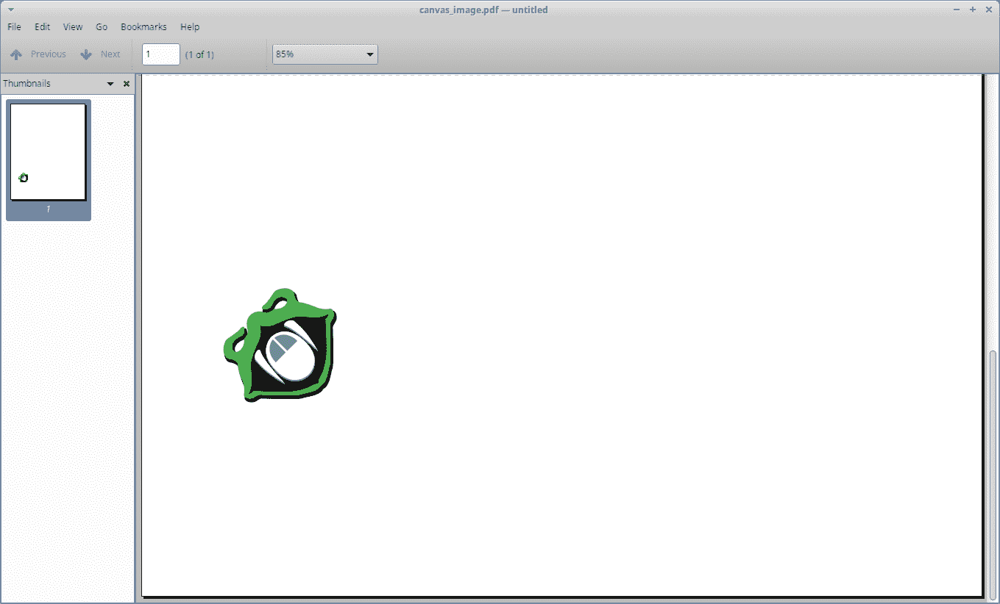
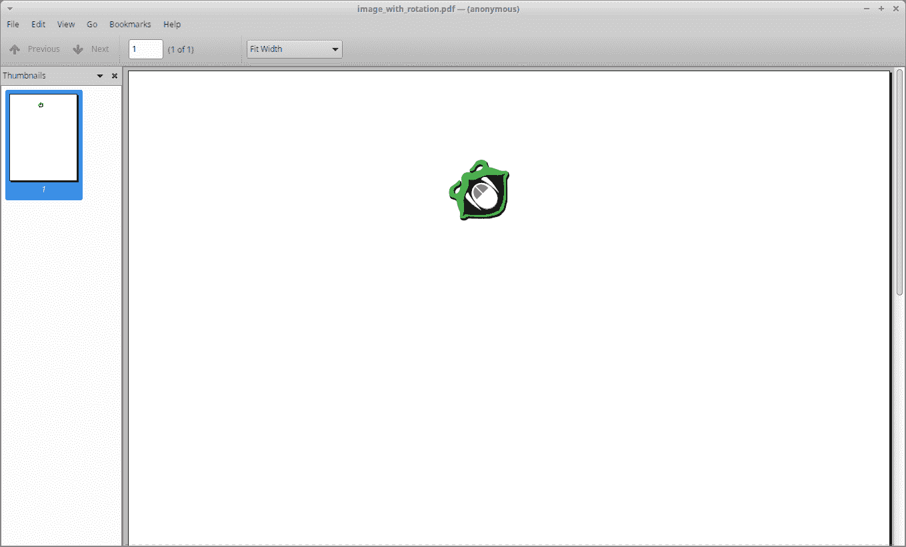

# 在 ReportLab 中旋转图像

> 原文：<https://www.blog.pythonlibrary.org/2019/09/05/rotating-images-in-reportlab/>

创建 PDF 时，有时您希望旋转 ReportLab 中的图像或其他对象。例如，出于水印目的，您可能想要将图像旋转 45 度。或者您可能需要一个沿 PDF 的一个边缘垂直排列的图像。

你可以通过使用 ReportLab 的 **canvas** 方法或者使用你可以在 **platypus** 中找到的更高级的 Flowables 来旋转图像。模块。让我们先来看看如何直接用画布来做这件事！

* * *

### 使用画布旋转图像

使用画布旋转图像有点令人困惑。原因是当你旋转画布时，如果不小心的话，你可能会无意中旋转画布上的其他元素。

我们来看看代码:

```py

# image_on_canvas.py

from reportlab.lib import utils
from reportlab.lib.pagesizes import letter
from reportlab.pdfgen import canvas

def add_image(image_path):
    img = utils.ImageReader(image_path)
    img_width, img_height = img.getSize()
    aspect = img_height / float(img_width)

    my_canvas = canvas.Canvas("canvas_image.pdf",
                              pagesize=letter)
    my_canvas.saveState()
    my_canvas.rotate(45)
    my_canvas.drawImage(image_path, 150, 10,
                        width=100, height=(100 * aspect))
    my_canvas.restoreState()
    my_canvas.save()

if __name__ == '__main__':
    image_path = 'snakehead.jpg'
    add_image(image_path)

```

这里使用 ReportLab 的 **utils** 函数提取图像的宽度和高度。然后创建画布并保存其当前状态。这将允许您从现在开始修改画布，然后在以后恢复它。如果你想在旋转后的图像前有一些文本或形状，你可以把代码放在调用 **saveState()** 之前。

保存画布状态后，可以使用画布的 **rotate()** 方法将画布旋转 45 度。然后你把图像画到画布上。最后，使用 **restoreState()** 将状态恢复到旋转前的状态。

*注意:当旋转画布时，x/y 位置现在是 45 度角，所以你在画布上定位图像时必须考虑到这一点。*

当我运行这段代码时，我得到了一个如下所示的文档:



你也可以在这里下载 PDF [。](https://www.blog.pythonlibrary.org/wp-content/uploads/2019/09/canvas_image.pdf)

现在让我们来看看如何做同样的事情使用流动！

* * *

### 使用可流动图像旋转图像

Flowables 是 ReportLab 中的对象，来自它们的 platypus 模块，代表使用脚本的页面布局和排版。这个模块基本上是 canvas 方法的一个高级接口，它抽象了绘图位，使得创建多页文档更加简单。

在 ReportLab 中使用可流动对象创建旋转图像的最快方法是创建**图像**可流动对象的子类。我们来看看吧！

```py

from reportlab.lib.pagesizes import letter
from reportlab.platypus import Image, SimpleDocTemplate

class RotatedImage(Image):

    def wrap(self, availWidth, availHeight):
        height, width = Image.wrap(self, availHeight, availWidth)
        return width, height

    def draw(self):
        self.canv.rotate(45)
        Image.draw(self)

doc = SimpleDocTemplate("image_with_rotation.pdf", pagesize=letter)
flowables = []

img = RotatedImage('snakehead.jpg',
                   width=50, height=50
                   )
img.hAlign = 'CENTER'
flowables.append(img)
doc.build(flowables)

```

在这里，您子类化 Image 并覆盖 **wrap()** 和 **draw()** 方法。你将关心的主要部分是在 draw()方法中，在那里你调用 **self.canv.rotate(45)** 。Image 类有自己的画布，您可以对其进行操作。在这种情况下，您告诉它您希望总是以 45 度角绘制图像。

接下来创建一个文档模板，并创建一个 **RotatedImage** 的实例。然后你告诉图像在页面上居中。最后你**建立()**文档。

当您运行此代码时，您应该看到以下内容:



如果你想看文件，你可以在这里得到实际的 PDF 文件。

* * *

### 包扎

现在您知道如何使用 ReportLab 旋转图像了。您学习了如何使用低级画布方法旋转图像，还学习了如何旋转可流动的图像。您也可以使用这些知识来旋转其他类型的对象。例如，您可以使用相同的方法旋转文本和形状。你总是要旋转画布来获得所需的效果。开心快乐编码！

| [](https://leanpub.com/reportlab) | 想了解更多关于使用 Python 处理 pdf 的信息吗？然后看看我的书:

### ReportLab:使用 Python 处理 PDF

**[在 Leanpub](https://leanpub.com/reportlab) 上立即购买** |

* * *

### 相关阅读

*   简单的分步指南[报告实验室教程](https://www.blog.pythonlibrary.org/2010/03/08/a-simple-step-by-step-reportlab-tutorial/)
*   使用 Python 在 [ReportLab 中创建交互式 PDF 表单](https://www.blog.pythonlibrary.org/2018/05/29/creating-interactive-pdf-forms-in-reportlab-with-python/)
*   ReportLab: [使用 Python 向 PDF 添加图表](https://www.blog.pythonlibrary.org/2019/04/08/reportlab-adding-a-chart-to-a-pdf-with-python/)