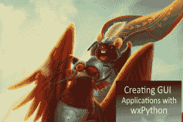

# 《创建 wxPython 应用程序》一书中的示例章节

> 原文：<https://www.blog.pythonlibrary.org/2019/01/22/sample-chapters-from-creating-wxpython-applications-book/>

我的新书在 Kickstarter 上的宣传活动进行得很顺利，所以我想和你分享这本书的一些章节会很有趣。你可以在这里查看《T2》的前几章 PDF 格式。

我也一直在做一些实验，关于 Kickstarter 的[延伸目标](https://www.kickstarter.com/projects/34257246/create-gui-applications-with-python-wxpython/posts/2388960)的书中其他章节给出的一些想法。我还没有做出任何具体的决定，但我确实认为与美国宇航局网站的 API 互动听起来很有趣，似乎也很容易做到。

我也会研究其他想法的可行性。

非常感谢你的支持！