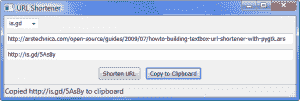

# 使用 wxPython 缩短 URL

> 原文：<https://www.blog.pythonlibrary.org/2009/12/24/shortening-urls-with-wxpython/>

今年夏天，我在 Ars Technica 上偶然发现了一篇关于使用 PyGTK 创建 URL 缩短器的文章。我认为这很有趣，但是我不使用 PyGTK。所以在那时，我决定使用 wxPython 编写自己的代码，并使用本文的代码来缩短代码。我很快拼凑了一些东西，然后把这篇文章放在一边，有点忘记了。今天，我决定继续完成它，并创建一个应用程序，可以使用其他流行的网址缩短程序来缩短网址。

## apink ars

首先，我将向你展示我的原始程序，它基本上是模仿 Ars Technica 的。

[](https://www.blog.pythonlibrary.org/wp-content/uploads/2009/12/wxArsShortener.png)

```py

import re
import urllib
import urllib2
import wx

class ArsShortener(wx.Frame):

    #----------------------------------------------------------------------
    def __init__(self):
        wx.Frame.__init__(self, None, wx.ID_ANY, 
                          'wxArsShortner', size=(300,70))

        # Add a panel so it looks the correct on all platforms
        panel = wx.Panel(self, wx.ID_ANY)

        self.txt = wx.TextCtrl(panel, wx.ID_ANY, "", size=(300, -1))
        self.txt.Bind(wx.EVT_TEXT, self.onTextChange)

        sizer = wx.BoxSizer(wx.VERTICAL)
        sizer.Add(self.txt, 0, wx.EXPAND, 5)
        panel.SetSizer(sizer)

    #----------------------------------------------------------------------
    def onTextChange(self, event):
        """"""
        text = self.txt.GetValue()
        textLength = len(text)
        if re.match("^https?://[^ ]+", text) and textLength > 20:
            apiurl = "http://is.gd/api.php?" + urllib.urlencode(dict(longurl=text))
            shorturl = urllib2.urlopen(apiurl).read() 
            self.txt.SetValue(shorturl)

if __name__ == '__main__':
    app = wx.PySimpleApp()
    frame = ArsShortener()
    frame.Show()
    app.MainLoop()

```

正如您所看到的，几乎一半的代码与 wxPython 相关，而另一半来自 Ars 文章。首先，我们导入 Python 正则表达式模块 re，用于验证目的。它检查粘贴的 URL 以确保它是 URL 的正确格式，而不仅仅是垃圾(参见 onTextChange 方法)。urllib 模块用于访问 [is.gd](http://is.gd) 网站，并向其传递我们想要缩短的 URL。一旦我们得到结果，我们调用文本控件的 SetValue 方法向用户显示它。条件语句还检查 URL 的长度是否足够长，以保证缩短它。

你会注意到我有三行注释掉了。我这样做是为了让应用程序可以调整大小，并让文本控件随着框架一起增长，但后来认为这可能是蹩脚的。因此，我将其注释掉。然而，我想你，亲爱的读者，可能会发现知道如何做到这一点是有用的。

## 缩短其他网站的 URL

[](https://www.blog.pythonlibrary.org/wp-content/uploads/2009/12/urlShortener.png)

现在我们来看看我的扩展示例。它可以使用 is.gd、bit.ly 或古老的 tinyurl 来缩短 url。对于本文的这一部分，除了 wx 之外，您还需要以下模块:

*   [Opie 的 bitly.py](http://opie4624.github.com/bitly.py/)
*   [TinyUrl 0.1.0+](http://pypi.python.org/pypi/TinyUrl/0.1.0)

我确信这些网站也有使用 urllib 模块的方法，但是我想看看这些第三方模块是否简化了事情。请注意，如果你想使用 bit.ly，他们要求你注册一个 API 密匙。我不会公布我的，但我会告诉你如何在我的程序中使用它。所以，事不宜迟，继续表演吧:

```py

import re
import urllib
import urllib2
import wx

bitlyFlag = True
tinyurlFlag = True

try:
    import bitly
except ImportError:
    bitlyFlag = False

try:
    import tinyurl
except ImportError:
    tinyurlFlag = False

########################################################################
class MainPanel(wx.Panel):
    """
    """

    #----------------------------------------------------------------------
    def __init__(self, parent):
        """Constructor"""
        wx.Panel.__init__(self, parent=parent, id=wx.ID_ANY)
        self.frame = parent

        # create the widgets
        self.createLayout()

    #----------------------------------------------------------------------
    def createLayout(self):
        """
        Create widgets and lay them out
        """
        choices = ["is.gd"]
        if bitlyFlag:
            choices.append("bit.ly")
        if tinyurlFlag:
            choices.append("tinyurl")
        choices.sort()

        # create the widgets
        self.urlCbo = wx.ComboBox(self, wx.ID_ANY, "is.gd", 
                                  choices=choices,
                                  size=wx.DefaultSize,
                                  style=wx.CB_DROPDOWN)
        self.inputUrlTxt = wx.TextCtrl(self, value="Paste long url here")
        self.inputUrlTxt.Bind(wx.EVT_SET_FOCUS, self.onFocus)
        self.outputUrlTxt = wx.TextCtrl(self, style=wx.TE_READONLY)

        shortenBtn = wx.Button(self, label="Shorten URL")
        shortenBtn.Bind(wx.EVT_BUTTON, self.onShorten)
        copyBtn = wx.Button(self, label="Copy to Clipboard")
        copyBtn.Bind(wx.EVT_BUTTON, self.onCopy)

        # create the sizers
        mainSizer = wx.BoxSizer(wx.VERTICAL)
        btnSizer = wx.BoxSizer(wx.HORIZONTAL)

        # layout the widgets
        mainSizer.Add(self.urlCbo, 0, wx.ALL, 5)
        mainSizer.Add(self.inputUrlTxt, 0, 
                      wx.ALL|wx.EXPAND, 5)
        mainSizer.Add(self.outputUrlTxt, 0, 
                      wx.ALL|wx.EXPAND, 5)
        btnSizer.Add(shortenBtn, 0, wx.ALL|wx.CENTER, 5)
        btnSizer.Add(copyBtn, 0, wx.ALL|wx.CENTER, 5)
        mainSizer.Add(btnSizer, 0, wx.ALL|wx.CENTER, 5)
        self.SetSizer(mainSizer)

    #----------------------------------------------------------------------
    def onCopy(self, event):
        """
        Copies data to the clipboard or displays an error
        dialog if the clipboard is inaccessible.
        """
        text = self.outputUrlTxt.GetValue()
        self.do = wx.TextDataObject()
        self.do.SetText(text)
        if wx.TheClipboard.Open():
            wx.TheClipboard.SetData(self.do)
            wx.TheClipboard.Close()
            status = "Copied %s to clipboard" % text
            self.frame.statusbar.SetStatusText(status)
        else:
            wx.MessageBox("Unable to open the clipboard", "Error")

    #----------------------------------------------------------------------
    def onFocus(self, event):
        """
        When control is given the focus, it is cleared
        """
        self.inputUrlTxt.SetValue("")

    #----------------------------------------------------------------------
    def onShorten(self, event):
        """
        Shortens a url using the service specified.
        Then sets the text control to the new url.
        """
        text = self.inputUrlTxt.GetValue()
        textLength = len(text)

        if re.match("^https?://[^ ]+", text) and textLength > 20:
            pass
        else:
            wx.MessageBox("URL is already tiny!", "Error")
            return

        url = self.urlCbo.GetValue()
        if url == "is.gd":
            self.shortenWithIsGd(text)
        elif url == "bit.ly":
            self.shortenWithBitly(text)
        elif url == "tinyurl":
            self.shortenWithTinyurl(text)

    #----------------------------------------------------------------------
    def shortenWithBitly(self, text):
        """
        Shortens the URL in the text control using bit.ly

        Requires a bit.ly account and API key
        """
        bitly.API_LOGIN = "username"
        bitly.API_KEY = "api_key"
        url = bitly.shorten(text)
        self.outputUrlTxt.SetValue(url)

    #----------------------------------------------------------------------
    def shortenWithIsGd(self, text):
        """
        Shortens the URL with is.gd using urllib and urllib2
        """

        apiurl = "http://is.gd/api.php?" + urllib.urlencode(dict(longurl=text))
        shorturl = urllib2.urlopen(apiurl).read() 
        self.outputUrlTxt.SetValue(shorturl)

    #----------------------------------------------------------------------
    def shortenWithTinyurl(self, text):
        """
        Shortens the URL with tinyurl
        """
        print "in tinyurl"
        url = tinyurl.create_one(text)
        self.outputUrlTxt.SetValue(url)

########################################################################
class UrlFrame(wx.Frame):
    """
    wx.Frame class
    """
    #----------------------------------------------------------------------
    def __init__(self):
        """Constructor"""
        title = "URL Shortener"
        wx.Frame.__init__(self, None, wx.ID_ANY, 
                          title=title, size=(650, 220))
        panel = MainPanel(self)
        self.statusbar = self.CreateStatusBar()
        self.SetMinSize((650, 220))       

#----------------------------------------------------------------------
if __name__ == "__main__":
    app = wx.PySimpleApp()
    frame = UrlFrame()
    frame.Show()
    app.MainLoop()

```

这段代码比我的简单示例要长得多，但是它内置了更多的逻辑。我马上实现了一些异常处理，以防程序员没有安装 bitly 或 tinyurl 模块。如果没有，则设置一个标志，防止添加这些选项。您将在 MainPanel 类的 *createLayout* 方法中看到这一点。这就是我们将选项添加到组合框将使用的*选择*列表的地方。根据您安装的内容，您会在下拉列表中看到一到三个选项。

下一个有趣的地方是输入 url 文本控件绑定到焦点事件的地方。当我们粘贴一个 url 到文本控件中时，我们用它来清除文本控件。还要注意，输出文本控件被设置为只读模式。这可以防止用户弄乱新的 url。最后，我们到达最后两个部件:缩短 URL 的按钮和复制到剪贴板的按钮。

让我们快速看一下 onCopy 方法中发生了什么，因为它是下一个:

```py

def onCopy(self, event):
    """
    Copies data to the clipboard or displays an error
    dialog if the clipboard is inaccessible.
    """
    text = self.outputUrlTxt.GetValue()
    self.do = wx.TextDataObject()
    self.do.SetText(text)
    if wx.TheClipboard.Open():
        wx.TheClipboard.SetData(self.do)
        wx.TheClipboard.Close()
        status = "Copied %s to clipboard" % text
        self.frame.statusbar.SetStatusText(status)
    else:
        wx.MessageBox("Unable to open the clipboard", "Error")

```

如您所见，这从输入文本控件中获取了当前文本，并从中创建了一个 TextDataObject。然后我们尝试打开剪贴板，如果成功，我们使用剪贴板的 SetData 方法将 TextDataObject 放入其中。最后，我们通过改变框架的状态栏文本来提醒用户我们做了什么。

在 onShorten 方法中，我重用了 Ars 程序中的正则表达式来检查用户是否粘贴了有效的 url，我们还检查了 url 的长度，看它是否真的需要缩短。我们从 combobox 中获取 shortener url 类型，然后使用一个条件将我们想要缩短的 url 传递给适当的缩短方法。 *shortenWithIsGd* 方法与第一个例子基本相同，所以我们将跳过这个例子。 *shortenWithBitly* 方法显示我们需要设置 LOGIN 和 API_KEY 属性，然后才能缩短 url。一旦我们完成了，我们就调用 bitly 的*缩短*方法。在 *shortenWithTinyurl* 方法中，它甚至更简单:您在这里需要做的就是调用 Tinyurl 的 *create_one* 方法。

## 包扎

现在你知道了通过几种方法来缩短你的长 URL 的基础。您可以随意添加自己的特性或其他缩短 API 来改进您自己使用的应用程序。注意，还有另一个 Python [小模块](http://code.google.com/p/python-bitly/)。虽然它的主页上说它需要的只是 simplejson 模块，但是如果你真的试图使用这个模块，如果你没有安装 [django](http://www.djangoproject.com/) ，你会收到一个错误。他们似乎意识到了这个问题，但出于这个原因，我选择使用 Opie 的 bitly 模块。祝编码愉快！

*注意:这段代码是在 Windows Vista 上使用带有 Python 2.5 的 wxPython 2.8.10.1(unicode)进行测试的。*

## 下载

*   [shortening.tar](https://www.blog.pythonlibrary.org/wp-content/uploads/2009/12/shortening.tar)
*   [shortening.zip](https://www.blog.pythonlibrary.org/wp-content/uploads/2009/12/shortening.zip)