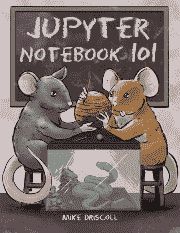

# 夏季 Python 图书销售

> 原文：<https://www.blog.pythonlibrary.org/2019/07/30/summer-python-book-sale/>

夏天到了，现在是学习 Python 的好时机！为此，我将在下周举办一场我的 Python 书籍的销售活动。销售将于 8 月 6 日结束。所有的书在 Leanpub 上都是 9.99-14.99 美元！

* * *

### 用 wxPython 创建 GUI 应用程序

用 wxPython 创建 GUI 应用程序是我最近的一本书。在这篇文章中，您将学习如何使用 wxPython 创建跨平台的桌面应用程序。使用此[链接](http://leanpub.com/creatingapplicationswithwxpython/c/summer19)或点击上面的图片获得折扣。

* * *

### Jupyter 笔记型电脑 101

Jupyter Notebook 是一个很好的教学工具，也是使用和学习 Python 和数据科学的有趣方式。我写了一本关于这个主题的很好的入门书，叫做《Jupyter 笔记本 101 。

* * *

### 使用 Python 处理 ReportLab - PDF

用 Python 创建和操作 pdf 很有趣！在[使用 Python 的 ReportLab - PDF 处理](http://leanpub.com/reportlab/c/summer19)中，您将了解如何使用 ReportLab 包创建 PDF。您还将学习如何使用 PyPDF2 和 pdfrw 以及其他一些方便的 PDF 相关 Python 包来操作预先存在的 PDF。

* * *

### Python 201:中级 Python

[Python 201:中级 Python](http://leanpub.com/python201/c/summer19) 是我的第一本书 [Python 101](https://python101.pythonlibrary.org/) 的续集，向读者讲授 Python 中的中级到高级主题。