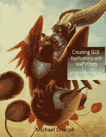

# 创建 GUI 应用程序手册目录

> 原文：<https://www.blog.pythonlibrary.org/2019/02/04/table-of-contents-for-creating-gui-applications-book/>

我们进入了 Kickstarter 的最后一周，我想我应该给大家一个快速更新。我今天写完了关于制造计算器的一章，开始看第 7 章。

我还想让你知道现在的目录是什么样的:

*   第 1 章 wxPython 简介
*   第 2 章-创建图像查看器
*   第 3 章-增强图像查看器
*   第 4 章-创建数据库查看器
*   第 5 章-使用 wxPython 编辑数据库
*   第 6 章-计算器
*   第 7 章-归档程序(tarball 创建实用程序)
*   第 8 章 MP3 标签编辑器
*   第 9 章 XML 编辑器
*   第 10 章 NASA 图像下载/搜索工具
*   第 11 章 PDF 合并器/分割器

还有一章是关于为你的应用程序创建可执行文件和安装程序的，还有几个附录。

非常感谢你的支持！

迈克