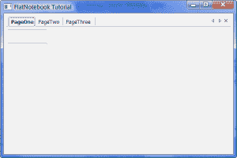
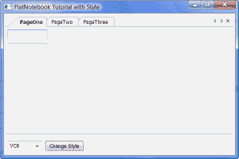
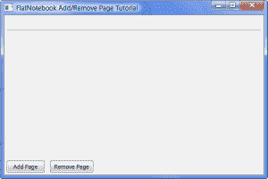
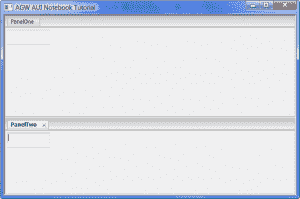

# wxPython 的“Book”控件(第 2 部分，共 2 部分)

> 原文：<https://www.blog.pythonlibrary.org/2009/12/09/the-%e2%80%9cbook%e2%80%9d-controls-of-wxpython-part-2-of-2/>

在本系列的第一部分中，我写了 wxPython 包含的所有非 agw 笔记本小部件。在第二篇文章中，我将关注 wxPython 的 AGW 图书馆中的两个笔记本。AGW 代表高级通用小部件，一组用 Python 而不是包装的 C++代码编写的小部件。我个人认为《AGW》也是对其杰出作者[安德里亚·加瓦那](http://thedoomedcity.blogspot.com/)的回拨。无论如何，这篇评论中的两个小部件将是平板笔记本和另一个 AUI 笔记本。FlatNotebook 有一个很棒的演示，我将在这篇文章的大部分时间里讲述我基于它创建的演示。aui 笔记本是 agw.aui 的一部分。虽然 agw.aui 的演示很酷，但它主要关注的是 AUI，而不是笔记本。所以我会向你们展示我能从中收集到的信息。现在，让我们开始吧！

更新:当涉及到 AGW 相关的小工具时，API 略有变化。基本上 wxPython 2.8.11.0+中的一些样式标志现在需要特定于 agw 的样式标志。要使用它们，您需要使用 agwStyle 关键字。查看安德里亚的文档了解更多信息:[http://xoomer.virgilio.it/infinity77/AGW_Docs/](http://xoomer.virgilio.it/infinity77/AGW_Docs/)如果你遇到了错误，尝试先更改或发送到邮件列表。

## 令人惊叹的平板笔记本

Flatbook 控件是用 Python 编写的，而不是来自 wxWidgets 的包装小部件。随着 2009 年 2 月 16 日 wxPython 2.8.9.2 的发布，它被添加到了 wxPython 中。从那以后，Andrea Gavana 一直在更新 agw 库，进行了大量的修复。我的例子将与 wxPython 的 2.8.9.2+版本一起工作，但是我建议获得 agw 的 [SVN 版本](http://svn.wxwidgets.org/svn/wx/wxPython/3rdParty/AGW/),并用它替换你的默认版本，因为已经有许多错误修复应用于 AUI 模块和其他几个模块。目前也在努力在代码中更好地记录这个库，所以你可能会发现这也很有帮助！

以下是平板笔记本的一些特性:

*   5 种不同的标签样式
*   这是一个通用控件(即纯 python ),所以很容易修改
*   您可以使用鼠标中键关闭选项卡
*   一个内置函数，用于在选项卡上添加右键弹出菜单
*   隐藏关闭单个选项卡的“X”的方法
*   支持禁用标签
*   还有更多！有关更多信息，请参阅源代码和 wxPython 演示！

现在我们已经完成了一个免费的广告，让我们来看看实际的产品:

[](https://www.blog.pythonlibrary.org/wp-content/uploads/2009/12/flatnotebookDemo.png)

**清单 1**

```py
import panelOne, panelTwo, panelThree
import wx
import wx.lib.agw.flatnotebook as fnb

########################################################################
class FlatNotebookDemo(fnb.FlatNotebook):
    """
    Flatnotebook class
    """

    #----------------------------------------------------------------------
    def __init__(self, parent):
        """Constructor"""
        fnb.FlatNotebook.__init__(self, parent, wx.ID_ANY)

        pageOne = panelOne.TabPanel(self)
        pageTwo = panelTwo.TabPanel(self)
        pageThree = panelThree.TabPanel(self)

        self.AddPage(pageOne, "PageOne")
        self.AddPage(pageTwo, "PageTwo")
        self.AddPage(pageThree, "PageThree")  

########################################################################
class DemoFrame(wx.Frame):
    """
    Frame that holds all other widgets
    """

    #----------------------------------------------------------------------
    def __init__(self):
        """Constructor"""        
        wx.Frame.__init__(self, None, wx.ID_ANY, 
                          "FlatNotebook Tutorial",
                          size=(600,400)
                          )
        panel = wx.Panel(self)

        notebook = FlatNotebookDemo(panel)
        sizer = wx.BoxSizer(wx.VERTICAL)
        sizer.Add(notebook, 1, wx.ALL|wx.EXPAND, 5)
        panel.SetSizer(sizer)
        self.Layout()

        self.Show()

#----------------------------------------------------------------------
if __name__ == "__main__":
    app = wx.PySimpleApp()
    frame = DemoFrame()
    app.MainLoop()

```

在清单 1 中，我子类化了 FlatNotebook，并为页面使用了我的前一篇文章中的通用面板。你会注意到，FlatNotebook 有自己的 AddPage 方法，它模仿了 wx.Notebook。这并不奇怪，因为 FlatNotebook 的 API 是这样的，你应该可以用它来替代 wx.Notebook。当然，开箱即用，FlatNotebook 就有优势。如果你运行上面的演示，你会看到 FlatNotebook 允许用户重新排列标签，关闭标签，它还包括一些上一页/下一页按钮，以防你的标签太多而无法一次显示在屏幕上。

现在让我们来看看可以应用于 FlatNotebook 的各种风格:

[](https://www.blog.pythonlibrary.org/wp-content/uploads/2009/12/flatnotebookStyleDemo.png)

**清单 2**

```py
import panelOne, panelTwo, panelThree
import wx
import wx.lib.agw.flatnotebook as fnb

########################################################################
class FlatNotebookDemo(fnb.FlatNotebook):
    """
    Flatnotebook class
    """

    #----------------------------------------------------------------------
    def __init__(self, parent):
        """Constructor"""
        fnb.FlatNotebook.__init__(self, parent, wx.ID_ANY)

        pageOne = panelOne.TabPanel(self)
        pageTwo = panelTwo.TabPanel(self)
        pageThree = panelThree.TabPanel(self)

        self.AddPage(pageOne, "PageOne")
        self.AddPage(pageTwo, "PageTwo")
        self.AddPage(pageThree, "PageThree")  

########################################################################
class DemoFrame(wx.Frame):
    """
    Frame that holds all other widgets
    """

    #----------------------------------------------------------------------
    def __init__(self):
        """Constructor"""        
        wx.Frame.__init__(self, None, wx.ID_ANY, 
                          "FlatNotebook Tutorial with Style",
                          size=(600,400)
                          )
        self.styleDict = {"Default":self.OnDefaultStyle,
                          "VC71":self.OnVC71Style,
                          "VC8":self.OnVC8Style,
                          "Fancy":self.OnFancyStyle,
                          "Firefox 2":self.OnFF2Style}
        choices = self.styleDict.keys()

        panel = wx.Panel(self)        
        self.notebook = FlatNotebookDemo(panel)
        self.styleCbo = wx.ComboBox(panel, wx.ID_ANY, "Default",
                                    wx.DefaultPosition, wx.DefaultSize,
                                    choices=choices, style=wx.CB_DROPDOWN)
        styleBtn = wx.Button(panel, wx.ID_ANY, "Change Style")
        styleBtn.Bind(wx.EVT_BUTTON, self.onStyle)

        # create some sizers
        sizer = wx.BoxSizer(wx.VERTICAL)
        hSizer = wx.BoxSizer(wx.HORIZONTAL)

        # add the widgets to the sizers
        sizer.Add(self.notebook, 1, wx.ALL|wx.EXPAND, 5)
        hSizer.Add(self.styleCbo, 0, wx.ALL|wx.CENTER, 5)
        hSizer.Add(styleBtn, 0, wx.ALL, 5)
        sizer.Add(wx.StaticLine(panel), 0, wx.ALL|wx.EXPAND, 5)
        sizer.Add(hSizer, 0, wx.ALL, 5)

        panel.SetSizer(sizer)
        self.Layout()

        self.Show()

    #----------------------------------------------------------------------
    def onStyle(self, event):
        """
        Changes the style of the tabs
        """
        print "in onStyle"
        style = self.styleCbo.GetValue()
        print style
        self.styleDict[style]()           

    # The following methods were taken from the wxPython 
    # demo for the FlatNotebook
    def OnFF2Style(self):

        style = self.notebook.GetWindowStyleFlag()

        # remove old tabs style
        mirror = ~(fnb.FNB_VC71 | fnb.FNB_VC8 | fnb.FNB_FANCY_TABS | fnb.FNB_FF2)
        style &= mirror

        style |= fnb.FNB_FF2

        self.notebook.SetWindowStyleFlag(style)

    def OnVC71Style(self):

        style = self.notebook.GetWindowStyleFlag()

        # remove old tabs style
        mirror = ~(fnb.FNB_VC71 | fnb.FNB_VC8 | fnb.FNB_FANCY_TABS | fnb.FNB_FF2)
        style &= mirror

        style |= fnb.FNB_VC71

        self.notebook.SetWindowStyleFlag(style)

    def OnVC8Style(self):

        style = self.notebook.GetWindowStyleFlag()

        # remove old tabs style
        mirror = ~(fnb.FNB_VC71 | fnb.FNB_VC8 | fnb.FNB_FANCY_TABS | fnb.FNB_FF2)
        style &= mirror

        # set new style
        style |= fnb.FNB_VC8

        self.notebook.SetWindowStyleFlag(style)

    def OnDefaultStyle(self):

        style = self.notebook.GetWindowStyleFlag()

        # remove old tabs style
        mirror = ~(fnb.FNB_VC71 | fnb.FNB_VC8 | fnb.FNB_FANCY_TABS | fnb.FNB_FF2)
        style &= mirror

        self.notebook.SetWindowStyleFlag(style)

    def OnFancyStyle(self):

        style = self.notebook.GetWindowStyleFlag()

        # remove old tabs style
        mirror = ~(fnb.FNB_VC71 | fnb.FNB_VC8 | fnb.FNB_FANCY_TABS | fnb.FNB_FF2)
        style &= mirror

        style |= fnb.FNB_FANCY_TABS
        self.notebook.SetWindowStyleFlag(style)

#----------------------------------------------------------------------
if __name__ == "__main__":
    app = wx.PySimpleApp()
    frame = DemoFrame()
    app.MainLoop()

```

对于一个“简单”的例子来说，这是很多代码，但我认为它将帮助我们理解如何将选项卡样式应用到我们的小部件。我借用了 wxPython 演示中的大多数方法，以防您没有注意到。这段代码的主要讨论点是这些方法的内容，它们大部分是相同的。以下是从本节中摘录的主要片段:

```py
style = self.notebook.GetWindowStyleFlag()

# remove old tabs style
mirror = ~(fnb.FNB_VC71 | fnb.FNB_VC8 | fnb.FNB_FANCY_TABS | fnb.FNB_FF2)
style &= mirror
style |= fnb.FNB_FF2
self.notebook.SetWindowStyleFlag(style)

```

首先，我们需要了解平板笔记本的当前风格。然后，我们在“镜像”行中使用一些奇特的魔法，创建一组我们想要删除的样式。“style &= mirror”这一行实际上是在删除，然后我们用“style |= fnb”添加我们想要的样式。FF2 FNB”。最后，我们使用 SetWindowStyleFlag()将样式实际应用到小部件。你可能想知道这些愚蠢的符号(如|、~、&)是怎么回事。这些被称为按位运算符。我自己不怎么使用它们，所以我推荐阅读 [Python 文档](http://docs.python.org/reference/expressions.html)以了解全部细节，因为我自己也不完全理解它们。

在我的下一个演示中，我创建了一个在 FlatNotebook 中添加和删除页面的方法。让我们看看如何:

[](https://www.blog.pythonlibrary.org/wp-content/uploads/2009/12/flatnotebookPageDemo.png)

**清单 3**

```py
import panelOne, panelTwo, panelThree
import random
import wx
import wx.lib.agw.flatnotebook as fnb

########################################################################
class FlatNotebookDemo(fnb.FlatNotebook):
    """
    Flatnotebook class
    """
    #----------------------------------------------------------------------
    def __init__(self, parent):
        """Constructor"""
        fnb.FlatNotebook.__init__(self, parent, wx.ID_ANY)

########################################################################
class DemoFrame(wx.Frame):
    """
    Frame that holds all other widgets
    """

    #----------------------------------------------------------------------
    def __init__(self, title="FlatNotebook Add/Remove Page Tutorial"):
        """Constructor"""        
        wx.Frame.__init__(self, None, wx.ID_ANY, 
                          title=title,
                          size=(600,400)
                          )
        self._newPageCounter = 0
        panel = wx.Panel(self)
        self.createRightClickMenu()

        # create some widgets
        self.notebook = FlatNotebookDemo(panel)
        addPageBtn = wx.Button(panel, label="Add Page")
        addPageBtn.Bind(wx.EVT_BUTTON, self.onAddPage)
        removePageBtn = wx.Button(panel, label="Remove Page")
        removePageBtn.Bind(wx.EVT_BUTTON, self.onDeletePage)
        self.notebook.SetRightClickMenu(self._rmenu)

        # create some sizers
        sizer = wx.BoxSizer(wx.VERTICAL)
        btnSizer = wx.BoxSizer(wx.HORIZONTAL)

        # layout the widgets
        sizer.Add(self.notebook, 1, wx.ALL|wx.EXPAND, 5)
        btnSizer.Add(addPageBtn, 0, wx.ALL, 5)
        btnSizer.Add(removePageBtn, 0, wx.ALL, 5)
        sizer.Add(btnSizer)
        panel.SetSizer(sizer)
        self.Layout()

        self.Show()

    #----------------------------------------------------------------------
    def createRightClickMenu(self):
        """
        Based on method from flatnotebook demo
        """
        self._rmenu = wx.Menu()
        item = wx.MenuItem(self._rmenu, wx.ID_ANY, 
                           "Close Tab\tCtrl+F4", 
                           "Close Tab")
        self.Bind(wx.EVT_MENU, self.onDeletePage, item)
        self._rmenu.AppendItem(item)

    #----------------------------------------------------------------------
    def onAddPage(self, event):
        """
        This method is based on the flatnotebook demo

        It adds a new page to the notebook
        """
        caption = "New Page Added #" + str(self._newPageCounter)
        self.Freeze()

        self.notebook.AddPage(self.createPage(caption), caption, True)
        self.Thaw()
        self._newPageCounter = self._newPageCounter + 1

    #----------------------------------------------------------------------
    def createPage(self, caption):
        """
        Creates a notebook page from one of three
        panels at random and returns the new page
        """
        panel_list = [panelOne, panelTwo, panelThree]
        obj = random.choice(panel_list)
        page = obj.TabPanel(self.notebook)
        return page

    #----------------------------------------------------------------------
    def onDeletePage(self, event):
        """
        This method is based on the flatnotebook demo

        It removes a page from the notebook
        """
        self.notebook.DeletePage(self.notebook.GetSelection())

#----------------------------------------------------------------------
if __name__ == "__main__":
    app = wx.PySimpleApp()
    frame = DemoFrame()
    app.MainLoop()

```

上面的代码允许用户通过单击 Add Page 按钮添加任意多的页面。“删除页面”按钮将删除当前选中的任何页面。添加页面时，button handler 冻结框架并调用笔记本的 AddPage 方法。这调用了“createPage”方法，该方法随机获取我的一个预定义面板，实例化它并将其返回给 AddPage 方法。在返回到“onAddPage”方法时，帧被解冻，并且页面计数器递增。

Remove Page 按钮调用笔记本的 GetSelection()方法获取当前选中的选项卡，然后调用笔记本的 DeletePage()方法将其从笔记本中删除。

我启用的另一个有趣的功能是选项卡右键菜单，它为我们提供了另一种关闭选项卡的方式，尽管您也可以使用它来执行其他操作。要启用它，您只需调用笔记本的 SetRightClickMenu()方法并传入一个 wx。菜单对象。

还有大量其他功能供您探索。请务必在官方的 wxPython 演示中查看 FlatNotebook 演示，在那里您可以学习使用鼠标中键或通过双击来关闭标签，打开标签背景的渐变颜色，禁用标签，启用智能跳转(有点像 Windows 中的 alt+tab 菜单)，在笔记本之间创建拖放标签等等！

## AGW·AUI 笔记本

[](https://www.blog.pythonlibrary.org/wp-content/uploads/2009/12/agwAuiNotebookDemo.png)

Andrea Gavana 不厌其烦地创建了一个纯 python 版本的高级用户界面(AUI ),它提供了透视保存、可停靠的浮动子窗口、可定制的外观和感觉以及可拆分的 AUI 笔记本。他的笔记本将是这一部分的重点。AGW·AUI 的笔记本有很多功能，但我只打算复习一些基本知识。如果你想看到所有的特性，请务必阅读代码并查看官方 [wxPython 演示](http://www.wxpython.org/download.php)中的演示。正如我在本教程开始时提到的，一定要从 SVN 下载 AUI (或整个 AGW)的[最新版本，以获得所有的错误修复。](http://svn.wxwidgets.org/svn/wx/wxPython/3rdParty/AGW/agw/ )

让我们来看看我在上面的截图中使用的简单例子:

**清单 4**

```py
#----------------------------------------------------------------------
# agwAUINotebook.py
#
# Created: December 2009
#
# Author: Mike Driscoll - mike@pythonlibrary.org
#
# Note: Some code comes from the wxPython demo
#
#----------------------------------------------------------------------

import wx
import wx.lib.agw.aui as aui 

########################################################################
class TabPanelOne(wx.Panel):
    """
    A simple wx.Panel class
    """
    #----------------------------------------------------------------------
    def __init__(self, parent):
        """"""
        wx.Panel.__init__(self, parent=parent, id=wx.ID_ANY)

        sizer = wx.BoxSizer(wx.VERTICAL)
        txtOne = wx.TextCtrl(self, wx.ID_ANY, "")
        txtTwo = wx.TextCtrl(self, wx.ID_ANY, "")

        sizer = wx.BoxSizer(wx.VERTICAL)
        sizer.Add(txtOne, 0, wx.ALL, 5)
        sizer.Add(txtTwo, 0, wx.ALL, 5)

        self.SetSizer(sizer)

########################################################################
class DemoFrame(wx.Frame):
    """
    wx.Frame class
    """

    #----------------------------------------------------------------------
    def __init__(self):
        wx.Frame.__init__(self, None, wx.ID_ANY, 
                          "AGW AUI Notebook Tutorial",
                          size=(600,400))

        self._mgr = aui.AuiManager()

        # tell AuiManager to manage this frame
        self._mgr.SetManagedWindow(self)

        notebook = aui.AuiNotebook(self)
        panelOne = TabPanelOne(notebook)
        panelTwo = TabPanelOne(notebook)

        notebook.AddPage(panelOne, "PanelOne", False)
        notebook.AddPage(panelTwo, "PanelTwo", False)

        self._mgr.AddPane(notebook, 
                          aui.AuiPaneInfo().Name("notebook_content").
                          CenterPane().PaneBorder(False)) 
        self._mgr.Update()
        #notebook.EnableTab(1, False)

 #----------------------------------------------------------------------
# Run the program
if __name__ == "__main__":
    app = wx.PySimpleApp()
    frame = DemoFrame()
    frame.Show()
    app.MainLoop()

```

这个笔记本和最初的 AuiNotebook 的第一个区别是它需要一个 AuiManager 对象。可能在原作背后也有类似的东西，但是我们不知道。无论如何，第一步是实例化 AuiManager，然后通过它的 SetManagedWindow()方法为它提供管理框架。现在我们可以添加 AUI 笔记本了。请注意，我们将框架作为笔记本的父对象传递，而不是 AuiManager。我认为原因是当 AuiManager 被赋予框架时，它就变成了顶级窗口。

等式的下一部分应该看起来很熟悉:AddPage()。让我们看看它接受什么:

```py
AddPage(self, page, caption, select=False, bitmap=wx.NullBitmap, disabled_bitmap=wx.NullBitmap, control=None)

```

在我的代码中，我只传入前三个参数，但是您也可以添加一些位图和一个 wx。控件的窗口。接下来的部分有点棘手。我们需要调用 AuiManager 的 AddPane()方法来告诉 AuiManager 我们希望它“管理”一些东西(在本例中是笔记本)。我们还传入了第二个看起来有点混乱的论点:

```py
aui.AuiPaneInfo().Name("notebook_content").CenterPane().PaneBorder(False)) 

```

该参数告诉 AuiManager 如何处理笔记本。在这种情况下，我们告诉它窗格(即笔记本)的名称是“notebook_content”，这是我们用来查找窗格的名称。我们还告诉 AuiManager，我们希望窗格处于居中的停靠位置，PaneBorder(False)命令告诉 AuiManager，我们希望在笔记本窗格周围绘制一个隐藏的边框。

我们的下一个例子将会更加复杂，它将向你展示如何改变一些笔记本的设置。

**清单 5**

```py
import panelOne, panelTwo, panelThree
import wx
import wx.lib.agw.aui as aui

ID_NotebookArtGloss = 0
ID_NotebookArtSimple = 1
ID_NotebookArtVC71 = 2
ID_NotebookArtFF2 = 3
ID_NotebookArtVC8 = 4
ID_NotebookArtChrome = 5

########################################################################
class AUIManager(aui.AuiManager):
    """
    AUI Manager class
    """

    #----------------------------------------------------------------------
    def __init__(self, managed_window):
        """Constructor"""
        aui.AuiManager.__init__(self)
        self.SetManagedWindow(managed_window)

########################################################################
class AUINotebook(aui.AuiNotebook):
    """
    AUI Notebook class
    """

    #----------------------------------------------------------------------
    def __init__(self, parent):
        """Constructor"""
        aui.AuiNotebook.__init__(self, parent=parent)
        self.default_style = aui.AUI_NB_DEFAULT_STYLE | aui.AUI_NB_TAB_EXTERNAL_MOVE | wx.NO_BORDER
        self.SetWindowStyleFlag(self.default_style)

        # add some pages to the notebook
        pages = [panelOne, panelTwo, panelThree]

        x = 1
        for page in pages:
            label = "Tab #%i" % x
            tab = page.TabPanel(self)
            self.AddPage(tab, label, False)
            x += 1

########################################################################
class DemoFrame(wx.Frame):
    """
    wx.Frame class
    """
    #----------------------------------------------------------------------
    def __init__(self):
        """Constructor"""
        title = "AGW AUI Notebook Feature Tutorial"
        wx.Frame.__init__(self, None, wx.ID_ANY, 
                          title=title, size=(600,400))
        self.themeDict = {"Glossy Theme (Default)":0,
                          "Simple Theme":1,
                          "VC71 Theme":2,
                          "Firefox 2 Theme":3,
                          "VC8 Theme":4,
                          "Chrome Theme":5,
                          }

        # create the AUI manager
        self.aui_mgr = AUIManager(self)

        # create the AUI Notebook
        self.notebook = AUINotebook(self)

        self._notebook_style = self.notebook.default_style

        # add notebook to AUI manager
        self.aui_mgr.AddPane(self.notebook, 
                             aui.AuiPaneInfo().Name("notebook_content").
                             CenterPane().PaneBorder(False)) 
        self.aui_mgr.Update()

        # create menu and tool bars
        self.createMenu()
        self.createTB()

    #----------------------------------------------------------------------
    def createMenu(self):
        """
        Create the menu
        """
        def doBind(item, handler):
            """ Create menu events. """
            self.Bind(wx.EVT_MENU, handler, item)

        menubar = wx.MenuBar()

        fileMenu = wx.Menu()

        doBind( fileMenu.Append(wx.ID_ANY, "&Exit\tAlt+F4", 
                                "Exit Program"),self.onExit)

        optionsMenu = wx.Menu()

        doBind( optionsMenu.Append(wx.ID_ANY, 
                                   "Disable Current Tab"),
                self.onDisableTab)

        # add the menus to the menubar
        menubar.Append(fileMenu, "File")
        menubar.Append(optionsMenu, "Options")

        self.SetMenuBar(menubar)

    #----------------------------------------------------------------------
    def createTB(self):
        """
        Create the toolbar
        """
        TBFLAGS = ( wx.TB_HORIZONTAL
                    | wx.NO_BORDER
                    | wx.TB_FLAT )
        tb = self.CreateToolBar(TBFLAGS)
        keys = self.themeDict.keys()
        keys.sort()
        choices = keys
        cb = wx.ComboBox(tb, wx.ID_ANY, "Glossy Theme (Default)", 
                         choices=choices,
                         size=wx.DefaultSize,
                         style=wx.CB_DROPDOWN)
        cb.Bind(wx.EVT_COMBOBOX, self.onChangeTheme)
        tb.AddControl(cb)
        tb.AddSeparator()

        self.closeChoices = ["No Close Button", "Close Button At Right",
                             "Close Button On All Tabs",
                             "Close Button On Active Tab"]
        cb = wx.ComboBox(tb, wx.ID_ANY, 
                         self.closeChoices[3],
                         choices=self.closeChoices,
                         size=wx.DefaultSize, 
                         style=wx.CB_DROPDOWN)
        cb.Bind(wx.EVT_COMBOBOX, self.onChangeTabClose)
        tb.AddControl(cb)

        tb.Realize()

    #----------------------------------------------------------------------
    def onChangeTabClose(self, event):
        """
        Change how the close button behaves on a tab

        Note: Based partially on the agw AUI demo
        """
        choice = event.GetString()        
        self._notebook_style &= ~(aui.AUI_NB_CLOSE_BUTTON |
                                 aui.AUI_NB_CLOSE_ON_ACTIVE_TAB |
                                 aui.AUI_NB_CLOSE_ON_ALL_TABS)

        # note that this close button doesn't work for some reason
        if choice == "Close Button At Right":
            self._notebook_style ^= aui.AUI_NB_CLOSE_BUTTON 
        elif choice == "Close Button On All Tabs":
            self._notebook_style ^= aui.AUI_NB_CLOSE_ON_ALL_TABS 
        elif choice == "Close Button On Active Tab":
            self._notebook_style ^= aui.AUI_NB_CLOSE_ON_ACTIVE_TAB

        self.notebook.SetWindowStyleFlag(self._notebook_style)
        self.notebook.Refresh()
        self.notebook.Update()

    #----------------------------------------------------------------------
    def onChangeTheme(self, event):
        """
        Changes the notebook's theme

        Note: Based partially on the agw AUI demo
        """

        print event.GetString()
        evId = self.themeDict[event.GetString()]
        print evId

        all_panes = self.aui_mgr.GetAllPanes()

        for pane in all_panes:

            if isinstance(pane.window, aui.AuiNotebook):            
                nb = pane.window

                if evId == ID_NotebookArtGloss:

                    nb.SetArtProvider(aui.AuiDefaultTabArt())
                    self._notebook_theme = 0

                elif evId == ID_NotebookArtSimple:
                    nb.SetArtProvider(aui.AuiSimpleTabArt())
                    self._notebook_theme = 1

                elif evId == ID_NotebookArtVC71:
                    nb.SetArtProvider(aui.VC71TabArt())
                    self._notebook_theme = 2

                elif evId == ID_NotebookArtFF2:
                    nb.SetArtProvider(aui.FF2TabArt())
                    self._notebook_theme = 3

                elif evId == ID_NotebookArtVC8:
                    nb.SetArtProvider(aui.VC8TabArt())
                    self._notebook_theme = 4

                elif evId == ID_NotebookArtChrome:
                    nb.SetArtProvider(aui.ChromeTabArt())
                    self._notebook_theme = 5

                #nb.SetWindowStyleFlag(self._notebook_style)
                nb.Refresh()
                nb.Update()

    #----------------------------------------------------------------------
    def onDisableTab(self, event):
        """
        Disables the current tab
        """
        page = self.notebook.GetCurrentPage()
        page_idx = self.notebook.GetPageIndex(page)

        self.notebook.EnableTab(page_idx, False)
        self.notebook.AdvanceSelection()

    #----------------------------------------------------------------------
    def onExit(self, event):
        """
        Close the demo
        """
        self.Close()

#----------------------------------------------------------------------
if __name__ == "__main__":
    app = wx.PySimpleApp()
    frame = DemoFrame()
    frame.Show()
    app.MainLoop()

```

对于这个演示，我决定尝试创建 AuiManager 和 aui.AuiNotebook 的子类。虽然我认为如果您需要实例化多个 AuiManager 实例，这可能会有所帮助，但对于这个演示来说，除了向您展示如何做之外，它真的没有多大帮助。让我们一点一点地解开这个例子，看看它是如何工作的！

在 AuiManager 类中，我强制程序员传入要管理的窗口，它会自动调用 SetManagedWindow()。你也可以用 AuiManager 的其他功能来做这件事。在 AuiNotebook 的例子中，我使用它的 SetWindowStyleFlag()方法设置了一个默认样式，然后我向笔记本添加了一些页面。这给了我一个快速创建多个笔记本的简单快捷的方法。

演示框架完成了大部分工作。它创建一个主题字典供以后使用，实例化 AuiManager 和 AuiNotebook，并创建一个工具栏和 menubar。我们的重点是与菜单栏和工具栏相关的事件处理程序，因为它们会影响 AuiNotebook 的功能。我们感兴趣的第一个方法是 onChangeTabClose()。

**清单 6**

```py
def onChangeTabClose(self, event):
    """
    Change how the close button behaves on a tab

    Note: Based partially on the agw AUI demo
    """
    choice = event.GetString()        
    self._notebook_style &= ~(aui.AUI_NB_CLOSE_BUTTON |
                             aui.AUI_NB_CLOSE_ON_ACTIVE_TAB |
                             aui.AUI_NB_CLOSE_ON_ALL_TABS)

    # note that this close button doesn't work for some reason
    if choice == "Close Button At Right":
        self._notebook_style ^= aui.AUI_NB_CLOSE_BUTTON 
    elif choice == "Close Button On All Tabs":
        self._notebook_style ^= aui.AUI_NB_CLOSE_ON_ALL_TABS 
    elif choice == "Close Button On Active Tab":
        self._notebook_style ^= aui.AUI_NB_CLOSE_ON_ACTIVE_TAB

    self.notebook.SetWindowStyleFlag(self._notebook_style)
    self.notebook.Refresh()
    self.notebook.Update()

```

该事件处理程序从工具栏中第二个 combobox 生成的 combobox 事件中调用。它的目的是决定标签上关闭按钮的位置。首先，它通过调用“事件”来获取用户的选择。GetString()”。接下来，它使用一些按位运算符来清除关闭按钮相关的样式。如果我没看错的话，它用一个“notted”multi-“or”来“and”当前的笔记本风格。是的，很混乱。简单来说就是说三种风格(aui。AUI 关闭按钮。AUI_NB_CLOSE_ON_ACTIVE_TAB，AUI。AUI_NB_CLOSE_ON_ALL_TABS)将从当前笔记本样式中减去。

然后，我使用一个条件来决定实际应用于笔记本的样式。一旦将它添加到变量中，我使用笔记本的 SetWindowStyleFlag()来应用它，然后刷新和更新显示，以便用户可以看到更改。

现在我们来改变笔记本的风格:

**清单 7**

```py
def onChangeTheme(self, event):
    """
    Changes the notebook's theme

    Note: Based partially on the agw AUI demo
    """
    evId = self.themeDict[event.GetString()]
    all_panes = self.aui_mgr.GetAllPanes()

    for pane in all_panes:

        if isinstance(pane.window, aui.AuiNotebook):
            nb = pane.window

            if evId == ID_NotebookArtGloss:

                nb.SetArtProvider(aui.AuiDefaultTabArt())

            elif evId == ID_NotebookArtSimple:
                nb.SetArtProvider(aui.AuiSimpleTabArt())

            elif evId == ID_NotebookArtVC71:
                nb.SetArtProvider(aui.VC71TabArt())

            elif evId == ID_NotebookArtFF2:
                nb.SetArtProvider(aui.FF2TabArt())

            elif evId == ID_NotebookArtVC8:
                nb.SetArtProvider(aui.VC8TabArt())

            elif evId == ID_NotebookArtChrome:
                nb.SetArtProvider(aui.ChromeTabArt())

            nb.Refresh()
            nb.Update()

```

事件处理程序是从第一个工具栏的 combobox 事件中调用的。它也通过事件获取用户的选择。GetString()，然后使用该字符串作为我的主题字典的键。字典返回一个分配给“evId”的整数。接下来，AuiManager 实例调用 GetAllPanes()来获取笔记本中所有页面的列表。最后，处理程序在页面上循环，并使用嵌套的条件调用 SetArtProvider()来更改笔记本。为了展示这些变化，我们调用了笔记本的刷新和更新方法。

本演示中我要介绍的最后一个方法是“onDisableTab”:

**清单 8**

```py
def onDisableTab(self, event):
    """
    Disables the current tab
    """
    page = self.notebook.GetCurrentPage()
    page_idx = self.notebook.GetPageIndex(page)

    self.notebook.EnableTab(page_idx, False)
    self.notebook.AdvanceSelection()

```

这个事件处理程序由一个菜单事件触发，是一段非常简单的代码。首先，我们调用笔记本的 GetCurrentPage()方法，然后将结果传递给笔记本的 GetPageIndex()方法。现在我们有了页面索引，我们可以通过笔记本的 EnableTab 方法使用它来禁用它。如您所见，通过传递 False，我们禁用了页面。您还可以使用 EnableTab 方法通过传递 True 来重新启用该选项卡。

## 包扎

还有许多其他方法会影响这两款笔记本的行为。这将需要更多的文章来涵盖一切。请务必下载 wxPython 演示和 SVN 版本的代码，以充分利用这些精彩的笔记本，并了解我在这里没有涉及的内容。例如，我没有讨论各个小部件的事件、选项卡位置(底部、顶部等)，或者可以锁定 AuiNotebook 的许多不同的功能。还要注意 AuiNotebook 支持“透视图”。官方演示有例子，这里就不复制了。记住，FlatNotebook 和 AGW AuiNotebook 都是纯 python，所以如果你懂 python，你可以自己动手。

*注意:所有代码都是在 windows XP/Vista 上用 wxPython 2.8.10.1(unicode)和 Python 2.5 测试的，使用的是 AGW 的最新 SVN 版本。这些代码在其他操作系统上应该也能很好地工作。如果没有，请通过电子邮件通知我 [wxPython 邮件列表](http://groups.google.com/group/wxpython-users)。*

**延伸阅读**

*   [AGW 文档](http://xoomer.virgilio.it/infinity77/AGW_Docs/index.html)

**下载量**

*   [笔记本-agw.zip](https://www.blog.pythonlibrary.org/wp-content/uploads/2009/12/Notebooks-agw.zip)
*   [Notebooks-agw.tar](https://www.blog.pythonlibrary.org/wp-content/uploads/2009/12/Notebooks-agw.tar)