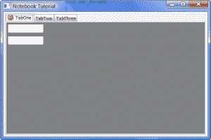
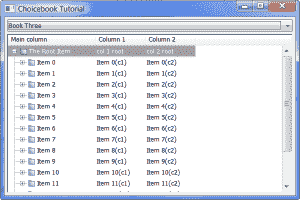
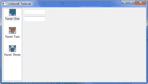
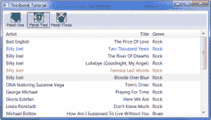
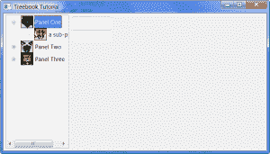
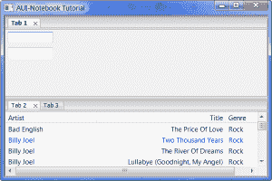

# wxPython 的“Book”控件(第 1 部分，共 2 部分)

> 原文：<https://www.blog.pythonlibrary.org/2009/12/03/the-book-controls-of-wxpython-part-1-of-2/>

如果您是 GUI 编程(尤其是 wxPython)的新手，您可能不知道什么是“book”控件。可能其他语言对此控件也有不同的称呼。在 wxPython 中，book 控件允许用户在各种面板之间切换。最常见的例子是带有标签界面的浏览器和系统选项对话框。本文将带您了解这些控件的创建和基本配置。

wxPython 目前内置了七个这样的控件，第八个内置在 agw AUI 小部件中。我将在本文中介绍以下小部件(虽然不一定按照这个顺序):AUI _ 笔记本、选择书、列表书、笔记本、工具书和树书。在第二篇文章中，我将介绍两个 agw book 控件:FlatNotebook 和嵌入在新 agw AUI 中的一个。请注意，这第一篇文章是一篇三页的文章。我个人觉得默认的 WordPress 分页不是很清晰。

## wx。笔记本

我们将从最熟悉的 book 小部件 wx.Notebook 开始。下面的截图让您了解它应该是什么样子:

[](https://www.blog.pythonlibrary.org/wp-content/uploads/2009/12/notebookDemo.png)

每个笔记本标签(或页面)将由一个 wx 组成。面板对象。我已经创建了三个不同的面板类，我们将用于选项卡。我从 [wxPython 演示](http://wxpython.org/download.php)中为这些面板(和图书小部件)提取了一些代码，并在本教程中对它们进行了修改。让我们看一下其中的一个面板，让您了解一下我在做什么:

```py

import wx

class TabPanel(wx.Panel):
    """
    This will be the first notebook tab
    """
    #----------------------------------------------------------------------
    def __init__(self, parent):
        """"""

        wx.Panel.__init__(self, parent=parent, id=wx.ID_ANY)

        sizer = wx.BoxSizer(wx.VERTICAL)
        txtOne = wx.TextCtrl(self, wx.ID_ANY, "")
        txtTwo = wx.TextCtrl(self, wx.ID_ANY, "")

        sizer = wx.BoxSizer(wx.VERTICAL)
        sizer.Add(txtOne, 0, wx.ALL, 5)
        sizer.Add(txtTwo, 0, wx.ALL, 5)

        self.SetSizer(sizer)

```

上面的代码将在一个垂直的 BoxSizer 中创建一个带有两个文本控件的面板。这就是它所能做的一切。现在让我们看看如何将这段代码与 wx.Notebook 结合使用。下面是一个简单的演示:

```py

import images
import wx
import panelOne, panelTwo, panelThree

########################################################################
class NotebookDemo(wx.Notebook):
    """
    Notebook class
    """

    #----------------------------------------------------------------------
    def __init__(self, parent):
        wx.Notebook.__init__(self, parent, id=wx.ID_ANY, style=
                             wx.BK_DEFAULT
                             #wx.BK_TOP 
                             #wx.BK_BOTTOM
                             #wx.BK_LEFT
                             #wx.BK_RIGHT
                             )

        # Create the first tab and add it to the notebook
        tabOne = panelOne.TabPanel(self)
        tabOne.SetBackgroundColour("Gray")
        self.AddPage(tabOne, "TabOne")

        # Show how to put an image on one of the notebook tabs,
        # first make the image list:
        il = wx.ImageList(16, 16)
        idx1 = il.Add(images.Smiles.GetBitmap())
        self.AssignImageList(il)

        # now put an image on the first tab we just created:
        self.SetPageImage(0, idx1)

        # Create and add the second tab
        tabTwo = panelTwo.TabPanel(self)
        self.AddPage(tabTwo, "TabTwo")

        # Create and add the third tab
        self.AddPage(panelThree.TabPanel(self), "TabThree")

        self.Bind(wx.EVT_NOTEBOOK_PAGE_CHANGED, self.OnPageChanged)
        self.Bind(wx.EVT_NOTEBOOK_PAGE_CHANGING, self.OnPageChanging)

    def OnPageChanged(self, event):
        old = event.GetOldSelection()
        new = event.GetSelection()
        sel = self.GetSelection()
        print 'OnPageChanged,  old:%d, new:%d, sel:%d\n' % (old, new, sel)
        event.Skip()

    def OnPageChanging(self, event):
        old = event.GetOldSelection()
        new = event.GetSelection()
        sel = self.GetSelection()
        print 'OnPageChanging, old:%d, new:%d, sel:%d\n' % (old, new, sel)
        event.Skip()

########################################################################
class DemoFrame(wx.Frame):
    """
    Frame that holds all other widgets
    """

    #----------------------------------------------------------------------
    def __init__(self):
        """Constructor"""        
        wx.Frame.__init__(self, None, wx.ID_ANY, 
                          "Notebook Tutorial",
                          size=(600,400)
                          )
        panel = wx.Panel(self)

        notebook = NotebookDemo(panel)
        sizer = wx.BoxSizer(wx.VERTICAL)
        sizer.Add(notebook, 1, wx.ALL|wx.EXPAND, 5)
        panel.SetSizer(sizer)
        self.Layout()

        self.Show()

#----------------------------------------------------------------------
if __name__ == "__main__":
    app = wx.PySimpleApp()
    frame = DemoFrame()
    app.MainLoop()

```

让我们把它分解一下。首先，我创建了 wx 的一个实例。笔记本类，并将其命名为 NotebookDemo。在它的“__init__”中，我把一些样式注释掉了。这些样式告诉笔记本在哪里放置标签(例如，在顶部、左侧、右侧或底部)。默认是将它们放在顶部。您可以注释掉默认值，并取消注释其他行中的一行，以查看不同之处。

要创建第一个选项卡，我们需要做的事情如下:

```py

# Create the first tab and add it to the notebook
tabOne = panelOne.TabPanel(self)
tabOne.SetBackgroundColour("Gray")
self.AddPage(tabOne, "TabOne")

```

实际上，我们甚至不需要设置背景颜色，但是我这样做是为了让文本控件更加突出。如果我们不设置颜色，我们可以把它变成这样的一行程序:

```py

self.AddPage(panelOne.TabPanel(self), "TabOne")

```

AddPage()方法是向 notebook 小部件添加页面的主要方法。此方法具有以下参数:

AddPage(self，Page，text，select，imageId)

我只为选项卡添加页面和文本。如果您愿意，您可以将“True”作为第四个参数传递，并使该选项卡被选中。虽然第一个选项卡将被默认选中，但是这样做有点傻。第五个参数允许程序员向选项卡添加图像；然而，我们用下一段代码来做:

```py

# Show how to put an image on one of the notebook tabs,
# first make the image list:
il = wx.ImageList(16, 16)
idx1 = il.Add(images.Smiles.GetBitmap())
self.AssignImageList(il)

# now put an image on the first tab we just created:
self.SetPageImage(0, idx1)

```

如您所见，我们首先创建一个 ImageList，并将图像设置为 16x16。然后，我使用 wxPython 演示中的“images”模块创建一个笑脸，并将其添加到列表中。接下来，我使用 AssignImageList()将列表分配给笔记本。要在其中一个选项卡上设置 ImageList 中的一个图像，可以调用 SetPageImage()并将选项卡索引作为第一个参数传递，将位图 ImageList 项实例作为第二个参数传递(即 idx1)。在这个例子中，我只向第一个选项卡添加了一个图像。

接下来的几行代码向笔记本添加了两个标签，然后绑定了两个事件:EVT _ 笔记本 _ 页面 _ 更改和 EVT _ 笔记本 _ 页面 _ 更改。当用户点击了不同于当前选择的标签时，EVT _ 笔记本 _ 页面 _ 改变被触发，当新标签被完全选择时结束。当下一个选项卡被完全选中时，EVT _ 笔记本 _ 页面 _ 已更改事件被触发。EVT _ 笔记本 _ 页面 _ 改变事件的一个方便的用法是，如果你需要用户在切换标签页之前做一些事情，可以否决这个事件。

[文档](http://www.wxpython.org/docs/api/wx.BookCtrlBase-class.html)是你的朋友。您将在那里找到许多方便的方法，如 GetPage、GetPageCount、GetPageImage、GetSelection、RemovePage 和 DeletePage 以及许多其他方法。

我需要为 wx 触及的最后一个主题。笔记本是如何嵌套标签的。在 wxPython 中嵌套制表符实际上非常容易。你所需要做的就是创建一个面板，上面有一个笔记本，然后把这个面板变成另一个笔记本的标签。这有点难以解释，所以我们来看一些代码:

```py

import panelOne, panelTwo
import wx

class TabPanel(wx.Panel):
    """
    This will be the first notebook tab
    """
    #----------------------------------------------------------------------
    def __init__(self, parent):
        """"""

        wx.Panel.__init__(self, parent=parent, id=wx.ID_ANY)

        sizer = wx.BoxSizer(wx.VERTICAL)

        # Create some nested tabs on the first tab
        nestedNotebook = wx.Notebook(self, wx.ID_ANY)
        nestedTabOne = panelOne.TabPanel(nestedNotebook)
        nestedTabTwo = panelTwo.TabPanel(nestedNotebook)
        nestedNotebook.AddPage(nestedTabOne, "NestedTabOne")
        nestedNotebook.AddPage(nestedTabTwo, "NestedTabTwo")

        sizer = wx.BoxSizer(wx.VERTICAL)
        sizer.Add(nestedNotebook, 1, wx.ALL|wx.EXPAND, 5)

        self.SetSizer(sizer)

```

上面的代码只是创建了一个面板，上面有一个笔记本。我重新使用了这个子笔记本的一些面板。现在我们只需要将它插入另一个笔记本(反之亦然):

```py

import images
import wx
import nestedPanelOne, panelTwo, panelThree

########################################################################
class NestedNotebookDemo(wx.Notebook):
    """
    Notebook class
    """

    #----------------------------------------------------------------------
    def __init__(self, parent):
        wx.Notebook.__init__(self, parent, id=wx.ID_ANY, style=
                             wx.BK_DEFAULT
                             #wx.BK_TOP 
                             #wx.BK_BOTTOM
                             #wx.BK_LEFT
                             #wx.BK_RIGHT
                             )

        # Create the first tab and add it to the notebook
        tabOne = nestedPanelOne.TabPanel(self)        
        self.AddPage(tabOne, "TabOne")

        # Show how to put an image on one of the notebook tabs,
        # first make the image list:
        il = wx.ImageList(16, 16)
        idx1 = il.Add(images.Smiles.GetBitmap())
        self.AssignImageList(il)

        # now put an image on the first tab we just created:
        self.SetPageImage(0, idx1)

        # Create and add the second tab
        tabTwo = panelTwo.TabPanel(self)
        self.AddPage(tabTwo, "TabTwo")

        # Create and add the third tab
        self.AddPage(panelThree.TabPanel(self), "TabThree")

```

这段代码与我们的第一段代码并没有太大的不同。唯一的区别是导入正确的面板并将其作为页面添加到笔记本中。现在我们将进入下一个图书控制。

## wx。精选图书

[](https://www.blog.pythonlibrary.org/wp-content/uploads/2009/12/choicebookDemo.png)

wx。Choicebook 是笔记本和 wx 的融合。选择部件。这允许用户单击下拉控件来选择要查看的页面。Choicebook 也继承了 wx。BookCtrlBase，所以它有大部分与 wx 相同的方法。笔记本有。让我们来看一个快速演示:

```py

import wx
import panelOne, panelTwo, panelThree

########################################################################
class ChoicebookDemo(wx.Choicebook):
    """
    Choicebook class
    """

    #----------------------------------------------------------------------
    def __init__(self, parent):
        wx.Choicebook.__init__(self, parent, wx.ID_ANY)

        # Create the first tab and add it to the notebook
        tabOne = panelOne.TabPanel(self)
        tabOne.SetBackgroundColour("Gray")
        self.AddPage(tabOne, "Book One")

        # Create and add the second tab
        tabTwo = panelTwo.TabPanel(self)
        self.AddPage(tabTwo, "Book Two")

        # Create and add the third tab
        self.AddPage(panelThree.TabPanel(self), "Book Three")

        self.Bind(wx.EVT_CHOICEBOOK_PAGE_CHANGED, self.OnPageChanged)
        self.Bind(wx.EVT_CHOICEBOOK_PAGE_CHANGING, self.OnPageChanging)

    #----------------------------------------------------------------------
    def OnPageChanged(self, event):
        old = event.GetOldSelection()
        new = event.GetSelection()
        sel = self.GetSelection()
        print 'OnPageChanged,  old:%d, new:%d, sel:%d\n' % (old, new, sel)
        event.Skip()

    #----------------------------------------------------------------------
    def OnPageChanging(self, event):
        old = event.GetOldSelection()
        new = event.GetSelection()
        sel = self.GetSelection()
        print 'OnPageChanging, old:%d, new:%d, sel:%d\n' % (old, new, sel)
        event.Skip()

########################################################################
class DemoFrame(wx.Frame):
    """
    Frame that holds all other widgets
    """

    #----------------------------------------------------------------------
    def __init__(self):
        """Constructor"""        
        wx.Frame.__init__(self, None, wx.ID_ANY, 
                          "Choicebook Tutorial",
                          size=(600,400))
        panel = wx.Panel(self)

        notebook = ChoicebookDemo(panel)
        sizer = wx.BoxSizer(wx.VERTICAL)
        sizer.Add(notebook, 1, wx.ALL|wx.EXPAND, 5)
        panel.SetSizer(sizer)
        self.Layout()

        self.Show()

#----------------------------------------------------------------------
if __name__ == "__main__":
    app = wx.PySimpleApp()
    frame = DemoFrame()
    app.MainLoop()

```

上面的代码与笔记本示例中的代码基本相同，但更简单。您只需使用 AddPage()方法向 book 控件添加一个新页面。其余的方法和我从[文档](http://www.wxpython.org/docs/api/wx.Choicebook-class.html)中看到的差不多。请注意，Choicebook 确实有自己的一组专门命名的事件。如果您使用另一本书的事件名称，您会很快发现您的事件处理程序没有被触发。

## wx。名单簿

[](https://www.blog.pythonlibrary.org/wp-content/uploads/2009/12/listbookDemo.png)

Listbook 控件使用 ListCtrl 来代替 tab 来控制笔记本。在这种情况下，您实际上可以使用带标签的图片来更改标签。有点奇怪，但我觉得也挺酷的。与 Choicebook 一样，该控件继承自 BookCtrlBase，并具有相同的方法。主要的区别似乎在于列表本的外观及其独特的事件集。让我们快速浏览一下我的演示，看看如何创建一个！

```py

import images
import wx
import panelOne, panelTwo, panelThree

########################################################################
class ListbookDemo(wx.Listbook):
    """"""

    #----------------------------------------------------------------------
    def __init__(self, parent):
        """Constructor"""
        wx.Listbook.__init__(self, parent, wx.ID_ANY, style=
                            wx.BK_DEFAULT
                            #wx.BK_TOP
                            #wx.BK_BOTTOM
                            #wx.BK_LEFT
                            #wx.BK_RIGHT
                            )
        # make an image list using the LBXX images
        il = wx.ImageList(32, 32)
        for x in range(3):
            obj = getattr(images, 'LB%02d' % (x+1))
            bmp = obj.GetBitmap()
            il.Add(bmp)
        self.AssignImageList(il)

        pages = [(panelOne.TabPanel(self), "Panel One"),
                 (panelTwo.TabPanel(self), "Panel Two"),
                 (panelThree.TabPanel(self), "Panel Three")]
        imID = 0
        for page, label in pages:
            self.AddPage(page, label, imageId=imID)
            imID += 1

        self.Bind(wx.EVT_LISTBOOK_PAGE_CHANGED, self.OnPageChanged)
        self.Bind(wx.EVT_LISTBOOK_PAGE_CHANGING, self.OnPageChanging)

    #----------------------------------------------------------------------
    def OnPageChanged(self, event):
        old = event.GetOldSelection()
        new = event.GetSelection()
        sel = self.GetSelection()
        print 'OnPageChanged,  old:%d, new:%d, sel:%d\n' % (old, new, sel)
        event.Skip()

    #----------------------------------------------------------------------
    def OnPageChanging(self, event):
        old = event.GetOldSelection()
        new = event.GetSelection()
        sel = self.GetSelection()
        print 'OnPageChanging, old:%d, new:%d, sel:%d\n' % (old, new, sel)
        event.Skip()

########################################################################
class DemoFrame(wx.Frame):
    """
    Frame that holds all other widgets
    """

    #----------------------------------------------------------------------
    def __init__(self):
        """Constructor"""        
        wx.Frame.__init__(self, None, wx.ID_ANY, 
                          "Listbook Tutorial",
                          size=(700,400)
                          )
        panel = wx.Panel(self)

        notebook = ListbookDemo(panel)
        sizer = wx.BoxSizer(wx.VERTICAL)
        sizer.Add(notebook, 1, wx.ALL|wx.EXPAND, 5)
        panel.SetSizer(sizer)
        self.Layout()

        self.Show()

#----------------------------------------------------------------------
if __name__ == "__main__":
    app = wx.PySimpleApp()
    frame = DemoFrame()
    app.MainLoop()

```

就像 wx.Notebook 一样，Listbook 的“tab”控件可以设置为沿任意边运行。您也可以使用我们在开始时在 Notebook 示例中使用的相同方法来附加图像。我通过将面板放在一个列表中并遍历它来缩短代码，但是除此之外，关于这个小部件没有太多要写的。

## wx。工具书

[](https://www.blog.pythonlibrary.org/wp-content/uploads/2009/12/toolbookDemo.png)

工具书是 wx。工具栏加一个 wx。笔记本，这意味着您使用带标签的位图按钮来控制您正在查看的笔记本的“标签”。正如您可能已经注意到的 Listbook 示例，我使用了 wxPython 演示的“images”模块作为它的图像，并且在我的示例代码中再次使用了它。

```py

import images
import wx
import panelOne, panelTwo, panelThree

def getNextImageID(count):
    imID = 0
    while True:
        yield imID
        imID += 1
        if imID == count:
            imID = 0

########################################################################
class ToolbookDemo(wx.Toolbook):
    """
    Toolbook class
    """

    #----------------------------------------------------------------------
    def __init__(self, parent):
        """Constructor"""
        wx.Toolbook.__init__(self, parent, wx.ID_ANY, style=
                             wx.BK_DEFAULT
                             #wx.BK_TOP
                             #wx.BK_BOTTOM
                             #wx.BK_LEFT
                             #wx.BK_RIGHT
                            )

        # make an image list using the LBXX images
        il = wx.ImageList(32, 32)
        for x in range(3):
            obj = getattr(images, 'LB%02d' % (x+1))
            bmp = obj.GetBitmap()
            il.Add(bmp)
        self.AssignImageList(il)
        imageIdGenerator = getNextImageID(il.GetImageCount())

        pages = [(panelOne.TabPanel(self), "Panel One"),
                 (panelTwo.TabPanel(self), "Panel Two"),
                 (panelThree.TabPanel(self), "Panel Three")]
        imID = 0
        for page, label in pages:
            self.AddPage(page, label, imageId=imageIdGenerator.next())
            imID += 1

        self.Bind(wx.EVT_TOOLBOOK_PAGE_CHANGED, self.OnPageChanged)
        self.Bind(wx.EVT_TOOLBOOK_PAGE_CHANGING, self.OnPageChanging)

    #----------------------------------------------------------------------
    def OnPageChanged(self, event):
        old = event.GetOldSelection()
        new = event.GetSelection()
        sel = self.GetSelection()
        print 'OnPageChanged,  old:%d, new:%d, sel:%d\n' % (old, new, sel)
        event.Skip()

    #----------------------------------------------------------------------
    def OnPageChanging(self, event):
        old = event.GetOldSelection()
        new = event.GetSelection()
        sel = self.GetSelection()
        print 'OnPageChanging, old:%d, new:%d, sel:%d\n' % (old, new, sel)
        event.Skip()

########################################################################
class DemoFrame(wx.Frame):
    """
    Frame that holds all other widgets
    """

    #----------------------------------------------------------------------
    def __init__(self):
        """Constructor"""        
        wx.Frame.__init__(self, None, wx.ID_ANY, 
                          "Toolbook Tutorial",
                          size=(700,400)
                          )
        panel = wx.Panel(self)

        notebook = ToolbookDemo(panel)
        sizer = wx.BoxSizer(wx.VERTICAL)
        sizer.Add(notebook, 1, wx.ALL|wx.EXPAND, 5)
        panel.SetSizer(sizer)
        self.Layout()

        self.Show()

#----------------------------------------------------------------------
if __name__ == "__main__":
    app = wx.PySimpleApp()
    frame = DemoFrame()
    app.MainLoop()

```

Toolbook 跟随前面控件的脚步，因为它的血统来自于 wx.BookCtrlBase。这个小部件因其外观和感觉(尽管它看起来非常类似于 Listbook)以及 Toolbook 的独特事件而闻名。我使用了 wxPython 演示中一些有趣的代码来帮助将图像分配给工具栏的按钮，但这确实是唯一重要的区别。欲了解全部信息，请阅读该控制的[文档](http://www.wxpython.org/docs/api/wx.Toolbook-class.html)！

## wx。树书

[](https://www.blog.pythonlibrary.org/wp-content/uploads/2009/12/treebookDemo.png)

Treebook 控件是 wx。TreeCtrl 和 wx.Notebook。我见过的大多数 tree ctrl 不使用图像，但是 wxPython 演示在 Treebook 中使用它们，所以我决定也使用它们。正如你从上面的截图中看到的，位图给了树书一种有趣的味道。让我们看看如何使这些控件之一！

```py

import images
import wx
import panelOne, panelTwo, panelThree

def getNextImageID(count):
    imID = 0
    while True:
        yield imID
        imID += 1
        if imID == count:
            imID = 0

########################################################################
class TreebookDemo(wx.Treebook):
    """
    Treebook class
    """

    #----------------------------------------------------------------------
    def __init__(self, parent):
        """Constructor"""
        wx.Treebook.__init__(self, parent, wx.ID_ANY, style=
                             wx.BK_DEFAULT
                             #wx.BK_TOP
                             #wx.BK_BOTTOM
                             #wx.BK_LEFT
                             #wx.BK_RIGHT
                            )
        il = wx.ImageList(32, 32)
        for x in range(6):
            obj = getattr(images, 'LB%02d' % (x+1))
            bmp = obj.GetBitmap()
            il.Add(bmp)
        self.AssignImageList(il)
        imageIdGenerator = getNextImageID(il.GetImageCount())

        pages = [(panelOne.TabPanel(self), "Panel One"),
                 (panelTwo.TabPanel(self), "Panel Two"),
                 (panelThree.TabPanel(self), "Panel Three")]
        imID = 0
        for page, label in pages:
            self.AddPage(page, label, imageId=imageIdGenerator.next())
            imID += 1
            self.AddSubPage(page, 'a sub-page', imageId=imageIdGenerator.next())

        self.Bind(wx.EVT_TREEBOOK_PAGE_CHANGED, self.OnPageChanged)
        self.Bind(wx.EVT_TREEBOOK_PAGE_CHANGING, self.OnPageChanging)

        # This is a workaround for a sizing bug on Mac...
        wx.FutureCall(100, self.AdjustSize)

    #----------------------------------------------------------------------
    def AdjustSize(self):
        #print self.GetTreeCtrl().GetBestSize()
        self.GetTreeCtrl().InvalidateBestSize()
        self.SendSizeEvent()

    #----------------------------------------------------------------------
    def OnPageChanged(self, event):
        old = event.GetOldSelection()
        new = event.GetSelection()
        sel = self.GetSelection()
        print 'OnPageChanged,  old:%d, new:%d, sel:%d\n' % (old, new, sel)
        event.Skip()

    #----------------------------------------------------------------------
    def OnPageChanging(self, event):
        old = event.GetOldSelection()
        new = event.GetSelection()
        sel = self.GetSelection()
        print 'OnPageChanging, old:%d, new:%d, sel:%d\n' % (old, new, sel)
        event.Skip()

########################################################################
class DemoFrame(wx.Frame):
    """
    Frame that holds all other widgets
    """

    #----------------------------------------------------------------------
    def __init__(self):
        """Constructor"""        
        wx.Frame.__init__(self, None, wx.ID_ANY, 
                          "Treebook Tutorial",
                          size=(700,400)
                          )
        panel = wx.Panel(self)

        notebook = TreebookDemo(panel)
        sizer = wx.BoxSizer(wx.VERTICAL)
        sizer.Add(notebook, 1, wx.ALL|wx.EXPAND, 5)
        panel.SetSizer(sizer)
        self.Layout()

        self.Show()

#----------------------------------------------------------------------
if __name__ == "__main__":
    app = wx.PySimpleApp()
    frame = DemoFrame()
    app.MainLoop()

```

和 Toolbook 一样，我再次使用了 wxPython 演示中的一些代码来创建这个演示，并重用了一些我自己的“框架”代码。除了 Treebook 的专门化事件之外，您还应该注意到它有一个 AddSubPage 方法，该方法向树中添加一个子节点，这又向笔记本中添加了另一个页面。还有其他几个只有这个控件才有的方法:CollapseNode、ExpandNode、GetPageParent、GetTreeCtrl、InsertSubPage 和 IsNodeExpanded。我认为它们是不言自明的，但是不要害怕阅读文档。

## wx.AuiNotebook

[](https://www.blog.pythonlibrary.org/wp-content/uploads/2009/12/auiNotebookDemo.png)

本文的最后一个控件来自 wx.aui 名称空间: [AuiNotebook](http://www.wxpython.org/docs/api/wx.aui.AuiNotebook-class.html) 。这是本文中唯一一个*没有*从通用 BookCtrlBase 继承的 notebook 控件。一定要研究这个控件的 API，以充分理解如何使用它，因为 AuiNotebook 有几个方法与我们到目前为止看到的其他控件不同。

AuiNotebook 允许用户重新排列标签，将标签拖到它自己的区域(正如你从上面的截图中看到的)，甚至将标签从一个 AuiNotebook 拖到另一个。以下代码片段将允许您完成所有这些事情:

```py

import wx
import wx.aui
import panelOne, panelTwo, panelThree

class DemoPanel(wx.Panel):
    """
    This will be the first notebook tab
    """
    #----------------------------------------------------------------------
    def __init__(self, parent):
        """"""        
        wx.Panel.__init__(self, parent=parent, id=wx.ID_ANY)

        # create the AuiNotebook instance
        nb = wx.aui.AuiNotebook(self)

        # add some pages to the notebook
        pages = [(panelOne.TabPanel(nb), "Tab 1"),
                 (panelTwo.TabPanel(nb), "Tab 2"),
                 (panelThree.TabPanel(nb), "Tab 3")]
        for page, label in pages:
            nb.AddPage(page, label)

        sizer = wx.BoxSizer(wx.VERTICAL)
        sizer.Add(nb, 1, wx.EXPAND)
        self.SetSizer(sizer)

########################################################################
class DemoFrame(wx.Frame):
    """
    Frame that holds all other widgets
    """

    #----------------------------------------------------------------------
    def __init__(self):
        """Constructor"""        
        wx.Frame.__init__(self, None, wx.ID_ANY, 
                          "AUI-Notebook Tutorial",
                          size=(600,400))
        panel = DemoPanel(self)                
        self.Show()

#----------------------------------------------------------------------
if __name__ == "__main__":
    app = wx.PySimpleApp()
    frame = DemoFrame()
    app.MainLoop()

```

对于这个简单的例子，我只是通过实例化 wx.aui.AuiNotebook(self)并传入 wx.Panel 来创建 AuiNotebook 的一个实例。还要注意的是，你可以通过点击单独的“x”来关闭任何标签。现在你知道如何制作你自己的笔记本了！

## 包扎

在本文的第二部分，我们将发现 AGW 笔记本的许多有趣的特性。我将它们排除在本文之外的主要原因之一是因为它们是纯 python 模块，并且有许多不在这组小部件中的额外功能。所有这些代码都在 Windows XP 和 Vista 上使用 wxPython 2.8.10.1(unicode)、Python 2.5 进行了测试。所有的例子都可以在 Mac 和 Linux 上很好的运行，但是请在评论中告诉我它们的运行效果！

## 进一步阅读

*   [图书控制文档](http://www.wxpython.org/docs/api/wx.BookCtrlBase-class.html)
*   [wxPython Wiki 笔记本示例](http://wiki.wxpython.org/Simple%20wx.Notebook%20Example)
*   [Zetcode 笔记本示例](http://zetcode.com/tutorials/wxwidgetstutorial/widgetsII/)

## 下载

*   [Notebooks.zip](https://www.blog.pythonlibrary.org/wp-content/uploads/2009/12/Notebooks.zip)
*   [Notebooks.tar](https://www.blog.pythonlibrary.org/wp-content/uploads/2009/12/Notebooks.tar)