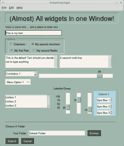
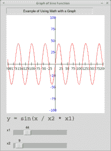
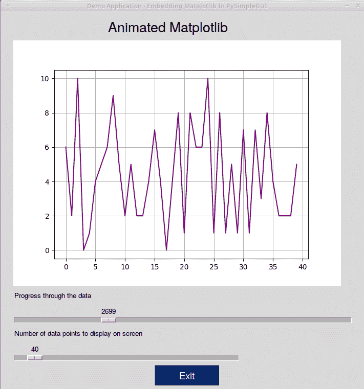
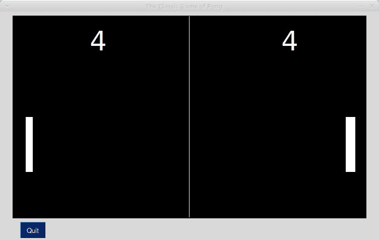

# PySimpleGUI 的演示

> 原文：<https://www.blog.pythonlibrary.org/2019/10/31/the-demos-for-pysimplegui/>

项目包含了许多有趣的 T2 演示，你可以用它们来学习如何使用 PySimpleGUI。据我所知，演示涵盖了所有基本的小部件，还涵盖了推荐的软件包设计模式。此外，还有几个游戏和其他小应用程序，如 Pong 和 Snake 游戏的版本。

在本文中，您将看到这个项目中的一个小样本演示，这将让您对使用 PySimpleGUI 可以做些什么有所了解。

* * *

### 查看可用的小部件

PySimpleGUI 有一个很好的小演示，名为 [Demo_All_Widgets.py](https://github.com/PySimpleGUI/PySimpleGUI/blob/master/DemoPrograms/Demo_All_Widgets.py) ，演示了 PySimpleGUI 当前支持的几乎所有小部件。PySimpleGUI 已经包装了 Tkinter 的所有核心部件，但没有包装 ttk 部件。

这是运行演示时的样子:



让我们快速看一下这个演示的代码:

```py

#!/usr/bin/env python
'''
Example of (almost) all widgets, that you can use in PySimpleGUI.
'''

import PySimpleGUI as sg

sg.change_look_and_feel('GreenTan')

# ------ Menu Definition ------ #
menu_def = [['&File', ['&Open', '&Save', 'E&xit', 'Properties']],
            ['&Edit', ['Paste', ['Special', 'Normal', ], 'Undo'], ],
            ['&Help', '&About...'], ]

# ------ Column Definition ------ #
column1 = [[sg.Text('Column 1', background_color='lightblue', justification='center', size=(10, 1))],
           [sg.Spin(values=('Spin Box 1', '2', '3'),
                    initial_value='Spin Box 1')],
           [sg.Spin(values=('Spin Box 1', '2', '3'),
                    initial_value='Spin Box 2')],
           [sg.Spin(values=('Spin Box 1', '2', '3'), initial_value='Spin Box 3')]]

layout = [
    [sg.Menu(menu_def, tearoff=True)],
    [sg.Text('(Almost) All widgets in one Window!', size=(
        30, 1), justification='center', font=("Helvetica", 25), relief=sg.RELIEF_RIDGE)],
    [sg.Text('Here is some text.... and a place to enter text')],
    [sg.InputText('This is my text')],
    [sg.Frame(layout=[
        [sg.CBox('Checkbox', size=(10, 1)),
         sg.CBox('My second checkbox!', default=True)],
        [sg.Radio('My first Radio!     ', "RADIO1", default=True, size=(10, 1)),
         sg.Radio('My second Radio!', "RADIO1")]], title='Options',
             title_color='red',
             relief=sg.RELIEF_SUNKEN,
             tooltip='Use these to set flags')],
    [sg.MLine(default_text='This is the default Text should you decide not to type anything', size=(35, 3)),
     sg.MLine(default_text='A second multi-line', size=(35, 3))],
    [sg.Combo(('Combobox 1', 'Combobox 2'), size=(20, 1)),
     sg.Slider(range=(1, 100), orientation='h', size=(34, 20), default_value=85)],
    [sg.OptionMenu(('Menu Option 1', 'Menu Option 2', 'Menu Option 3'))],
    [sg.Listbox(values=('Listbox 1', 'Listbox 2', 'Listbox 3'), size=(30, 3)),
     sg.Frame('Labelled Group', [[
         sg.Slider(range=(1, 100), orientation='v', size=(5, 20), default_value=25, tick_interval=25),
         sg.Slider(range=(1, 100), orientation='v', size=(5, 20), default_value=75),
         sg.Slider(range=(1, 100), orientation='v', size=(5, 20), default_value=10),
         sg.Col(column1, background_color='lightblue')]])
    ],
    [sg.Text('_' * 80)],
    [sg.Text('Choose A Folder', size=(35, 1))],
    [sg.Text('Your Folder', size=(15, 1), justification='right'),
     sg.InputText('Default Folder'), sg.FolderBrowse()],
    [sg.Submit(tooltip='Click to submit this form'), sg.Cancel()]]

window = sg.Window('Everything bagel', layout,
    default_element_size=(40, 1), grab_anywhere=False)

event, values = window.read()
sg.popup('Title',
         'The results of the window.',
         'The button clicked was "{}"'.format(event),
         'The values are', values)

```

PySimpleGUI 通过使用 Python 列表来布局它们的小部件。您还可以看到，这个演示也使用列表来生成菜单。然后创建一个**窗口**对象，并传入布局，这是您的元素列表或小部件列表。

让我们看看你还能做什么！

* * *

### 使用 PySimpleGUI 绘图

PySimpleGUI 还支持创建图形。一个这样的例子可以在[Demo _ Graph _ Element _ Sine _ wave . py](https://github.com/PySimpleGUI/PySimpleGUI/blob/master/DemoPrograms/Demo_Graph_Element_Sine_Wave.py)中找到。这个演示向开发者展示了如何使用 Graph 小部件。

这是运行演示时的样子:



下面是代码的样子:

```py

import PySimpleGUI as sg
import math

# Yet another usage of Graph element.

SIZE_X = 200
SIZE_Y = 100
NUMBER_MARKER_FREQUENCY = 25

def draw_axis():
    graph.draw_line((-SIZE_X, 0), (SIZE_X, 0))                # axis lines
    graph.draw_line((0, -SIZE_Y), (0, SIZE_Y))

    for x in range(-SIZE_X, SIZE_X+1, NUMBER_MARKER_FREQUENCY):
        graph.draw_line((x, -3), (x, 3))                       # tick marks
        if x != 0:
            # numeric labels
            graph.draw_text(str(x), (x, -10), color='green')

    for y in range(-SIZE_Y, SIZE_Y+1, NUMBER_MARKER_FREQUENCY):
        graph.draw_line((-3, y), (3, y))
        if y != 0:
            graph.draw_text(str(y), (-10, y), color='blue')

# Create the graph that will be put into the window
graph = sg.Graph(canvas_size=(400, 400),
                 graph_bottom_left=(-(SIZE_X+5), -(SIZE_Y+5)),
                 graph_top_right=(SIZE_X+5, SIZE_Y+5),
                 background_color='white',
                 key='graph')
# Window layout
layout = [[sg.Text('Example of Using Math with a Graph', justification='center', size=(50, 1), relief=sg.RELIEF_SUNKEN)],
          [graph],
          [sg.Text('y = sin(x / x2 * x1)', font='COURIER 18')],
          [sg.Text('x1'), sg.Slider((0, 200), orientation='h',
                                 enable_events=True, key='-SLIDER-')],
          [sg.Text('x2'), sg.Slider((1, 200), orientation='h', enable_events=True, key='-SLIDER2-')]]

window = sg.Window('Graph of Sine Function', layout)

while True:
    event, values = window.read()
    if event is None:
        break
    graph.erase()
    draw_axis()
    prev_x = prev_y = None

    for x in range(-SIZE_X, SIZE_X):
        y = math.sin(x/int(values['-SLIDER2-']))*int(values['-SLIDER-'])
        if prev_x is not None:
            graph.draw_line((prev_x, prev_y), (x, y), color='red')
        prev_x, prev_y = x, y

window.close()

```

为了使图形正确工作，您需要擦除图形，并在上面的 **while** 循环中重新绘制。稍微摆弄一下代码，看看能做些什么。demo 文件夹中还有几个与图形相关的演示，您也应该看看。

PySimpleGUI 还支持 [matplotlib](https://matplotlib.org/) 集成。一个有趣的游戏是[Demo _ Matplotlib _ animated . py](https://github.com/PySimpleGUI/PySimpleGUI/blob/master/DemoPrograms/Demo_Matplotlib_Animated.py)。

当我运行它时，演示结果如下:



现在让我们来看看另一个演示！

* * *

### 用 PySimpleGUI 创建 Pong

正如我在本文前面提到的，您也可以使用 PySimpleGUI 非常容易地创建 Pong 游戏。可以查看 [Demo_Pong.py](https://github.com/PySimpleGUI/PySimpleGUI/blob/master/DemoPrograms/Demo_Pong.py) 了解全部详情。

以下是运行该代码时所创建的内容:



这个游戏的代码有点长，但是不难理解。在编写的时候，这个游戏是在一个模块中使用 183 行代码编写的。

### 包扎

PySimpleGUI 的[演示文件夹](https://github.com/PySimpleGUI/PySimpleGUI/tree/master/DemoPrograms)里有 150+个演示。我确实发现了一些由于使用特定于操作系统的代码而无法在 Linux 上工作的问题。然而，大多数例子似乎是可行的，它们是一个很好的方式来看看你可以用这个项目做什么。查看它们，了解如何将 PySimpleGUI 用于您自己的项目或演示。

* * *

### 相关阅读

*   简要介绍 [PySimpleGUI](https://www.blog.pythonlibrary.org/2019/10/23/a-brief-intro-to-pysimplegui/)
*   PySimpleGUI [文档](https://pysimplegui.readthedocs.io/)
*   其他简单的 PySimpleGUI [应用](https://github.com/israel-dryer)