# wxPython 的对话框(第 1 部分，共 2 部分)

> 原文：<https://www.blog.pythonlibrary.org/2010/06/26/the-dialogs-of-wxpython-part-1-of-2/>

对话框是用户界面设计不可或缺的一部分。我们一直在使用它们。我们到处都能找到各种形状和大小的对话框。在本文中，我们将介绍以下对话框类型:

*   wx.BusyInfo
*   wx(地名)。ColourDialog(放置对话框)
*   立方结构对话方块(AGW)
*   wx。DirDialog 和 MultiDirDialog (AGW)
*   wx . file 对话方块
*   wx 字体对话框
*   wx.MessageDialog

这是很多对话框，但是在 wxPython 演示中还有八个。我们下次会讲到这些。现在，让我们来看看这个列表！

## wx。Busy info——让用户知道你很忙

[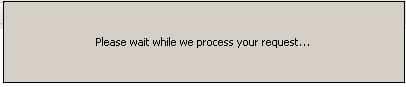](https://www.blog.pythonlibrary.org/wp-content/uploads/2010/06/busyInfo.jpg)

BusyInfo 对话框并不广为人知。出于某种原因，它甚至没有在 wxPython 演示应用程序中演示。为了让你看得开心，我们现在就制作一个。

```py

import time
import wx

########################################################################
class MyForm(wx.Frame):

    #----------------------------------------------------------------------
    def __init__(self):
        wx.Frame.__init__(self, None, wx.ID_ANY,
                          "BusyDialog Tutorial")
        panel = wx.Panel(self, wx.ID_ANY)

        busyBtn = wx.Button(panel, label="Show Busy Dialog")
        busyBtn.Bind(wx.EVT_BUTTON, self.onBusy)

        sizer = wx.BoxSizer(wx.VERTICAL)
        sizer.Add(busyBtn, 0, wx.ALL|wx.CENTER, 5)
        panel.SetSizer(sizer)

    #----------------------------------------------------------------------
    def onBusy(self, event):
        self.Hide()
        msg = "Please wait while we process your request..."
        busyDlg = wx.BusyInfo(msg)
        time.sleep(5)
        busyDlg = None
        self.Show()

# Run the program
if __name__ == "__main__":
    app = wx.App(False)
    frame = MyForm()
    frame.Show()
    app.MainLoop()

```

幸运的是， [BusyInfo](http://www.wxpython.org/docs/api/wx.BusyInfo-class.html) 对话框也是最容易创建的对话框之一。你需要做的就是用一个字符串实例化它。关闭该对话框的常用方法不是销毁它，而是将实例设置为 None。这有点奇怪，但它工作得很好。如果需要的话，你也可以销毁它，但是我从来不需要也没有见过其他人这样做的例子。

## 用 wx 选择颜色。ColourDialog 和 CubeColourDialog

在 wxPython 发行版中有两个颜色选择器对话框。我们要看的第一个是原生对话框，wx.ColourDialog。Windows XP 上的 ColourDialog 看起来像:

[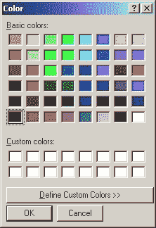](https://www.blog.pythonlibrary.org/wp-content/uploads/2010/06/wxColourDialog.jpg)

对于这个例子，我们将创建一个简单的双按钮表单，可以打开两种类型的颜色对话框。让我们来看看:

```py

import wx
import wx.lib.agw.cubecolourdialog as CCD

########################################################################
class MyForm(wx.Frame):

    #----------------------------------------------------------------------
    def __init__(self):
        wx.Frame.__init__(self, None, wx.ID_ANY,
                          "File and Folder Dialogs Tutorial")
        panel = wx.Panel(self, wx.ID_ANY)
        self.colourData = None

        colorDlgBtn = wx.Button(panel, label="Open ColorDialog")
        colorDlgBtn.Bind(wx.EVT_BUTTON, self.onColorDlg)
        colorCubeBtn = wx.Button(panel, label="Open ColorCubeDialog")
        colorCubeBtn.Bind(wx.EVT_BUTTON, self.onCubeColorDialog)

        # put the buttons in a sizer
        sizer = wx.BoxSizer(wx.VERTICAL)
        sizer.Add(colorDlgBtn, 0, wx.ALL|wx.CENTER, 5)
        sizer.Add(colorCubeBtn, 0, wx.ALL|wx.CENTER, 5)
        panel.SetSizer(sizer)

    #----------------------------------------------------------------------
    def onColorDlg(self, event):
        """
        This is mostly from the wxPython Demo!
        """
        dlg = wx.ColourDialog(self)

        # Ensure the full colour dialog is displayed, 
        # not the abbreviated version.
        dlg.GetColourData().SetChooseFull(True)

        if dlg.ShowModal() == wx.ID_OK:
            data = dlg.GetColourData()
            print 'You selected: %s\n' % str(data.GetColour().Get())

        dlg.Destroy()

    #----------------------------------------------------------------------
    def onCubeColorDialog(self, event):
        """
        This is mostly from the wxPython Demo!
        """
        self.colourData.SetColour(self.GetBackgroundColour())

        dlg = CCD.CubeColourDialog(self, self.colourData)

        if dlg.ShowModal() == wx.ID_OK:

            # If the user selected OK, then the dialog's wx.ColourData will
            # contain valid information. Fetch the data ...
            self.colourData = dlg.GetColourData()
            h, s, v, a = dlg.GetHSVAColour()

            # ... then do something with it. The actual colour data will be
            # returned as a three-tuple (r, g, b) in this particular case.
            colour = self.colourData.GetColour()
            self.SetBackgroundColour(self.colourData.GetColour())
            self.Refresh()

        dlg.Destroy()

#----------------------------------------------------------------------
# Run the program
if __name__ == "__main__":
    app = wx.App(False)
    frame = MyForm()
    frame.Show()
    app.MainLoop()

```

如你所见，wx。ColourDialog 非常容易实例化(参见 *onColorDlg* 方法)。你需要做的就是调用对话框。wxPython 演示还包含了一行代码，展示了如何显示对话框的全彩版本，所以我们在这个例子中包含了这一行代码(和注释): dlg。GetColourData()。SetChooseFull(True)。最后，我们调用对话框的 *ShowModal* 方法来显示对话框。为了获得用户的颜色选择，我们遵循两步过程。首先，我们使用*数据= dlg 获取所有颜色数据。GetColourData()* 。然后为了获得特定的颜色，我们调用数据对象的 *GetColour()。Get()* 方法。

现在让我们看看 Windows XP 上的[立方体颜色对话框](http://xoomer.virgilio.it/infinity77/AGW_Docs/cubecolourdialog.CubeColourDialog.html)是什么样子的:

[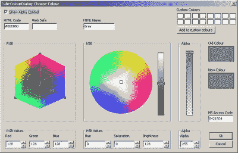](https://www.blog.pythonlibrary.org/wp-content/uploads/2010/06/cubeColourDlg.jpg)

*注意:如果您使用的不是 wxPython 2.8.11.0 或这个小部件的 SVN 版本，您可能会收到一个与设置 alpha 相关的错误。*

CubeColourDialog 是用纯 python 编写的，而不是用 [SWIG](http://www.swig.org/) 包装的 C++小部件。这使得 CubeColourDialog 更容易编辑和增强。让我们看看上面使用的 onCubeColorDialog 方法的代码:

```py

def onCubeColorDialog(self, event):
    """
    This is mostly from the wxPython Demo!
    """

    self.colourData.SetColour(self.GetBackgroundColour())

    dlg = CCD.CubeColourDialog(self, self.colourData)

    if dlg.ShowModal() == wx.ID_OK:

        # If the user selected OK, then the dialog's wx.ColourData will
        # contain valid information. Fetch the data ...
        self.colourData = dlg.GetColourData()
        h, s, v, a = dlg.GetHSVAColour()

        # ... then do something with it. The actual colour data will be
        # returned as a three-tuple (r, g, b) in this particular case.
        colour = self.colourData.GetColour()
        self.SetBackgroundColour(self.colourData.GetColour())
        self.Refresh()

    dlg.Destroy()

```

首先，我们将 colourData 变量设置为父小部件的背景色。我不太清楚为什么我们要这样做，但我认为这是因为我们希望对话框匹配其父对话框的颜色。接下来创建对话框的一个实例并显示它。如果用户按下 OK 按钮，我们就会得到他们选择的颜色。注意，我们可以通过调用对话框的 *GetHSVAColour* 方法来获得所选颜色的色调、饱和度、亮度和 alpha 分量。在这个例子中，我们实际上并不使用这些信息，但是在您的应用程序中可能会很方便。要真正选择颜色，我们只需从更新后的 colourData 实例中使用名副其实的 GetColour()方法。最后，我们将应用程序的背景设置为新选择的颜色。很整洁，是吧？

还有另一个名为 [PyColourChooser](http://www.wxpython.org/docs/api/wx.lib.colourchooser.pycolourchooser.PyColourChooser-class.html) 的纯 python 颜色选择器。然而，它不是一个独立的对话框，所以我们不会在这里讨论它。

## 用 wx 打开文件和文件夹。文件对话框，wx。DirDialog 和 MultiDirDialog (AGW)

[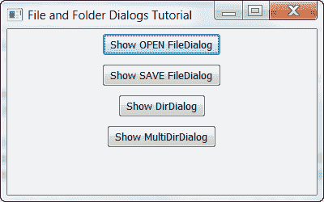](https://www.blog.pythonlibrary.org/wp-content/uploads/2010/06/fileDirDlg.png)

用 wxPython 打开文件和文件夹轻而易举！它包括本机对话框的包装器，还包括同时选择多个文件夹(即目录)的纯 python 实现。让我们先看一下示例代码，然后我们将讨论每个对话框的细节。

```py

import os
import wx
import wx.lib.agw.multidirdialog as MDD

wildcard = "Python source (*.py)|*.py|" \
            "All files (*.*)|*.*"

########################################################################
class MyForm(wx.Frame):

    #----------------------------------------------------------------------
    def __init__(self):
        wx.Frame.__init__(self, None, wx.ID_ANY,
                          "File and Folder Dialogs Tutorial")
        panel = wx.Panel(self, wx.ID_ANY)
        self.currentDirectory = os.getcwd()

        # create the buttons and bindings
        openFileDlgBtn = wx.Button(panel, label="Show OPEN FileDialog")
        openFileDlgBtn.Bind(wx.EVT_BUTTON, self.onOpenFile)

        saveFileDlgBtn = wx.Button(panel, label="Show SAVE FileDialog")
        saveFileDlgBtn.Bind(wx.EVT_BUTTON, self.onSaveFile)

        dirDlgBtn = wx.Button(panel, label="Show DirDialog")
        dirDlgBtn.Bind(wx.EVT_BUTTON, self.onDir)

        multiDirDlgBtn = wx.Button(panel, label="Show MultiDirDialog")
        multiDirDlgBtn.Bind(wx.EVT_BUTTON, self.onMultiDir)

        # put the buttons in a sizer
        sizer = wx.BoxSizer(wx.VERTICAL)
        sizer.Add(openFileDlgBtn, 0, wx.ALL|wx.CENTER, 5)
        sizer.Add(saveFileDlgBtn, 0, wx.ALL|wx.CENTER, 5)
        sizer.Add(dirDlgBtn, 0, wx.ALL|wx.CENTER, 5)
        sizer.Add(multiDirDlgBtn, 0, wx.ALL|wx.CENTER, 5)
        panel.SetSizer(sizer)

    #----------------------------------------------------------------------
    def onDir(self, event):
        """
        Show the DirDialog and print the user's choice to stdout
        """
        dlg = wx.DirDialog(self, "Choose a directory:",
                           style=wx.DD_DEFAULT_STYLE
                           #| wx.DD_DIR_MUST_EXIST
                           #| wx.DD_CHANGE_DIR
                           )
        if dlg.ShowModal() == wx.ID_OK:
            print "You chose %s" % dlg.GetPath()
        dlg.Destroy()

    #----------------------------------------------------------------------
    def onMultiDir(self, event):
        """
        Create and show the MultiDirDialog
        """
        dlg = MDD.MultiDirDialog(self, title="Choose a directory:",
                                 defaultPath=self.currentDirectory,
                                 agwStyle=0)
        if dlg.ShowModal() == wx.ID_OK:
            paths = dlg.GetPaths()
            print "You chose the following file(s):"
            for path in paths:
                print path
        dlg.Destroy()

    #----------------------------------------------------------------------
    def onOpenFile(self, event):
        """
        Create and show the Open FileDialog
        """
        dlg = wx.FileDialog(
            self, message="Choose a file",
            defaultDir=self.currentDirectory, 
            defaultFile="",
            wildcard=wildcard,
            style=wx.FD_OPEN | wx.FD_MULTIPLE | wx.FD_CHANGE_DIR
            )
        if dlg.ShowModal() == wx.ID_OK:
            paths = dlg.GetPaths()
            print "You chose the following file(s):"
            for path in paths:
                print path
        dlg.Destroy()

    #----------------------------------------------------------------------
    def onSaveFile(self, event):
        """
        Create and show the Save FileDialog
        """
        dlg = wx.FileDialog(
            self, message="Save file as ...", 
            defaultDir=self.currentDirectory, 
            defaultFile="", wildcard=wildcard, style=wx.FD_SAVE
            )
        if dlg.ShowModal() == wx.ID_OK:
            path = dlg.GetPath()
            print "You chose the following filename: %s" % path
        dlg.Destroy()

#----------------------------------------------------------------------
# Run the program
if __name__ == "__main__":
    app = wx.App(False)
    frame = MyForm()
    frame.Show()
    app.MainLoop()

```

### 打开和保存文件对话框

[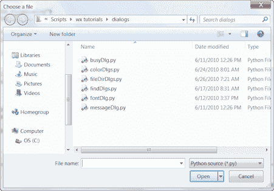](https://www.blog.pythonlibrary.org/wp-content/uploads/2010/06/openFileDlg.png)

[wx。FileDialog](http://www.wxpython.org/docs/api/wx.FileDialog-class.html) 有两个版本:打开和保存文件版本。上面是开放版本，下面是保存版本:

[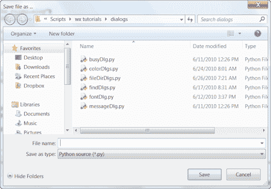](https://www.blog.pythonlibrary.org/wp-content/uploads/2010/06/saveFileDlg.png)

让我们来看看每一项的代码:

```py

def onOpenFile(self, event):
    """
    Create and show the Open FileDialog
    """
    dlg = wx.FileDialog(
        self, message="Choose a file",
        defaultDir=self.currentDirectory, 
        defaultFile="",
        wildcard=wildcard,
        style=wx.FD_OPEN | wx.FD_MULTIPLE | wx.FD_CHANGE_DIR
        )
    if dlg.ShowModal() == wx.ID_OK:
        paths = dlg.GetPaths()
        print "You chose the following file(s):"
        for path in paths:
            print path
    dlg.Destroy()

#----------------------------------------------------------------------
def onSaveFile(self, event):
    """
    Create and show the Save FileDialog
    """
    dlg = wx.FileDialog(
        self, message="Save file as ...", 
        defaultDir=self.currentDirectory, 
        defaultFile="", wildcard=wildcard, style=wx.FD_SAVE
        )
    if dlg.ShowModal() == wx.ID_OK:
        path = dlg.GetPath()
        print "You chose the following filename: %s" % path
    dlg.Destroy()

```

方法显示了如何创建开放版本。您可以设置对话框的标题，对话框将在哪个目录下打开，它将显示哪些文件，选择的默认文件，您是否可以选择多个文件(wx。多个标志)以及是否可以更改目录(通过 CHANGE_DIR 标志)。在这个例子中，我们使用对话框的 GetPaths 方法获取用户选择的一个或多个路径，然后将这些选择打印到 stdout。

对话框的保存版本几乎相同。唯一不同的是我们把样式改成了 wx.SAVE。

### wx。目录对话框

[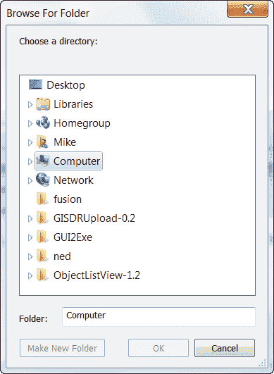](https://www.blog.pythonlibrary.org/wp-content/uploads/2010/06/dirDlg.png)

目录对话框比文件对话框更容易实例化！下面是简单的代码:

```py

#----------------------------------------------------------------------
def onDir(self, event):
    """
    Show the DirDialog and print the user's choice to stdout
    """
    dlg = wx.DirDialog(self, "Choose a directory:",
                       style=wx.DD_DEFAULT_STYLE
                       #| wx.DD_DIR_MUST_EXIST
                       #| wx.DD_CHANGE_DIR
                       )
    if dlg.ShowModal() == wx.ID_OK:
        print "You chose %s" % dlg.GetPath()
    dlg.Destroy()

```

在这个对话框中，我们只能更改几个项目:标题、目录是否必须已经存在以及用户是否可以更改目录。您还可以通过 defaultPath 参数设置它启动的默认目录。

### 多重对话(AGW)

[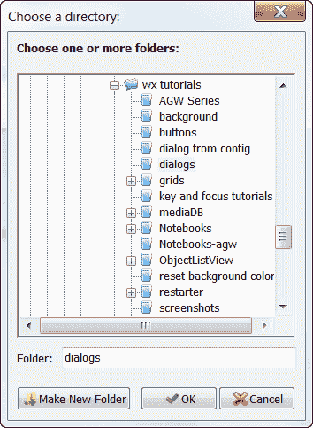](https://www.blog.pythonlibrary.org/wp-content/uploads/2010/06/multiDirDlg.png)

来自 [AGW 库](http://xoomer.virgilio.it/infinity77/AGW_Docs/multidirdialog_module.html)的 [MultiDirDialog](http://www.wxpython.org/docs/api/wx.lib.agw.multidirdialog.MultiDirDialog-class.html) 是 wx 的纯 python 实现。DirDialog，但是有更多的特性。例如，它允许用户一次选择多个目录。下面是如何使用它的一个简单示例:

```py

def onMultiDir(self, event):
    """
    Create and show the MultiDirDialog
    """
    dlg = MDD.MultiDirDialog(self, title="Choose a directory:",
                             defaultPath=self.currentDirectory,
                             agwStyle=0)
    if dlg.ShowModal() == wx.ID_OK:
        paths = dlg.GetPaths()
        print "You chose the following file(s):"
        for path in paths:
            print path
    dlg.Destroy()

```

虽然这段代码没有显示出来，但是您也可以设置是否允许用户创建一个新目录。除此之外，还有特殊的 agwStyle 标志，这个对话框没有太大的不同。尽管如此，因为它是用 python 编写的，所以使用起来很方便，而且你可以比 wx 更容易地增强它。目录对话框版本。

## wx 字体对话框

[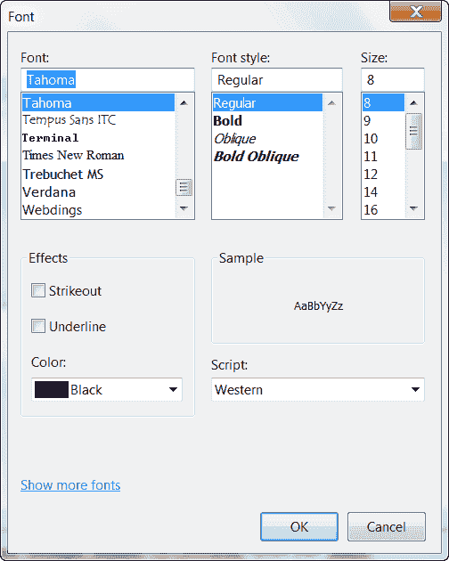](https://www.blog.pythonlibrary.org/wp-content/uploads/2010/06/fontDialog.png)

字体对话框给予用户选择字体的能力。对于这个例子，我们将使用 wxPython 演示本身的代码的稍微修改的版本:

```py

import wx
from wx.lib import stattext

#---------------------------------------------------------------------------

class TestPanel(wx.Panel):
    def __init__(self, parent):
        wx.Panel.__init__(self, parent, -1)

        btn = wx.Button(self, -1, "Select Font")
        self.Bind(wx.EVT_BUTTON, self.OnSelectFont, btn)

        self.sampleText = stattext.GenStaticText(self, -1, "Sample Text")
        self.sampleText.SetBackgroundColour(wx.WHITE)

        self.curFont = self.sampleText.GetFont()
        self.curClr = wx.BLACK

        fgs = wx.FlexGridSizer(cols=2, vgap=5, hgap=5)
        fgs.AddGrowableCol(1)
        fgs.AddGrowableRow(0)

        fgs.Add(btn)
        fgs.Add(self.sampleText, 0, wx.ADJUST_MINSIZE|wx.GROW)

        fgs.Add((15,15)); fgs.Add((15,15))   # an empty row

        fgs.Add(wx.StaticText(self, -1, "PointSize:"))
        self.ps = wx.StaticText(self, -1, "")
        font = self.ps.GetFont()
        font.SetWeight(wx.BOLD)
        self.ps.SetFont(font)
        fgs.Add(self.ps, 0, wx.ADJUST_MINSIZE)

        fgs.Add(wx.StaticText(self, -1, "Family:"))
        self.family = wx.StaticText(self, -1, "")
        self.family.SetFont(font)
        fgs.Add(self.family, 0, wx.ADJUST_MINSIZE)

        fgs.Add(wx.StaticText(self, -1, "Style:"))
        self.style = wx.StaticText(self, -1, "")
        self.style.SetFont(font)
        fgs.Add(self.style, 0, wx.ADJUST_MINSIZE)

        fgs.Add(wx.StaticText(self, -1, "Weight:"))
        self.weight = wx.StaticText(self, -1, "")
        self.weight.SetFont(font)
        fgs.Add(self.weight, 0, wx.ADJUST_MINSIZE)

        fgs.Add(wx.StaticText(self, -1, "Face:"))
        self.face = wx.StaticText(self, -1, "")
        self.face.SetFont(font)
        fgs.Add(self.face, 0, wx.ADJUST_MINSIZE)

        fgs.Add((15,15)); fgs.Add((15,15))   # an empty row

        fgs.Add(wx.StaticText(self, -1, "wx.NativeFontInfo:"))
        self.nfi = wx.StaticText(self, -1, "")
        self.nfi.SetFont(font)
        fgs.Add(self.nfi, 0, wx.ADJUST_MINSIZE)

        # give it some border space
        sizer = wx.BoxSizer(wx.VERTICAL)
        sizer.Add(fgs, 0, wx.GROW|wx.ADJUST_MINSIZE|wx.ALL, 25)

        self.SetSizer(sizer)
        self.UpdateUI()

    def UpdateUI(self):
        self.sampleText.SetFont(self.curFont)
        self.sampleText.SetForegroundColour(self.curClr)
        self.ps.SetLabel(str(self.curFont.GetPointSize()))
        self.family.SetLabel(self.curFont.GetFamilyString())
        self.style.SetLabel(self.curFont.GetStyleString())
        self.weight.SetLabel(self.curFont.GetWeightString())
        self.face.SetLabel(self.curFont.GetFaceName())
        self.nfi.SetLabel(self.curFont.GetNativeFontInfo().ToString())
        self.Layout()

    def OnSelectFont(self, evt):
        data = wx.FontData()
        data.EnableEffects(True)
        data.SetColour(self.curClr)         # set colour
        data.SetInitialFont(self.curFont)

        dlg = wx.FontDialog(self, data)

        if dlg.ShowModal() == wx.ID_OK:
            data = dlg.GetFontData()
            font = data.GetChosenFont()
            colour = data.GetColour()

            self.curFont = font
            self.curClr = colour
            self.UpdateUI()

        # Don't destroy the dialog until you get everything you need from the
        # dialog!
        dlg.Destroy()

########################################################################
class MyForm(wx.Frame):

    #----------------------------------------------------------------------
    def __init__(self):
        wx.Frame.__init__(self, None, wx.ID_ANY,
                          "wx.FontDialog Tutorial")
        panel = TestPanel(self)

#----------------------------------------------------------------------
# Run the program
if __name__ == "__main__":
    app = wx.App(False)
    frame = MyForm()
    frame.Show()
    app.MainLoop()

```

在这个例子中，我们在 *OnSelectFont* 方法中创建和显示了对话框。出于我不完全理解的原因，我们立即创建了一个字体数据对象，并为它设置了各种属性。然后，如果用户选择了一种字体并点击了 OK 按钮，我们会转储这些设置并根据用户的选择创建新的设置。我们从用户选择的字体中提取字体和颜色数据，并设置一些类属性。接下来我们调用 *UpdateUI* 方法。这将更新我们的 GenStaticText 来显示选择的字体。请随意查看在 *UpdateUI* 方法中是如何实现的。

## wx.MessageDialog

[wx。MessageDialog](http://www.wxpython.org/docs/api/wx.MessageDialog-class.html) 用于向用户提供某种消息或询问一个简单的问题。以下是一些截图示例:

[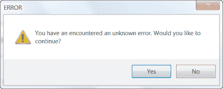](https://www.blog.pythonlibrary.org/wp-content/uploads/2010/06/errorMsgDialog.png)

[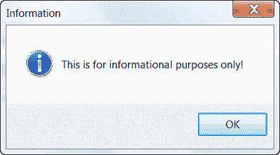](https://www.blog.pythonlibrary.org/wp-content/uploads/2010/06/infoMsgDlg.png)

[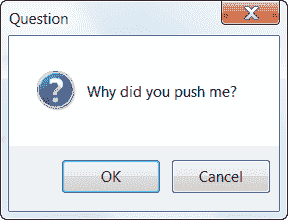](https://www.blog.pythonlibrary.org/wp-content/uploads/2010/06/questionMsgDlg.png)

现在让我们快速看一下如何创建这些对话框！

```py

# http://www.wxpython.org/docs/api/wx.MessageDialog-class.html

import wx

########################################################################
class MyForm(wx.Frame):

    #----------------------------------------------------------------------
    def __init__(self):
        wx.Frame.__init__(self, None, wx.ID_ANY,
                          "MessageDialog Tutorial")
        self.panel = wx.Panel(self, wx.ID_ANY)

        sizer = wx.BoxSizer(wx.VERTICAL)
        buttons = [("Exclamation", self.onExclamation),
                   ("Information", self.onInfo),
                   ("Question", self.onQuestion)
                   ]
        for label, handler in buttons:
            self.createAndLayoutButtons(label, handler, sizer)
        self.panel.SetSizer(sizer)

    #----------------------------------------------------------------------
    def createAndLayoutButtons(self, label, handler, sizer):
        """"""
        button = wx.Button(self.panel, label=label)
        button.Bind(wx.EVT_BUTTON, handler)
        sizer.Add(button, 0, wx.ALL|wx.CENTER, 5)

    #----------------------------------------------------------------------
    def onExclamation(self, event):
        """"""
        msg = "You have an encountered an unknown error. Would you like to continue?"
        self.showMessageDlg(msg, "ERROR",
                            wx.YES_NO|wx.YES_DEFAULT|wx.ICON_EXCLAMATION)

    #----------------------------------------------------------------------
    def onInfo(self, event):
        """
        This method is fired when its corresponding button is pressed
        """
        self.showMessageDlg("This is for informational purposes only!",
                            "Information", wx.OK|wx.ICON_INFORMATION)

    #----------------------------------------------------------------------
    def onQuestion(self, event):
        """"""
        self.showMessageDlg("Why did you push me?", "Question",
                            wx.OK|wx.CANCEL|wx.ICON_QUESTION)

    #----------------------------------------------------------------------
    def showMessageDlg(self, msg, title, style):
        """"""
        dlg = wx.MessageDialog(parent=None, message=msg, 
                               caption=title, style=style)
        dlg.ShowModal()
        dlg.Destroy()

# Run the program
if __name__ == "__main__":
    app = wx.App(False)
    frame = MyForm()
    frame.Show()
    app.MainLoop()

```

如果你看上面的例子，你会很快注意到我们可以只使用样式标志来改变 MessageDialog 的外观:

*   wx。YES_NO 为对话框提供“是”和“否”按钮
*   wx。“确定”只给了我们一个“确定”按钮
*   wx。好|wx。取消创建“确定”和“取消”按钮
*   wx。ICON _ 感叹号在对话框中放置一个黄色的三角形图标
*   wx。ICON_INFORMATION 创建一个圆形蓝色图标
*   wx。ICON_QUESTION 给我们一个问号图标

在[文档](http://www.wxpython.org/docs/api/wx.MessageDialog-class.html)中还列出了几个我们可以使用的标志，但它们大多是多余的。不过，请随意阅读它们。

## 包扎

在这篇文章中，我们已经讨论了很多内容。现在，您已经知道如何创建 wxPython 中提供的大约一半标准对话框。我们将在本文的第二部分看另一半。同时，我希望你已经发现这是有启发性的。欢迎在评论中提问！

**注意:此代码在以下位置进行了测试:**

*   视窗 XP 专业版，wxPython 2.8.10.1/2 . 8 . 11 . 0，Python 2.5
*   Windows 7 家庭版，wxPython 2.8.10.1，Python 2.6

如果你想看这篇文章的第二部分，点击[这里](https://www.blog.pythonlibrary.org/2010/07/10/the-dialogs-of-wxpython-part-2-of-2/)

## 附加阅读

*   wx。BusyInfo [文档](http://www.wxpython.org/docs/api/wx.BusyInfo-class.html)或者查看[维基页面](http://wiki.wxpython.org/BusyInfo)
*   wx。颜色对话框[文档](http://www.wxpython.org/docs/api/wx.ColourDialog-class.html)
*   CubeColourDialog (AGW) [文档](http://www.wxpython.org/docs/api/wx.lib.agw.cubecolourdialog.CubeColourDialog-class.html)(另见[加瓦纳的文档](http://xoomer.virgilio.it/infinity77/AGW_Docs/cubecolourdialog.CubeColourDialog.html))
*   [PyColourChooser 文档](http://www.wxpython.org/docs/api/wx.lib.colourchooser.pycolourchooser.PyColourChooser-class.html)
*   [wx。导演对话](http://www.wxpython.org/docs/api/wx.DirDialog-class.html)和[多导演对话](http://www.wxpython.org/docs/api/wx.lib.agw.multidirdialog.MultiDirDialog-class.html) ( [AGW](http://xoomer.virgilio.it/infinity77/AGW_Docs/multidirdialog_module.html) )
*   wx。文件对话框[文档](http://www.wxpython.org/docs/api/wx.FontDialog-class.html)
*   wx。字体对话框[文档](http://www.wxpython.org/docs/api/wx.FontDialog-class.html)
*   wx。消息对话框[文档](http://www.wxpython.org/docs/api/wx.MessageDialog-class.html)

## 下载

*   [dialogs_part_one.zip](https://www.blog.pythonlibrary.org/wp-content/uploads/2010/06/dialogs_part_one.zip)
*   [dialogs_part_one.tar](https://www.blog.pythonlibrary.org/wp-content/uploads/2010/06/dialogs_part_one.tar)