# wxPython 的对话框(第 2 部分，共 2 部分)

> 原文：<https://www.blog.pythonlibrary.org/2010/07/10/the-dialogs-of-wxpython-part-2-of-2/>

在本系列的后半部分，我发现对话框比我原来想象的还要多。虽然将它分成三部分可能是个好主意，但我们将坚持只分成两部分。在本文中，我们将讨论以下对话:

*   通用消息对话框(AGW)
*   图像对话框
*   wx。多选对话框
*   wx.PageSetupDialog
*   wx。打印对话框
*   wx。进度对话框
*   PyBusyInfo (AGW)
*   PyProgress (AGW)
*   ScrolledMessageDialog
*   wx。单选对话框
*   wx 文本交互组件

对于门外汉来说，还有一个 AboutBox 对话框，这里没有，原因很简单，它已经在本系列之外的博客中讨论过了。你自己去看看。只是想澄清一下为什么 wx？对话框不在这里:本系列只讨论预构建的对话框。wx。对话框小部件非常适合创建你自己的自定义对话框。需要注意的最后一点是，这里的示例代码是从 wxPython 演示中提取出来的，并重新用于本文。

现在，继续表演！

## GenericMessageDialog

[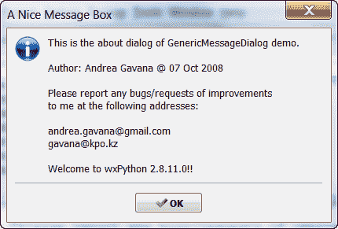](https://www.blog.pythonlibrary.org/wp-content/uploads/2010/07/genericMsgDlg.png)

GenericMessageDialog 是 Andrea Gavana 创建的 AGW 通用控件库的一部分。它比 MessageDialog 本身给了我们更多的选择，因为 GenericMessageDialog 是用纯 python 编写的，因此更容易被黑客攻击。让我们看看如何在屏幕截图中创建对话框:

```py

import images
import wx
import wx.lib.agw.genericmessagedialog as GMD

_msg = "This is the about dialog of GenericMessageDialog demo.\n\n" + \
       "Author: Andrea Gavana @ 07 Oct 2008\n\n" + \
       "Please report any bugs/requests of improvements\n" + \
       "to me at the following addresses:\n\n" + \
       "andrea.gavana@gmail.com\n" + "gavana@kpo.kz\n\n" + \
       "Welcome to wxPython " + wx.VERSION_STRING + "!!"

########################################################################
class MyForm(wx.Frame):
    """
    Based on Andrea Gavana's demo from the wxPython Demo
    """

    #----------------------------------------------------------------------
    def __init__(self):
        wx.Frame.__init__(self, None, wx.ID_ANY,
                          "Generic Message Dialog Tutorial",
                          size=(575,225))

        self.mainPanel = wx.Panel(self)
        self.buttonSizer_staticbox = wx.StaticBox(self.mainPanel, -1, "Buttons Styles")
        self.ok = wx.CheckBox(self.mainPanel, -1, "wx.OK")
        self.yes_no = wx.CheckBox(self.mainPanel, -1, "wx.YES_NO")
        self.cancel = wx.CheckBox(self.mainPanel, -1, "wx.CANCEL")
        self.yes = wx.CheckBox(self.mainPanel, -1, "wx.YES")
        self.no = wx.CheckBox(self.mainPanel, -1, "wx.NO")
        self.no_default = wx.CheckBox(self.mainPanel, -1, "wx.NO_DEFAULT")
        self.help = wx.CheckBox(self.mainPanel, -1, "wx.HELP")
        self.dialogStyles = wx.RadioBox(self.mainPanel, -1, "Dialog Styles",
                                        choices=["wx.ICON_INFORMATION", "wx.ICON_WARNING",
                                                 "wx.ICON_EXCLAMATION", "wx.ICON_ERROR",
                                                 "wx.ICON_QUESTION"],
                                        majorDimension=5, style=wx.RA_SPECIFY_ROWS)
        self.showDialog = wx.Button(self.mainPanel, -1, "Show GenericMessageDialog")

        self.SetProperties()
        self.DoLayout()

        self.Bind(wx.EVT_BUTTON, self.OnShowDialog, self.showDialog)
        self.Bind(wx.EVT_CHECKBOX, self.OnCheckBox)

    def SetProperties(self):

        self.ok.SetValue(1)
        self.dialogStyles.SetSelection(0)
        self.showDialog.SetDefault()

    def DoLayout(self):

        frameSizer = wx.BoxSizer(wx.VERTICAL)
        mainSizer = wx.BoxSizer(wx.HORIZONTAL)
        buttonSizer = wx.StaticBoxSizer(self.buttonSizer_staticbox, wx.VERTICAL)
        buttonSizer.Add(self.ok, 0, wx.LEFT|wx.RIGHT|wx.TOP, 5)
        buttonSizer.Add((0, 2), 0, 0, 0)
        buttonSizer.Add(self.yes_no, 0, wx.LEFT|wx.RIGHT, 5)
        buttonSizer.Add((0, 2), 0, 0, 0)
        buttonSizer.Add(self.cancel, 0, wx.LEFT|wx.RIGHT, 5)
        buttonSizer.Add((0, 2), 0, 0, 0)
        buttonSizer.Add(self.yes, 0, wx.LEFT|wx.RIGHT, 5)
        buttonSizer.Add((0, 2), 0, 0, 0)
        buttonSizer.Add(self.no, 0, wx.LEFT|wx.RIGHT, 5)
        buttonSizer.Add((0, 2), 0, 0, 0)
        buttonSizer.Add(self.no_default, 0, wx.LEFT|wx.RIGHT, 5)
        buttonSizer.Add((0, 2), 0, 0, 0)
        buttonSizer.Add(self.help, 0, wx.LEFT|wx.RIGHT|wx.BOTTOM, 5)
        mainSizer.Add(buttonSizer, 0, wx.ALL, 5)
        mainSizer.Add(self.dialogStyles, 0, wx.ALL, 5)
        mainSizer.Add((10, 0), 0, 0, 0)
        mainSizer.Add(self.showDialog, 0, wx.ALL|wx.ALIGN_CENTER_HORIZONTAL, 10)
        mainSizer.Add((10, 0), 0, 0, 0)
        self.mainPanel.SetSizer(mainSizer)

        frameSizer.Add(self.mainPanel, 1, wx.EXPAND)
        self.SetSizer(frameSizer)
        frameSizer.Layout()

    def OnCheckBox(self, event):

        obj = event.GetEventObject()
        widgets = [self.yes, self.yes_no, self.no, self.no_default]
        if not event.IsChecked():
            return

        if obj == self.ok:
            for checks in widgets:
                checks.SetValue(0)
        elif obj in widgets:
            self.ok.SetValue(0)

    def OnShowDialog(self, event):

        btnStyle = 0
        for child in self.mainPanel.GetChildren():
            if isinstance(child, wx.CheckBox):
                if child.GetValue():
                    btnStyle |= eval(child.GetLabel())

        dlgStyle = eval(self.dialogStyles.GetStringSelection())
        dlg = GMD.GenericMessageDialog(self, _msg,
                                       "A Nice Message Box",
                                       btnStyle | dlgStyle)
        dlg.SetIcon(images.Mondrian.GetIcon())
        dlg.ShowModal()
        dlg.Destroy()

# Run the program
if __name__ == "__main__":
    app = wx.App(False)
    frame = MyForm()
    frame.Show()
    app.MainLoop()

```

在任何示例中，首先要寻找的是文件顶部导入的内容。在本例中，我们使用 wxPython 演示中的 *images.py* 文件来提供本例中的一些图像。我们还从*wx . lib . agw . genericmessagedialog*中导入我们需要的对话框。我们可以跳过框架的初始化代码，因为我们想把重点放在对话框上。我们看到的第一个对话框相关的方法是*设置属性*。它在对话框中设置了一些默认选项，如选中“ok”复选框，选择第一个单选按钮，并将焦点放在将打开通用对话框的按钮上。前两个将告诉我们的对话框创建方法 *OnShowDialog* ，我们想要什么样的对话框。因此，我们要看的下一个方法是 OnShowDialog 方法。

在这里，我们发现 GenericMessageDialog 采用了与普通 MessageDialog 几乎相同的值，即父项、消息、标题和一些样式。如果适用，您还可以设置其大小、位置和 agwstyle。我们还可以通过调用 SetIcon 向对话框添加图标。你有它！一个通用的消息对话框！

## 使用图像对话框查看图像

[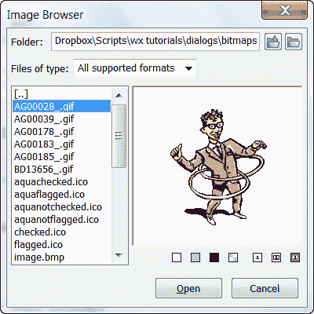](https://www.blog.pythonlibrary.org/wp-content/uploads/2010/07/imageDialog.png)

ImageDialog 是一个方便的小对话框，可以用来预览各种图像格式。这个对话框是另一个通用对话框，但它不是 AGW 库的一部分。ImageDialog 非常方便，非常容易创建。有多简单？我们来看看下面的代码，自己看看吧！

```py

import os
import wx
import wx.lib.imagebrowser as ib

########################################################################
class MyForm(wx.Frame):

    #----------------------------------------------------------------------
    def __init__(self):
        wx.Frame.__init__(self, None, wx.ID_ANY,
                          "ImageDialog Tutorial")
        panel = wx.Panel(self, wx.ID_ANY)
        b = wx.Button(panel, label="Create and Show a ImageDialog")
        b.Bind(wx.EVT_BUTTON, self.onButton)

        sizer = wx.BoxSizer(wx.VERTICAL)
        sizer.Add(b, 0, wx.ALL|wx.CENTER, 5)
        panel.SetSizer(sizer)

    #----------------------------------------------------------------------
    def onButton(self, event):
        """
        Based on the wxPython demo by the same name
        """
        # get current working directory
        dir = os.getcwd()

        # set the initial directory for the demo bitmaps
        initial_dir = os.path.join(dir, 'bitmaps')

        # open the image browser dialog
        dlg = ib.ImageDialog(self, initial_dir)

        dlg.Centre()

        if dlg.ShowModal() == wx.ID_OK:
            # show the selected file
            print "You Selected File: " + dlg.GetFile()
        else:
            print "You pressed Cancel"

        dlg.Destroy()

#----------------------------------------------------------------------
# Run the program
if __name__ == "__main__":
    app = wx.App(False)
    frame = MyForm()
    frame.Show()
    app.MainLoop()

```

如果你查看一下 *onButton* 方法，你可以看到我们是如何初始化这个对话框的。基本上，你只需要给控件提供一个父控件和一个装满图片的目录，然后显示对话框。就是这样！我没告诉你这很容易吗？

## 用 wx 做选择。多选对话框

[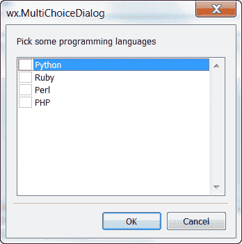](https://www.blog.pythonlibrary.org/wp-content/uploads/2010/07/multipleChoiceDialog.png)

如果你需要向用户询问一条或多条简单的信息，你会怎么做？你可以创建自己的控件，也可以选择 *wx。多选对话框*。多选择对话框使您能够提供一个允许用户选择多个选项的对话框。是的，这很明显...如此这般地进行编码！

```py

import wx

########################################################################
class MyForm(wx.Frame):

    #----------------------------------------------------------------------
    def __init__(self):
        wx.Frame.__init__(self, None, wx.ID_ANY,
                          "MultiChoiceDialog Tutorial")
        panel = wx.Panel(self, wx.ID_ANY)
        b = wx.Button(panel, label="Create and Show a wx.MultiChoiceDialog")
        b.Bind(wx.EVT_BUTTON, self.onButton)

        sizer = wx.BoxSizer(wx.VERTICAL)
        sizer.Add(b, 0, wx.ALL|wx.CENTER, 5)
        panel.SetSizer(sizer)

    #----------------------------------------------------------------------
    def onButton(self, event):
        """
        Based on the wxPython demo - opens the MultiChoiceDialog
        and prints the user's selection(s) to stdout
        """
        lst = ["Python", "Ruby", "Perl", "PHP"]
        dlg = wx.MultiChoiceDialog( self, 
                                   "Pick some programming languages",
                                   "wx.MultiChoiceDialog", lst)

        if (dlg.ShowModal() == wx.ID_OK):
            selections = dlg.GetSelections()
            strings = [lst[x] for x in selections]
            print "You chose:" + str(strings)

        dlg.Destroy()

#----------------------------------------------------------------------
# Run the program
if __name__ == "__main__":
    app = wx.App(False)
    frame = MyForm()
    frame.Show()
    app.MainLoop()

```

多选择对话框和大多数对话框一样。它接受父标签、描述性标签、窗口标题和选项列表。要获得用户的选择，你需要做的就是调用对话框的 *GetSelections* 方法。就是这样！

## wx.PageSetupDialog

[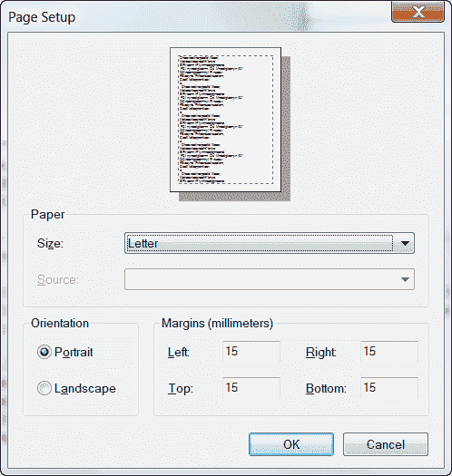](https://www.blog.pythonlibrary.org/wp-content/uploads/2010/07/pagesetupDlg.png)

wx。PageSetupDialog 用于设置打印页面的一些参数，或者只是设置页面进行编辑。您可以使用它来调整纸张大小、页边距以及页面应该是横向还是纵向。下面是设置的方法:

```py

import wx

########################################################################
class MyForm(wx.Frame):

    #----------------------------------------------------------------------
    def __init__(self):
        wx.Frame.__init__(self, None, wx.ID_ANY,
                          "PageSetupDialog Tutorial")
        panel = wx.Panel(self, wx.ID_ANY)
        b = wx.Button(panel, label="Create and Show a PageSetupDialog")
        b.Bind(wx.EVT_BUTTON, self.onButton)

        sizer = wx.BoxSizer(wx.VERTICAL)
        sizer.Add(b, 0, wx.ALL|wx.CENTER, 5)
        panel.SetSizer(sizer)

    #----------------------------------------------------------------------
    def onButton(self, event):
        """
        Based on the wxPython demo - sets some default values for the 
        PageSetupDialog, then opens it. If the user presses OK, the 
        user's choices are extracted and printed to stdout
        """
        data = wx.PageSetupDialogData()
        data.SetMarginTopLeft( (15, 15) )
        data.SetMarginBottomRight( (15, 15) )
        #data.SetDefaultMinMargins(True)
        data.SetPaperId(wx.PAPER_LETTER)

        dlg = wx.PageSetupDialog(self, data)

        if dlg.ShowModal() == wx.ID_OK:
            data = dlg.GetPageSetupData()
            tl = data.GetMarginTopLeft()
            br = data.GetMarginBottomRight()
            print 'Margins are: %s %s\n' % (str(tl), str(br))

        dlg.Destroy()

#----------------------------------------------------------------------
# Run the program
if __name__ == "__main__":
    app = wx.App(False)
    frame = MyForm()
    frame.Show()
    app.MainLoop()

```

让我们看看 *onButton* 方法。首先，我们需要为对话框设置一些默认值，这就是前四行的目的。接下来我们需要获得用户的选择，所以在条件 IF 语句中我们看到如何访问对话框中的一些设置，例如 *GetMarginTopLeft* 或 *GetMarginBottomRight* 。您可以使用其他 getters 来获取其他信息，如 *GetPaperSize* 。注意，要访问这些方法，首先必须创建一个基于 *GetPageSetupData* 的对象。

## wx。打印对话框

[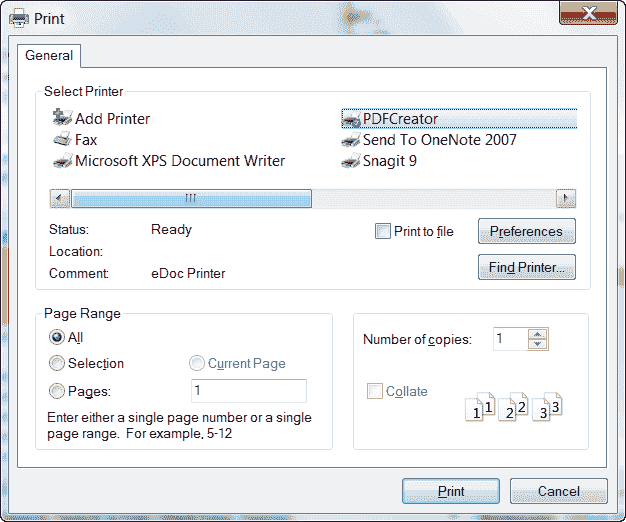](https://www.blog.pythonlibrary.org/wp-content/uploads/2010/07/printDlg.png)

wx。PrintDialog 允许用户选择打印到哪台打印机，并为用户提供正常的选项，如果用户试图打印某样东西，就会看到这些选项。这是一个围绕平台的本地打印对话框的方便的包装器。你可以这样做:

```py

import wx

########################################################################
class MyForm(wx.Frame):

    #----------------------------------------------------------------------
    def __init__(self):
        wx.Frame.__init__(self, None, wx.ID_ANY,
                          "PrintDialog Tutorial")
        panel = wx.Panel(self, wx.ID_ANY)
        b = wx.Button(panel, label="Create and Show a wx.PrintDialog")
        b.Bind(wx.EVT_BUTTON, self.onButton)

        sizer = wx.BoxSizer(wx.VERTICAL)
        sizer.Add(b, 0, wx.ALL|wx.CENTER, 5)
        panel.SetSizer(sizer)

    #----------------------------------------------------------------------
    def onButton(self, evt):
        """
        Based on the wxPython demo - Sets up a few defaults for the dialog
        before showing it modally. 
        """
        data = wx.PrintDialogData()

        data.EnableSelection(True)
        data.EnablePrintToFile(True)
        data.EnablePageNumbers(True)
        data.SetMinPage(1)
        data.SetMaxPage(5)
        data.SetAllPages(True)

        dlg = wx.PrintDialog(self, data)

        if dlg.ShowModal() == wx.ID_OK:
            data = dlg.GetPrintDialogData()
            print 'GetAllPages: %d\n' % data.GetAllPages()
        dlg.Destroy()

#----------------------------------------------------------------------
# Run the program
if __name__ == "__main__":
    app = wx.App(False)
    frame = MyForm()
    frame.Show()
    app.MainLoop()

```

与 PageSetupDialog 非常相似，我们也需要为这个对话框设置一些默认值。在这里，我们设置最小和最大页数，启用打印到文件，等等。当您获取用户的选择时，您可能希望保存它们并使用该信息实例化对话框，这样他们就不必在想要再次打印时重新定制他们的打印作业。总之，为了实际获得用户的选择，我们调用对话框的 *GetPrintDialogData* 方法，然后使用结果来查询其他部分。我们的例子只是展示了如何获取所有要打印的页面。您可以通过执行以下操作来深入查看更多信息:

```py

pd = data.GetPrintData()
>>> pd.Duplex
0
>>> pd.GetFilename()
u''
>>> pd.GetOrientation()
1
>>> pd.GetPaperSize()
wx.Size(210, 297)
>>> pd.GetPrintMode()

```

您将不得不参考 wxPython、wxWidgets 甚至您的平台的文档来弄清楚一些结果的含义。

## wx。进度对话框

[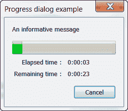](https://www.blog.pythonlibrary.org/wp-content/uploads/2010/07/progressDlg.png)

wx。ProgressDialog 可以用来向用户显示下载进行到什么程度，或者向用户提供关于其他长时间运行过程的反馈。你也可以使用 wx。Gauge 或 PyProgress (AGW)向用户提供类似的信息。我们很快就会看到这一点，但首先我们要看看如何创建 wx。进度对话框:

```py

# progressDialog.py

import wx

########################################################################
class MyForm(wx.Frame):

    #----------------------------------------------------------------------
    def __init__(self):
        wx.Frame.__init__(self, None, wx.ID_ANY,
                          "ProgressDialog Tutorial")
        panel = wx.Panel(self, wx.ID_ANY)
        b = wx.Button(panel, label="Create and Show a ProgressDialog")
        b.Bind(wx.EVT_BUTTON, self.onButton)

        sizer = wx.BoxSizer(wx.VERTICAL)
        sizer.Add(b, 0, wx.ALL|wx.CENTER, 5)
        panel.SetSizer(sizer)

    #----------------------------------------------------------------------
    def onButton(self, evt):
        """
        Copied from the wxPython demo
        """
        max = 80

        dlg = wx.ProgressDialog("Progress dialog example",
                               "An informative message",
                               maximum = max,
                               parent=self,
                               style = wx.PD_CAN_ABORT
                                | wx.PD_APP_MODAL
                                | wx.PD_ELAPSED_TIME
                                #| wx.PD_ESTIMATED_TIME
                                | wx.PD_REMAINING_TIME
                                )

        keepGoing = True
        count = 0

        while keepGoing and count < max:
            count += 1
            wx.MilliSleep(250)

            if count >= max / 2:
                (keepGoing, skip) = dlg.Update(count, "Half-time!")
            else:
                (keepGoing, skip) = dlg.Update(count)

        dlg.Destroy()

#----------------------------------------------------------------------
# Run the program
if __name__ == "__main__":
    app = wx.App(False)
    frame = MyForm()
    frame.Show()
    app.MainLoop()

```

如您所见，ProgressDialog 接受以下参数:窗口标题、消息、运行时间、父元素和各种样式。我们添加了 wx。PD_CAN_ABORT 样式允许我们中止对话框。其余的风格和方法都是不言自明的。

## PyBusyInfo (AGW)

[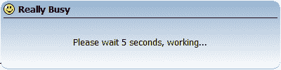](https://www.blog.pythonlibrary.org/wp-content/uploads/2010/07/pyBusyDlg.png)

在上一篇文章中，我们介绍了 BusyDlg。嗯，Andrea Gavana 写了一个纯 python 版本的几乎未知的对话框，让我们能够添加图像！由于它是 python，我们可以很容易地向它添加其他特性。下面是创建一个的方法:

```py

import images
import wx
import wx.lib.agw.pybusyinfo as PBI

########################################################################
class MyForm(wx.Frame):

    #----------------------------------------------------------------------
    def __init__(self):
        wx.Frame.__init__(self, None, wx.ID_ANY,
                          "PyBusyInfo Tutorial")
        panel = wx.Panel(self, wx.ID_ANY)
        b = wx.Button(panel, label="Test PyBusyInfo")
        b.Bind(wx.EVT_BUTTON, self.onButton)

        sizer = wx.BoxSizer(wx.VERTICAL)
        sizer.Add(b, 0, wx.ALL|wx.CENTER, 5)
        panel.SetSizer(sizer)

    #----------------------------------------------------------------------
    def onButton(self, event):
        """
        Based on the wxPython demo by the same name
        """
        event.Skip()
        message = "Please wait 5 seconds, working..."
        busy = PBI.PyBusyInfo(message, parent=None, title="Really Busy",
                              icon=images.Smiles.GetBitmap())

        wx.Yield()

        for indx in xrange(5):
            wx.MilliSleep(1000)

        del busy

#----------------------------------------------------------------------
# Run the program
if __name__ == "__main__":
    app = wx.App(False)
    frame = MyForm()
    frame.Show()
    app.MainLoop()

```

注意到 *PyBusyInfo* 也有一个古怪的方法来破坏对话框。在这种情况下，我们称 python 的内置为“del”。希望 Gavana 先生会给它添加一个 Destroy()方法，这样对话框就可以用标准的方式销毁了。还要注意我们是如何添加图标的，只需将图标参数传入即可。

## PyProgress (AGW)

[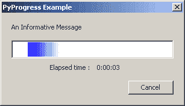](https://www.blog.pythonlibrary.org/wp-content/uploads/2010/07/pyProgressDlg.png)

勤劳的安德里亚·加瓦纳为我们带来了对话。是的，它是另一个 AGW 库小部件，这意味着它也是纯 python。它看起来和 wx.ProgressDialog 有点不同。希望你也会喜欢它的美学。让我们来看看如何制作一个我们自己的:

```py

import images
import wx
import wx.lib.agw.pyprogress as PP

########################################################################
class MyForm(wx.Frame):

    #----------------------------------------------------------------------
    def __init__(self):
        wx.Frame.__init__(self, None, wx.ID_ANY,
                          "PyBusyInfo Tutorial")
        panel = wx.Panel(self, wx.ID_ANY)
        b = wx.Button(panel, label="Test PyBusyInfo")
        b.Bind(wx.EVT_BUTTON, self.onButton)

        sizer = wx.BoxSizer(wx.VERTICAL)
        sizer.Add(b, 0, wx.ALL|wx.CENTER, 5)
        panel.SetSizer(sizer)

    #----------------------------------------------------------------------
    def onButton(self, event):
        """
        Based on the wxPython demo by the same name
        """
        event.Skip()
        style = wx.PD_APP_MODAL|wx.PD_ELAPSED_TIME|wx.PD_CAN_ABORT
        dlg = PP.PyProgress(None, -1, "PyProgress Example",
                            "An Informative Message",                            
                            style=style)
        max = 400
        keepGoing = True
        count = 0

        while keepGoing and count < max:
            count += 1
            wx.MilliSleep(30)

            if count >= max / 2:
                keepGoing = dlg.UpdatePulse("Half-time!")
            else:
                keepGoing = dlg.UpdatePulse()

        dlg.Destroy()
        wx.SafeYield()
        wx.GetApp().GetTopWindow().Raise()

#----------------------------------------------------------------------
# Run the program
if __name__ == "__main__":
    app = wx.App(False)
    frame = MyForm()
    frame.Show()
    app.MainLoop()

```

上面的代码非常像我们到目前为止看到的所有其他对话框。只是为了好玩，我会让你弄清楚这个是如何工作的。

## ScrolledMessageDialog

[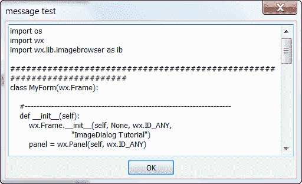](https://www.blog.pythonlibrary.org/wp-content/uploads/2010/07/scrolledMsgDlg.png)

ScrolledMessageDialog 是少数几个不是由 Andrea Gavana 编写的通用对话框之一。它也是最容易创建和使用的工具之一。不相信我？好吧，看看下面的代码，看看你错得有多离谱！

```py

import wx
import wx.lib.dialogs

########################################################################
class MyForm(wx.Frame):

    #----------------------------------------------------------------------
    def __init__(self):
        wx.Frame.__init__(self, None, wx.ID_ANY,
                          "ScrolledMessageDialog Tutorial")
        panel = wx.Panel(self, wx.ID_ANY)
        b = wx.Button(panel, label="Create and Show a ScrolledMessageDialog")
        b.Bind(wx.EVT_BUTTON, self.onButton)

        sizer = wx.BoxSizer(wx.VERTICAL)
        sizer.Add(b, 0, wx.ALL|wx.CENTER, 5)
        panel.SetSizer(sizer)

    #----------------------------------------------------------------------
    def onButton(self, event):
        """
        Based on the wxPython demo by the same name
        """
        f = open("imageDialog.py", "r")
        msg = f.read()
        f.close()

        dlg = wx.lib.dialogs.ScrolledMessageDialog(self, msg, "message test")
        dlg.ShowModal()

        dlg.Destroy()

#----------------------------------------------------------------------
# Run the program
if __name__ == "__main__":
    app = wx.App(False)
    frame = MyForm()
    frame.Show()
    app.MainLoop()

```

正如您可以清楚地看到的，您所需要的只是一些要传递给对话框的文本。在本例中，我们读取了另一个 python 文件，并将其传递给对话框。我希望你已经注意到我们为这些通用对话框所做的特殊导入。为此，我们必须导入 *wx.lib.dialogs* 来访问 *ScrolledMessageDialog* 。

## wx。单选对话框

[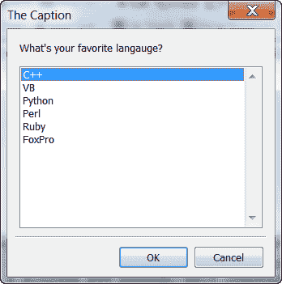](https://www.blog.pythonlibrary.org/wp-content/uploads/2010/07/singleChoiceDlg.png)

有时你想给用户一个项目列表，但只允许他选择一个。您可以使用自定义的 wx。或者你可以使用 *wx。SingleChoiceDialog* 。如果你没猜错，我们将选择后者...

```py

import wx

########################################################################
class MyForm(wx.Frame):

    #----------------------------------------------------------------------
    def __init__(self):
        wx.Frame.__init__(self, None, wx.ID_ANY,
                          "SingleChoiceDialog Tutorial")
        panel = wx.Panel(self, wx.ID_ANY)
        b = wx.Button(panel, label="Create and Show a SingleChoiceDialog")
        b.Bind(wx.EVT_BUTTON, self.onButton)

        sizer = wx.BoxSizer(wx.VERTICAL)
        sizer.Add(b, 0, wx.ALL|wx.CENTER, 5)
        panel.SetSizer(sizer)

    #----------------------------------------------------------------------
    def onButton(self, event):
        """
        Based on the wxPython demo by the same name
        """
        dlg = wx.SingleChoiceDialog(
                self, "What's your favorite langauge?", 'The Caption',
                ["C++", "VB", "Python", "Perl", "Ruby", "FoxPro"], 
                wx.CHOICEDLG_STYLE
                )

        if dlg.ShowModal() == wx.ID_OK:
            print 'You selected: %s\n' % dlg.GetStringSelection()

        dlg.Destroy()

#----------------------------------------------------------------------
# Run the program
if __name__ == "__main__":
    app = wx.App(False)
    frame = MyForm()
    frame.Show()
    app.MainLoop()

```

这里的 *SingleChoiceDialog* 接受了大多数与其他对话框相同的参数。请注意，我们需要传入一个列表来创建选择列表和 wx。CHOICEDLG_STYLE 样式使对话框正常工作。除此之外，我们去过那里，做过那件事。

## wx 文本交互组件

[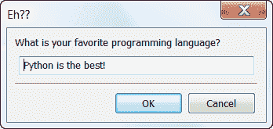](https://www.blog.pythonlibrary.org/wp-content/uploads/2010/07/textEntryDlg.png)

*wx。TextEntryDialog* 给了我们允许用户告诉我们他想要什么的能力。是的，这很可怕，但有时你不得不这么做。您可以使用这个对话框从您尊敬的用户那里获得非特定的评论或反馈。你可以这样做:

```py

import wx

########################################################################
class MyForm(wx.Frame):

    #----------------------------------------------------------------------
    def __init__(self):
        wx.Frame.__init__(self, None, wx.ID_ANY,
                          "TextEntryDialog Tutorial")
        panel = wx.Panel(self, wx.ID_ANY)
        b = wx.Button(panel, label="Create and Show a TextEntryDialog")
        b.Bind(wx.EVT_BUTTON, self.onButton)

        sizer = wx.BoxSizer(wx.VERTICAL)
        sizer.Add(b, 0, wx.ALL|wx.CENTER, 5)
        panel.SetSizer(sizer)

    #----------------------------------------------------------------------
    def onButton(self, event):
        """
        Based on the wxPython demo by the same name
        """
        dlg = wx.TextEntryDialog(
                self, 'What is your favorite programming language?',
                'Eh??', 'Python')

        dlg.SetValue("Python is the best!")

        if dlg.ShowModal() == wx.ID_OK:
            print "you accepted!"
        dlg.Destroy()

#----------------------------------------------------------------------
# Run the program
if __name__ == "__main__":
    app = wx.App(False)
    frame = MyForm()
    frame.Show()
    app.MainLoop()

```

这里我们看到对话框的参数包括:parent、message、caption、defaultValue。当然，当我们调用对话框的 *SetValue()* 方法时，我们会覆盖 defaultValue。代码的其余部分应该看起来很熟悉。

## 包扎

如果你能走到这一步，恭喜你！你刚刚艰难地读完了这个网站上有史以来最长的帖子之一！您现在应该是 wxPython 对话框的专家了。如果你想要更多的信息，请随意阅读下面的参考资料，继续你的学习。走出去，开始使用这些对话，以取得良好的效果！

*注意:在撰写本文时，除了 wxPython 演示、Wingware 的 IDE 和几页文档之外，我没有使用任何东西。*

## 附加阅读

*   GenericMessageDialog - [官方文档](http://www.wxpython.org/docs/api/wx.lib.agw.genericmessagedialog-module.html)， [Gavana 的文档](http://xoomer.virgilio.it/infinity77/AGW_Docs/genericmessagedialog_module.html)，来自 [wxPython Wiki](http://wiki.wxpython.org/GenericMessageDialog) 的同名文件
*   ImageDialog - [官方文档](http://www.wxpython.org/docs/api/wx.lib.imagebrowser.ImageDialog-class.html)，部分 [java 网站](http://www.java2s.com/Tutorial/Python/0380__wxPython/useImageDialog.htm)
*   wx。多选对话框- [官方文档](http://www.wxpython.org/docs/api/wx.MultiChoiceDialog-class.html)
*   wx。PageSetupDialog - [官方文档](http://www.wxpython.org/docs/api/wx.PageSetupDialog-class.html)，Andrea Gavana 的[文档](http://xoomer.virgilio.it/infinity77/wxPython/Widgets/wx.PageSetupDialog.html)
*   wx。打印对话- [官方文档](http://www.wxpython.org/docs/api/wx.PrintDialog-class.html)，[打印维基页面](http://wiki.wxpython.org/Printing)
*   wx。进度对话框- [官方文档](http://www.wxpython.org/docs/api/wx.ProgressDialog-class.html)
*   PyBusyInfo - [Andrea Gavana's Docs](http://xoomer.virgilio.it/infinity77/AGW_Docs/pybusyinfo_module.html)
*   官方文件，[安德里亚·加瓦那的文件](http://xoomer.virgilio.it/infinity77/AGW_Docs/pyprogress_module.html)
*   ScrolledMessageDialog - [官方文档](http://www.wxpython.org/docs/api/wx.lib.dialogs.ScrolledMessageDialog-class.html)，维基[示例](http://wiki.wxpython.org/MessageBoxes)
*   wx。SingleChoiceDialog - [官方文档](http://www.wxpython.org/docs/api/wx.SingleChoiceDialog-class.html)
*   wx。TextEntryDialog - [官方文档](http://www.wxpython.org/docs/api/wx.TextEntryDialog-class.html)

## 更多阅读

*   本[系列第一部分](https://www.blog.pythonlibrary.org/2010/06/26/the-dialogs-of-wxpython-part-1-of-2/)
*   Devshed 的[对话文章](http://www.devshed.com/c/a/Python/Dialogs-in-wxPython/)
*   SciPy 的对话[食谱页面](http://www.scipy.org/Cookbook/wxPython_dialogs)
*   Zetcode 的[对话框文章](http://zetcode.com/wxpython/dialogs/)

## 下载

*   [dialogs_part_two.zip](https://www.blog.pythonlibrary.org/wp-content/uploads/2010/07/dialogs_part_two.zip)
*   [dialogs_part_two.tar](https://www.blog.pythonlibrary.org/wp-content/uploads/2010/07/dialogs_part_two.tar)

**注意:此代码在以下位置进行了测试:**

*   视窗 XP 专业版，wxPython 2.8.10.1/2 . 8 . 11 . 0，Python 2.5
*   Windows 7 家庭版，wxPython 2.8.10.1，Python 2.6