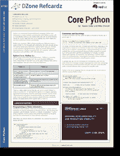

# DZone 基本核心 Python 备忘单

> 原文：<https://www.blog.pythonlibrary.org/2013/10/28/the-dzone-essential-core-python-cheat-sheet/>

几个月前， [Dzone](http://www.dzone.com/links/index.html) 联系我，让我和他们一起完成另一个作者开始的 Python 备忘单。大约两周前，我发现另一位作者是内奥米·塞德。无论如何，经过 DZone 方面的大量审查，他们终于发布了成品。你可以在这里查看

我认为尝试延续别人的想法是非常有趣的，尽管有时也会有点令人沮丧。将来，我想我会喜欢和其他作家一起合作完成一件作品。不过最后，我认为这个项目结果很好，DZone 的人让它看起来非常好。

希望新的 Python 开发人员(也可能是老的)会发现它对学习 Python 很有帮助。