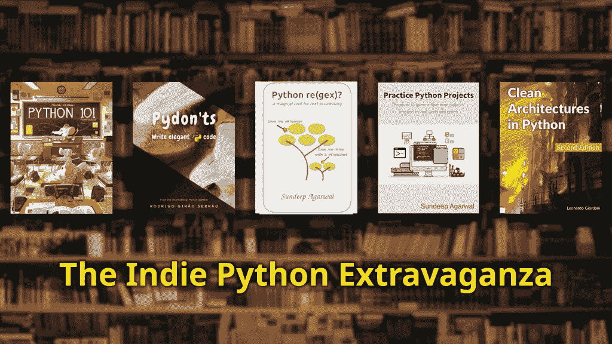

# 独立 Python 盛会图书包

> 原文：<https://www.blog.pythonlibrary.org/2021/10/01/the-indie-python-extravaganza-book-bundle/>

我正和我的一些独立内容创作者伙伴一起为 2021 年 10 月**的**月创建一个[免费 Python 书籍包](https://leanpub.com/b/theindiepythonextravaganza/c/pytober)！

## **独立 Python 盛会！**

这些书将帮助您一页一页地提高 Python 编程语言的知识。加入四个独立作者的旅程，从 Python 的基础到生产就绪系统的结构，浏览该语言的核心特性，一些中间项目和深入研究正则表达式。

在这个包里，Mike 将用 **Python 101** 教你 Python 的基础知识。Sundeep 将率先帮助你通过**实践 Python 项目**将你的知识付诸实践。在 Rodrigo 的**Pydon ts**书中，学习在用他写 Python 程序时不要做什么！如果你需要学习正则表达式，Sundeep 用他的 **Python re(gex)再次为你撑腰？** book，当你准备好开始生产代码时，你会有 Python 中的 **Clean Architectures 来帮助你！**

## 该套餐仅在 2021 年**10 月**日**免费**使用。

### 仅在 [Leanpub](https://leanpub.com/b/theindiepythonextravaganza/c/pytober) 上提供！

以下是关于该捆绑包中图书的更多信息:

## **Python 101**

**第二版**

作者:迈克·德里斯科尔

了解如何编写 Python 以及其他内容。您不仅将学习 Python 的语法，还将创建原型应用程序和二进制文件，并与家人和朋友分享。

## **练习 Python 项目**

**受现实世界用例启发的初级到中级项目**

作者:桑迪普·阿加瓦尔

知道 Python 基础但不知道下一步该怎么做？通过受真实世界启发的 Python 项目，在您的编程之旅中迈出下一步。

## **Pydon ts**

**编写优雅的 Python 代码**

罗德里戈·吉罗将

Python 有如此多的库，以至于人们经常忘记花时间去了解 Python 提供的所有真正有趣和有用的特性。

Pydon 'ts 教你 Python 的这些核心特性，用大量的代码示例向你展示如何在*真实世界*的*真实代码*中使用这些特性。

想掌握 Python？从这里开始？？？？。

## **Python re(gex)？**

**文本处理的神奇工具**

作者:桑迪普·阿加瓦尔

脚本和自动化任务通常需要从输入数据中提取特定的文本部分，或者将它们从一种格式修改为另一种格式。

这本书将帮助你学习 **Python 正则表达式**，一种满足各种文本处理需求的迷你编程语言。

## **Python 中的干净架构**

更好的软件设计的实用方法

作者莱昂纳多·乔尔达尼

什么是好的软件架构？为什么我们要费心构造代码并花时间测试它呢？如果你喜欢花几个小时调试你的程序，或者在办公室呆到很晚，从生产中的错误部署中恢复过来，这本书绝对不适合你！

(照片由[阿尔方斯·莫拉莱斯](https://unsplash.com/@alfonsmc10?utm_source=unsplash&utm_medium=referral&utm_content=creditCopyText)在 [Unsplash](https://unsplash.com/s/photos/library?utm_source=unsplash&utm_medium=referral&utm_content=creditCopyText) 上拍摄)