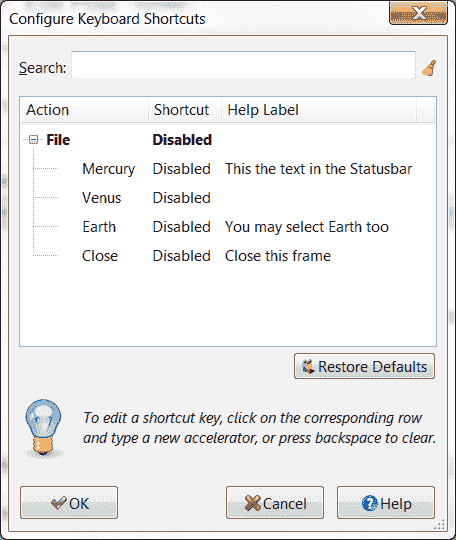

# wxPython 的新快捷编辑器

> 原文：<https://www.blog.pythonlibrary.org/2012/06/23/the-new-shortcuteditor-for-wxpython/>

我本打算在读到它的一周内写一篇文章，但后来事情变得很忙，我就忘了。总之，wxPython 工具包中有一个新的小部件，叫做 ShortcutEditor。你可以在 wxPython [邮件列表](https://groups.google.com/forum/#!topic/wxpython-users/2RwGgH6jHVw)上读到它。除非你经常从 SVN 出差，否则你可能需要更新本地驱动器上的 agw lib 文件夹。它也可能包含在最新的凤凰版本中，但我不确定。如果您想检查它，请在命令行上执行以下操作(假设您已经安装了 svn)

 `svn checkout http://svn.wxwidgets.org/svn/wx/wxPython/3rdParty/AGW/agw/` 

这将在你当前的目录下创建一个“agw”文件夹。您会希望将它复制到 wxPython 安装中的文件之上。在我的机器上，它位于以下位置:**C:\ python 27 \ Lib \ site-packages \ wx-2 . 9 . 3-MSW \ wx \ Lib**源代码中包含了一个简单的演示应用程序。我在这里复制它，所以你也可以试着运行它:

```py

import wx
import wx.lib.agw.shortcuteditor as SE

class MyFrame(wx.Frame):

    def __init__(self, parent):

        wx.Frame.__init__(self, parent, -1, "ShortcutEditor Demo") 

        bar = wx.MenuBar()
        menu = wx.Menu()

        menu.Append(101, "&Mercury", "This the text in the Statusbar")
        menu.Append(102, "&Venus", "")
        menu.Append(103, "&Earth", "You may select Earth too")
        menu.AppendSeparator()
        menu.Append(104, "&Close", "Close this frame")

        bar.Append(menu, 'File')
        self.SetMenuBar(bar)

        dlg = SE.ShortcutEditor(self)
        dlg.FromMenuBar(self)

        if dlg.ShowModal() == wx.ID_OK:
            # Changes accepted, send back the new shortcuts to the TLW wx.MenuBar
            dlg.ToMenuBar(self)

        dlg.Destroy()

# our normal wxApp-derived class, as usual

app = wx.App(0)

frame = MyFrame(None)
app.SetTopWindow(frame)
frame.Show()

app.MainLoop()

```

如果您运行上面的代码，您应该会在屏幕上看到类似这样的内容:

[](https://www.blog.pythonlibrary.org/wp-content/uploads/2012/06/wxshortcuteditor.png)

然后就可以开始换快捷键了。我觉得这很酷。根据该文件的内部文档，它可以更改菜单快捷键和加速器表。你应该找个时间试一试。我认为这将是一个非常有用的工具，可以添加到我自己的脚本中。