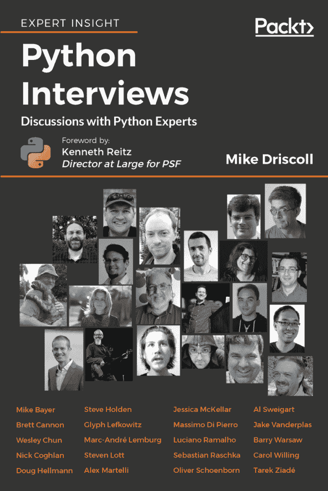

# Packt Python 简易包 2019

> 原文：<https://www.blog.pythonlibrary.org/2018/12/31/the-packt-python-humble-bundle-2019/>

Packt Publishing 正在与 Humble Bundle 合作，于 2019 年推出 Python 捆绑包。

你可以在这里查看完整的头衔列表:[https://www.humblebundle.com/books/python-packt-2019-books](https://www.humblebundle.com/books/python-packt-2019-books)

其中一本是我自己的 [Python 访谈](http://amzn.to/2FEWfcY)书

这一捆书里还有不少其他看起来很有趣的书。我知道史蒂文·洛特和达斯丁·菲利普斯的书最有可能是好书。

这个包的另一个好处是，你可以通过获得一堆有趣的 Python 书籍来支持 Python 软件基金会！