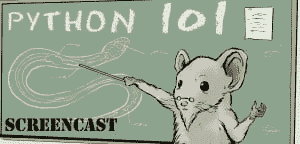

# Python 101 截屏 Kickstarter 现已上线！

> 原文：<https://www.blog.pythonlibrary.org/2015/03/25/the-python-101-screencast-kickstarter-is-now-live/>

我最近的项目是把我的书《Python 101》改编成电影。我已经启动了一个 Kickstarter 来筹集资金来帮助这一努力。你可以在这里查看:

[https://www . kickstarter . com/projects/34257246/the-python-101-screencast](https://www.kickstarter.com/projects/34257246/the-python-101-screencast)

基本的想法是把这本书的每一章都变成一个截屏。目前有 44 个章节将被制作成迷你视频。我已经意识到我可以在一个截屏中添加许多其他项目，这些项目展示起来比写起来容易，所以肯定会有额外的内容。我希望你能和我一起参与这个项目。

谢谢，迈克