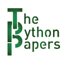

# Python 论文时事通讯

> 原文：<https://www.blog.pythonlibrary.org/2023/01/02/the-python-papers-newsletter/>

几个月来，我一直在考虑创办一份 Python 时事通讯的想法。我决定硬着头皮在 2023 年试一试。

我的时事通讯叫做[Python 论文](https://pypapers.substack.com/)。

我将涉及许多不同的 Python 主题:

*   Python GUIs
*   用 Python 进行图像处理
*   初级 Python 主题到高级主题
*   Excel 和 Python
*   我对各种套餐的了解，包括熊猫和姜戈
*   还有更多！
*   我还计划涵盖非 Python 主题。我喜欢写作，但是我想写的一些东西并不真正适合这里的 Mouse Vs Python。我将能够在时事通讯中更多地谈论我的非编程爱好以及一些通用工程主题。

这里有几个例子:

*   工程最佳实践
*   Python pro 提示
*   Python 测验
*   面试技巧
*   我的内容创作理念
*   对于我的内容，什么有效，什么无效
*   不管我还在想什么

我希望你能加入我的新冒险。Python 论文中的一些主题肯定也会泄露给鼠标 Vs Python。如果我能帮助它，这个网站将不会很快消亡！