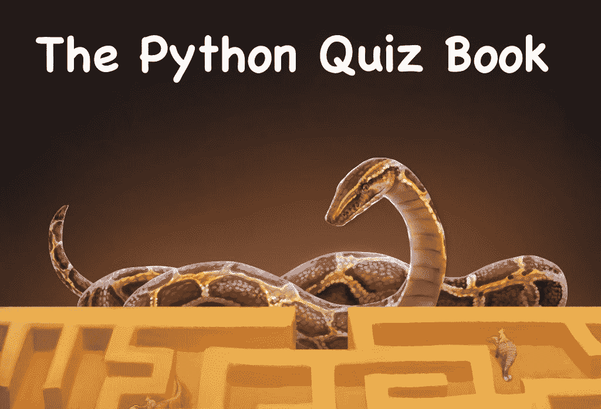

# Python 问答书 Kickstarter

> 原文：<https://www.blog.pythonlibrary.org/2022/10/10/the-python-quiz-book-kickstarter/>

Quizzes are a fun way to test your knowledge of something.  They make you think. The Python Quiz Book is all about brain teasers for the Python programming language. The Python Quiz Book isn't made to teach you Python. It's there to help you test your knowledge or teach you something new about the language.**The Python Quiz Book** will contain over 100 quizzes! The book will also have a companion course on [Teach Me Python](https://teachmepython.com/) that you can get access to if you pledge for the appropriate level.The goal of the book is to help you be a better engineer. Some of the quizzes will be esoteric or demonstrate bad programming practices. You can learn what not to do in your own code. You will also learn neat tips and tricks about Python that you can share with your friends and coworkers.You can support my latest Python book on [Kickstarter](https://www.kickstarter.com/projects/driscollis/the-python-quiz-book) today. Or [download some sample chapters](https://www.dropbox.com/s/05piolsdyol93qd/pyquiz-preview.pdf?dl=0) to check out the book before you commit to purchasing.