# 标志的故事

> 原文：<https://www.blog.pythonlibrary.org/2011/01/15/the-story-of-the-logos/>

去年九月，我觉得为我的读者举办一场比赛会很酷，在比赛中，我会让他们为我的博客设计一些很棒的标志，以换取一些奖品。如果你愿意，你可以在这里阅读全部内容。唉，我没有收到任何设计。我确实从人们那里得到了一些积极的评价，也有一两条评论说我太小气了。无论如何，在那次彻底失败后，我决定问我的一些艺术家朋友是否有兴趣做这件事，但他们也拒绝了。这个世界也将会怎样？这些人人都在谈论的“饥饿”艺术家在哪里？

(注意:这篇文章会有很多图片，所以加载时间可能会比平时长。)

## 一点背景信息

幸运的是，我哥哥认识一个自称为“杀戮者”的人(不知道他是否在挨饿)，他是在“T2 G-Fest”上认识的，这是一个专门为哥斯拉和其他东邦和怪兽制作的“节日”。你可以看到他的一些关于[越轨艺术](http://thekillustrator.deviantart.com/)的作品。无论如何，他和他的妻子一起经营生意，他们实际上并没有比我的比赛花费更多。让我们来看看标志在设计阶段是如何变化的。

## 概念艺术

当我委托制作这些作品时，我告诉艺术家，我想要某种机甲标志和某种类似纳尼亚的老鼠与蛇搏斗的东西。我想我可能也跟他说过我的蛇头想法，但我不太记得了。不管怎样，这是第一组草图:

[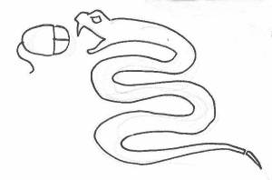](https://www.blog.pythonlibrary.org/wp-content/uploads/2011/01/attack_concept.png)

我有点喜欢上面的，但不认为它作为一个标志会很好。下面这个也一样。

[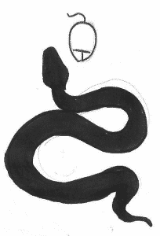](https://www.blog.pythonlibrary.org/wp-content/uploads/2011/01/black_snake_concept.png)

我喜欢这个。蛇吃自己有点恶心，但我喜欢这个概念。我可能会在某个时候委托这个。

[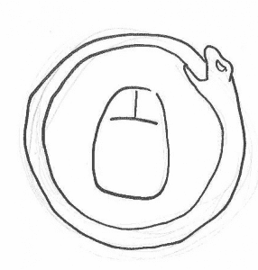](https://www.blog.pythonlibrary.org/wp-content/uploads/2011/01/eating_concept.png)

这可能是我最喜欢的一个了。我喜欢那只老鼠近乎蒸汽朋克的样子。你会看到最终的结果更加完美，但我有点希望我的鼠标看起来更像原来的样子。

[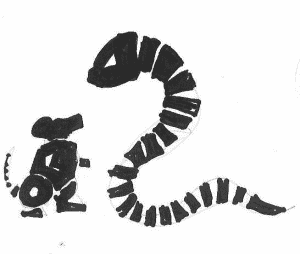](https://www.blog.pythonlibrary.org/wp-content/uploads/2011/01/mecha_concept.png)

当我第一次看到它时，我不确定下面的图片是怎么回事，但一旦我意识到它是什么，我真的很喜欢它。

[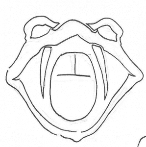](https://www.blog.pythonlibrary.org/wp-content/uploads/2011/01/snake_head_concept.png)

过了一段时间，我终于明白了纳尼亚老鼠的概念:

[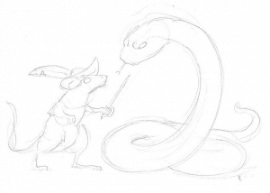](https://www.blog.pythonlibrary.org/wp-content/uploads/2011/01/narnian_concept.png)

这位艺术家独自想出了下面两条:

[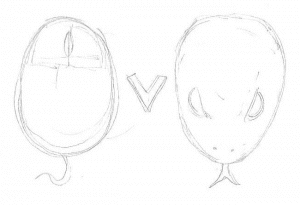](https://www.blog.pythonlibrary.org/wp-content/uploads/2011/01/mvp_concept.png)

我喜欢上面的那个，所以它仍然在我的“可能”清单上。你怎么想呢?

[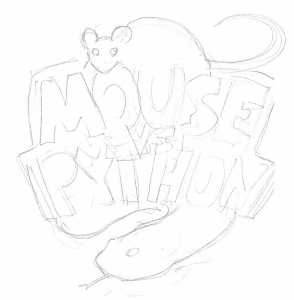](https://www.blog.pythonlibrary.org/wp-content/uploads/2011/01/mvp_logo_concept.png)

这是一个标志概念，艺术家将蛇和老鼠混合到标志中。我觉得这很有趣，我可能应该让他多做几个例子，但我决定只做黑鱼，纳尼亚和机甲。

## 打磨概念艺术

既然我已经做出了选择，下一步就是让插图画家润色它们并给它们上色。让我们来看看:

[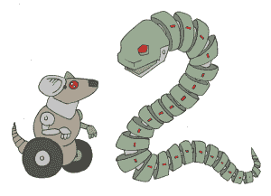](https://www.blog.pythonlibrary.org/wp-content/uploads/2011/01/mechish2_web.png)

正如你所看到的，这个机器人鼠标有轮子而不是腿，最后看起来有点“卡通化”。尽管如此，我还是喜欢它。

[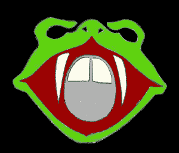](https://www.blog.pythonlibrary.org/wp-content/uploads/2011/01/snakehead2_web.png)

我觉得蛇头用对比色好看多了。很容易看出他在用电脑鼠标吃零食。我想他一定有无线鼠标。

[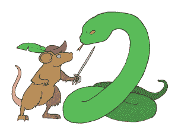](https://www.blog.pythonlibrary.org/wp-content/uploads/2011/01/narnyish2_web.png)

这看起来很酷。这只老鼠看起来有点像《纳尼亚传奇》中的雷佩契普传，又有点像微型火枪手。

## 最终结果

在批准了上面的图片后，插画师把它们交给了他的伴侣和妻子。她拿起它们，打磨了一些，她还创造了标志的文字部分。你准备好检查他们了吗？如果有，开始滚动！

[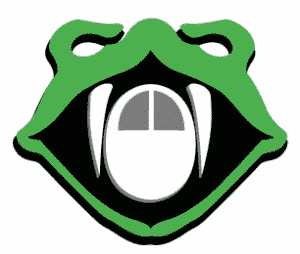](https://www.blog.pythonlibrary.org/wp-content/uploads/2011/01/snakehead_fin.png)

蛇头看起来更锋利，它的眼睛看起来有点呆滞。令人毛骨悚然，但仍然整洁。它的尖牙也长了一点。不过，我不确定他的鼻洞怎么了。

[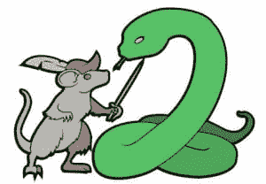](https://www.blog.pythonlibrary.org/wp-content/uploads/2011/01/narnyish_fin.jpg)

纳尼亚的画面变得不那么详细了，老鼠换了帽子，把头发染成了灰色，但看起来基本没变。

[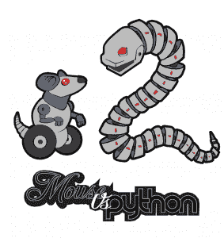](https://www.blog.pythonlibrary.org/wp-content/uploads/2011/01/mechish2_fin.png)

这张显示的是机甲版加 logo。我不确定她是如何匹配官方 Python logo 字体的(我也没有要求她这么做)，但我觉得结果相当不错。

## 包扎

现在你知道我的商标是怎么来的了。我制作它们是为了让我的博客看起来更酷，同时我也可以制作一些有趣的商品，希望有人会喜欢购买它们并支持我的博客。我用 Zazzle 创建了我的[商店](http://www.zazzle.com/mousevspython)。我只得到销售的 10%的佣金，所以我怀疑我能赚多少。即使除了我自己没有人买任何东西，我仍然认为它是值得的。我喜欢我得到的，我希望你也是。