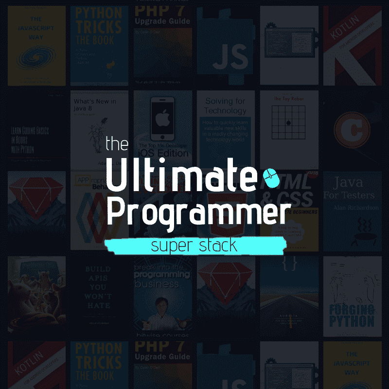

# 终极程序员超级堆栈包

> 原文：<https://www.blog.pythonlibrary.org/2018/11/06/the-ultimate-programmer-super-stack-bundle/>

最近，我有机会拿到了我的第二本书， [Python 201:中级 Python](https://leanpub.com/python201/) 加入了其他一些有趣的编程书籍中。

它被称为 **[终极程序员超级堆栈](https://pythonlibrary--infostack.thrivecart.com/up/)** ，它是一个由 25 个以上的优质电子课程、畅销电子书和奖金资源组成的手工精选集合，将帮助新程序员:

1.  了解当今最流行(也最赚钱)的各种语言和框架，包括从 Python、JavaScript 和 Ruby 到 HTML、CSS 和 Kotlin 等等
2.  了解如何从头开始构建 API、网站以及 iOS 和 Android 应用程序
3.  揭示“软件行业”(计算机程序如何工作，计算机程序员如何思考，以及如何开始你自己的计算机编程业务)
4.  掌握成为“完整的程序员”所需的软技能(相信我，这将对你的职业生涯产生巨大影响)

还有更多。

以下是您可以在堆栈中找到的几个亮点:

1.  **Dan Bader 的《Python 技巧:令人敬畏的 Python 特性自助餐》**(零售价:29.00 美元)。Dan 是 Realpython.com 的创始人，他的文章、视频和培训已经覆盖了全球超过一百万的开发者。这是他最畅销的书籍之一，无论您是 Python 的新手，还是希望掌握这门技术并成为认证的 Python 爱好者，这都是一个很好的起点。
2.  菲尔·斯特金的《构建你不会讨厌的 API》(T1)(零售价:26.99 美元)。Phil 是一名 API 设计师和系统架构师，目前正在帮助 WeWorK 扩展他们的 API，以处理更多的流量，更好地抵抗变化，并且不会像多米诺骨牌一样在其中一个人遇到困难时倒下。Phil 被认为是 API 方面的领先专家之一，这本书就像是深入他的大脑。
3.  **Grant Klimaytys 出版的《前 1%开发者- iOS 版》**(零售价:197.00 美元)。Grant 是 Learn App Development 的创始人，他曾指导全球超过 120，000 名学生如何成为专业的应用程序开发人员。在这个高级课程中，您将从头开始学习如何为 iPhone 编写代码，了解软件创建的基础知识(适用于任何语言)，甚至创建自己的应用程序，开始在 App Store 上赚取被动收入(赢家赢家，鸡肉晚餐！)

## [点击这里查看](https://pythonlibrary--infostack.thrivecart.com/up/)