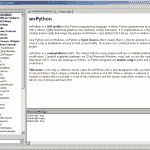
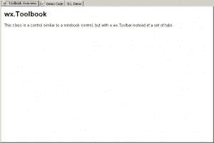
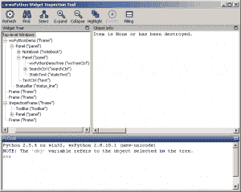

# wxPython 演示

> 原文：<https://www.blog.pythonlibrary.org/2010/10/15/the-wxpython-demo/>

wxPython 项目是最流行和最容易使用的 Python GUI 工具包之一。它使用 SWIG 包装了流行的 C++ wxWidgets 项目。这也是我所知道的唯一一个尽可能在每个平台上使用本机小部件的跨平台工具包(无论是好是坏)。有些人喜欢说 PyQt 也是这样做的，但是据我所知，PyQt 实际上绘制了所有的控件来模仿本地控件，它实际上并没有使用它们。无论如何，这是无关紧要的。主题是 wxPython 演示。有很多人甚至不知道这个演示的存在。

wxPython 演示是从 wxPython 的主网站额外下载的。它有一个 wxPython 包含的几乎所有小部件的可运行示例。在本文中，我们将快速看一下这个演示可以做什么。

## 介绍 wxPython 演示！

如果你去 wxPython 网站，点击左边的下载链接，你会在这里找到[。只需根据您当前使用的平台(即 Windows、Mac 或 Linux)在相应的“文档、演示、示例等”下下载相应的文件部分。在 Linux 上，包管理器有时也会列出它。安装完成后，双击快捷方式(在 Windows 上)或“\wxPython2.8 Docs and Demos\demo”文件夹中的 demo.py 文件运行演示。你应该会得到类似上面的图片(点击它看得更清楚)。](http://wxpython.org/download.php)

## 使用演示

要使用该演示，您可以通过展开左侧的树，然后单击各个项目来浏览小部件。或者，您可以使用左下角的搜索框来过滤演示，从而搜索项目。一旦你选择了一个演示，你会看到一个笔记本，右边有三个标签。标签将被标记为小部件名称和概述、演示代码，然后是演示本身。您可以修改演示的代码，保存修改并在演示中运行它们。然后恢复到原始状态。真的很酷！

## wxPython 演示还有其他工具！

wxPython 演示在帮助菜单中有几个其他很酷的工具。第一个是 PyShell，这是一个有趣的小 Python shell，您可以像空闲时一样使用它。然后是小部件检查工具。对于调试应用程序来说，这是一个非常方便的工具。它可以突出显示 sizer 和 widget，这可以告诉您 widget 是否被放错了 sizer 中，或者为什么您的 GUI 看起来如此时髦。wxPython 的创建者 Robin Dunn 创建了它，他经常使用它来调试 wxPython 邮件列表中的代码或粘贴在 wxPython IRC 频道中的代码。

## 包扎

无论如何，您可以通过使用 wxPython 演示来学习如何使用大多数小部件。当我想学习一个小工具或者回答别人关于小工具的问题时，我通常会去那里。我希望这对您学习 wxPython 有所帮助。

## 进一步阅读

*   我写的一篇关于将 wxPython 演示代码转换成真实代码的文章
*   Widget 检查工具 [wiki 页面](http://wiki.wxpython.org/Widget%20Inspection%20Tool)
*   wxPython [下载页面](http://wxpython.org/download.php)