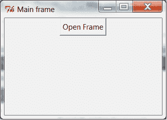

# 如何显示/隐藏一个窗口

> 原文：<https://www.blog.pythonlibrary.org/2012/07/26/tkinter-how-to-show-hide-a-window/>

今天我们就来看看 Tkinter！我很好奇一个人如何隐藏一个帧，然后使用 Tkinter 重新显示它，我不断发现一些线程(比如这个 [one](http://www.daniweb.com/software-development/python/threads/243559/need-help-tkinter-hide-window-then-show) )讨论了如何使用 withdraw()和 deiconify()，但并没有真正提供任何可用的代码。在 wxPython 中，我使用 [pubsub](https://www.blog.pythonlibrary.org/2010/06/27/wxpython-and-pubsub-a-simple-tutorial/) 做了这类事情。我们将讨论如何隐藏和显示根框架的三个不同版本。

### 我的第一个例子

[](https://www.blog.pythonlibrary.org/wp-content/uploads/2012/07/tk_main_frame.png)

Tkinter 的很多示例代码都不是非常面向对象。我的意思是，我看到的代码不在类中。但我发现 GUI 代码在一个类中更容易理解。无论如何，这就是我如何结束创作我的第一个例子:

```py

import Tkinter as Tk

########################################################################
class MyApp(object):
    """"""

    #----------------------------------------------------------------------
    def __init__(self, parent):
        """Constructor"""
        self.root = parent
        self.root.title("Main frame")
        self.frame = Tk.Frame(parent)
        self.frame.pack()

        btn = Tk.Button(self.frame, text="Open Frame", command=self.openFrame)
        btn.pack()

    #----------------------------------------------------------------------
    def hide(self):
        """"""
        self.root.withdraw()

    #----------------------------------------------------------------------
    def openFrame(self):
        """"""
        self.hide()
        otherFrame = Tk.Toplevel()
        otherFrame.geometry("400x300")
        otherFrame.title("otherFrame")
        handler = lambda: self.onCloseOtherFrame(otherFrame)
        btn = Tk.Button(otherFrame, text="Close", command=handler)
        btn.pack()

    #----------------------------------------------------------------------
    def onCloseOtherFrame(self, otherFrame):
        """"""
        otherFrame.destroy()
        self.show()

    #----------------------------------------------------------------------
    def show(self):
        """"""
        self.root.update()
        self.root.deiconify()

#----------------------------------------------------------------------
if __name__ == "__main__":
    root = Tk.Tk()
    root.geometry("800x600")
    app = MyApp(root)
    root.mainloop()

```

让我们花点时间来分解一下。我们有一个简单的类，其中我们传入了一个“根”对象(Tk。Tk())作为顶级父级。这又被用作 Tk.Frame 的父帧。 **pack()** 命令是 Tkinter 附带的几何管理器之一。它允许你将部件“打包”成列或行，并且有不同的选项，如填充、扩展和侧边。接下来，我们创建一个 Tk。扣上扣子，打包。如果你不调用 pack(或者其他的几何管理器),那么你的小部件根本不会出现。在按钮实例化过程中，我们传递给它一个父节点、一个标签字符串和一个单击按钮时要运行的命令。

当用户点击按钮时，我们创建另一个顶层窗口，并给它一个不同的标题，大小和关闭按钮。我们使用 lambda 匿名方法来创建回调，因为我们需要将 otherFrame 实例传递给处理程序，以便我们可以关闭它。我们也可以只创建 otherFrame 作为类属性(即 self.otherFrame)并跳过 lambda，但是如果你用 Tkinter 做了很多，那么你真的需要习惯看到那种回调设置。当**关闭**按钮被调用时，它销毁另一帧并调用**显示**方法，显示原始帧。一些例子表明，在调用**deiconfig()**方法之前，您需要调用 **update()** 方法，然而，如果您注释掉 update()调用，您会发现它工作得很好。至少在使用 Python 2.6 的 Windows 7 上是这样的。

现在让我们试着把第二个框架分割成它自己的类！

### 将第二帧分成一个类

将第二个框架放入它自己的类中可以促进代码重用和更好地组织代码，尤其是如果第二个框架非常复杂的话。有一种方法可以做到:

```py

import Tkinter as Tk

########################################################################
class OtherFrame(Tk.Toplevel):
    """"""

    #----------------------------------------------------------------------
    def __init__(self):
        """Constructor"""
        Tk.Toplevel.__init__(self)
        self.geometry("400x300")
        self.title("otherFrame")

########################################################################
class MyApp(object):
    """"""

    #----------------------------------------------------------------------
    def __init__(self, parent):
        """Constructor"""
        self.root = parent
        self.root.title("Main frame")
        self.frame = Tk.Frame(parent)
        self.frame.pack()

        btn = Tk.Button(self.frame, text="Open Frame", command=self.openFrame)
        btn.pack()

    #----------------------------------------------------------------------
    def hide(self):
        """"""
        self.root.withdraw()

    #----------------------------------------------------------------------
    def openFrame(self):
        """"""
        self.hide()
        subFrame = OtherFrame()
        handler = lambda: self.onCloseOtherFrame(subFrame)
        btn = Tk.Button(subFrame, text="Close", command=handler)
        btn.pack()

    #----------------------------------------------------------------------
    def onCloseOtherFrame(self, otherFrame):
        """"""
        otherFrame.destroy()
        self.show()

    #----------------------------------------------------------------------
    def show(self):
        """"""
        self.root.update()
        self.root.deiconify()

#----------------------------------------------------------------------
if __name__ == "__main__":
    root = Tk.Tk()
    root.geometry("800x600")
    app = MyApp(root)
    root.mainloop()

```

这和代码的第一个版本基本相同。在第二个框架的类中创建第二个框架的按钮确实很好，但是如果我们这样做，那么就很难告诉原始框架去伪存真。还是为了完整起见，让我们看看它是什么样子:

```py

import Tkinter as Tk

########################################################################
class OtherFrame(Tk.Toplevel):
    """"""

    #----------------------------------------------------------------------
    def __init__(self, original):
        """Constructor"""
        self.original_frame = original
        Tk.Toplevel.__init__(self)
        self.geometry("400x300")
        self.title("otherFrame")

        btn = Tk.Button(self, text="Close", command=self.onClose)
        btn.pack()

    #----------------------------------------------------------------------
    def onClose(self):
        """"""
        self.destroy()
        self.original_frame.show()

########################################################################
class MyApp(object):
    """"""

    #----------------------------------------------------------------------
    def __init__(self, parent):
        """Constructor"""
        self.root = parent
        self.root.title("Main frame")
        self.frame = Tk.Frame(parent)
        self.frame.pack()

        btn = Tk.Button(self.frame, text="Open Frame", command=self.openFrame)
        btn.pack()

    #----------------------------------------------------------------------
    def hide(self):
        """"""
        self.root.withdraw()

    #----------------------------------------------------------------------
    def openFrame(self):
        """"""
        self.hide()
        subFrame = OtherFrame(self)

    #----------------------------------------------------------------------
    def show(self):
        """"""
        self.root.update()
        self.root.deiconify()

#----------------------------------------------------------------------
if __name__ == "__main__":
    root = Tk.Tk()
    root.geometry("800x600")
    app = MyApp(root)
    root.mainloop()

```

注意，在这个版本中，我们必须将 MyApp 类的实例传递给另一个框架，这样我们就可以调用它的 **show** 方法。您还可以看到，我们不再需要 lambda 函数，因为我们不再需要将另一个 frame 实例传递给处理程序。这让事情变得简单了。这仍然是一种脆弱的做事方式。为什么？如果你决定改变主框架的显示方法为 **showFrame** 或者其他什么，那么你必须记得在另一个类中也改变它，否则它会中断。如果将实例传递给多个类，这很快就会变得乏味。幸运的是，有一个简单的解决方案，它叫做 pubsub！

### 使用 pubsub 在两个窗口之间进行通信

你需要去 pubsub 的[网站](http://pubsub.sourceforge.net/installation.html)安装这个包，因为它不包含在 Python 中。它包含在 wxPython 中，尽管我不认为您可以在 wxPython 之外轻松使用该版本。无论如何，一旦你有了它，你就可以按照这个代码:

```py

from pubsub import pub
import Tkinter as Tk

########################################################################
class OtherFrame(Tk.Toplevel):
    """"""

    #----------------------------------------------------------------------
    def __init__(self):
        """Constructor"""
        Tk.Toplevel.__init__(self)
        self.geometry("400x300")
        self.title("otherFrame")

        # create the button
        btn = Tk.Button(self, text="Close", command=self.onClose)
        btn.pack()

    #----------------------------------------------------------------------
    def onClose(self):
        """
        closes the frame and sends a message to the main frame
        """
        self.destroy()
        pub.sendMessage("otherFrameClosed", arg1="data")

########################################################################
class MyApp(object):
    """"""

    #----------------------------------------------------------------------
    def __init__(self, parent):
        """Constructor"""
        self.root = parent
        self.root.title("Main frame")
        self.frame = Tk.Frame(parent)
        self.frame.pack()

        btn = Tk.Button(self.frame, text="Open Frame", command=self.openFrame)
        btn.pack()

        pub.subscribe(self.listener, "otherFrameClosed")

    #----------------------------------------------------------------------
    def listener(self, arg1, arg2=None):
        """
        pubsub listener - opens main frame when otherFrame closes
        """
        self.show()

    #----------------------------------------------------------------------
    def hide(self):
        """
        hides main frame
        """
        self.root.withdraw()

    #----------------------------------------------------------------------
    def openFrame(self):
        """
        opens other frame and hides main frame
        """
        self.hide()
        subFrame = OtherFrame()

    #----------------------------------------------------------------------
    def show(self):
        """
        shows main frame
        """
        self.root.update()
        self.root.deiconify()

#----------------------------------------------------------------------
if __name__ == "__main__":
    root = Tk.Tk()
    root.geometry("800x600")
    app = MyApp(root)
    root.mainloop()

```

正如所料，这段代码只是集成了 pubsub 的内容。我们在主框架中创建一个**监听器**方法，并通过调用

```py

pub.subscribe(self.listener, "otherFrameClosed")

```

“签名”是 **otherFrameClosed** 。因此，如果我们发布一个带有该签名的消息，那么主框架和任何其他订阅了该签名的类都将调用它们各自的方法。在另一个框架中，我们在 close 方法的末尾添加了一个 **pub.sendMessage** 调用，在这里我们发布到前面提到的签名，并传递一个伪参数。你不必这样做，但我认为如果你知道如何在班级之间传递信息会更好。您几乎可以传递任何想要传递的 Python 对象/类型。

### 包扎

现在您对 Tkinter 和它的一些顶级方法有了一些了解。您可以让您的框架消失，并再次出现在命令！你也尝到了 pubsub 的威力。用这些新知识去编码吧！

### 额外资源

*   来自 [effbot](http://effbot.org/tkinterbook/toplevel.htm) 的顶级信息
*   zetcode 的 [Tkinter 教程](http://zetcode.com/gui/tkinter/introduction/)
*   Python [lambda](https://www.blog.pythonlibrary.org/2010/07/19/the-python-lambda/)
*   弗雷德里克·伦德[简介为 Tkinter](http://www.pythonware.com/library/tkinter/introduction/)

### 下载源代码

*   [tkinter_frames.zip](https://www.blog.pythonlibrary.org/wp-content/uploads/2012/07/tkinter_frames.zip)