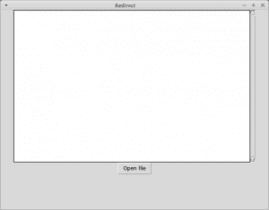

# Tkinter -重定向标准输出/标准错误

> 原文：<https://www.blog.pythonlibrary.org/2014/07/14/tkinter-redirecting-stdout-stderr/>

重定向 stdout 似乎是 wxPython 用户组中非常常见的请求，所以我决定看看用 Tkinter 做这件事有多简单。重定向 stdout 或 stderr 的典型用例是，您正在调用某个其他进程(如 ping 或 tracert ),并且您希望捕获它在做什么，以便将其放入您的 UI。通常你可以只使用 Python 的**子流程**模块，调用它的 **communicate()** 方法来访问数据。然后你可以把它打印到 stdout，它会神奇地出现在你选择的 UI 小部件中。

我们完成的用户界面将如下所示:

[](https://www.blog.pythonlibrary.org/wp-content/uploads/2014/07/tkredirect.png)

让我们来看看如何使用 Tkinter:

```py

import ScrolledText
import sys
import tkFileDialog
import Tkinter

########################################################################
class RedirectText(object):
    """"""

    #----------------------------------------------------------------------
    def __init__(self, text_ctrl):
        """Constructor"""
        self.output = text_ctrl

    #----------------------------------------------------------------------
    def write(self, string):
        """"""
        self.output.insert(Tkinter.END, string)

########################################################################
class MyApp(object):
    """"""

    #----------------------------------------------------------------------
    def __init__(self, parent):
        """Constructor"""
        self.root = parent
        self.root.title("Redirect")
        self.frame = Tkinter.Frame(parent)
        self.frame.pack()

        self.text = ScrolledText.ScrolledText(self.frame)
        self.text.pack()

        # redirect stdout
        redir = RedirectText(self.text)
        sys.stdout = redir

        btn = Tkinter.Button(self.frame, text="Open file", command=self.open_file)
        btn.pack()

    #----------------------------------------------------------------------
    def open_file(self):
        """
        Open a file, read it line-by-line and print out each line to
        the text control widget
        """
        options = {}
        options['defaultextension'] = '.txt'
        options['filetypes'] = [('all files', '.*'), ('text files', '.txt')]
        options['initialdir'] = '/home'
        options['parent'] = self.root
        options['title'] = "Open a file"

        with tkFileDialog.askopenfile(mode='r', **options) as f_handle:
            for line in f_handle:
                print line

#----------------------------------------------------------------------
if __name__ == "__main__":
    root = Tkinter.Tk()
    root.geometry("800x600")
    app = MyApp(root)
    root.mainloop()

```

那是相当多的代码。让我们花一两分钟来分解它。首先，我们导入了 **ScrolledText** ，这是一个包含滚动条的文本控件。我们还导入了 **tkFileDialog** ，它让我们能够打开一个文件。为了使这个例子非常简单，我们将使用对话框打开一个文本文件，并逐行打印到 stdout。

我们看到的第一个类叫做 **RedirectText** 。它将一个文本控件小部件作为其参数。我们创建了一个 **write** 方法，将一个字符串附加到小部件的当前值。然后在 **MyApp** 类中，我们创建所有必要的小部件并将 stdout 重定向到我们的 RedirectText 类。我们还将按钮绑定到我们的 **open_file** 方法。这是行动发生的地方！

这里我们创建文件对话框并打开一个文件。然后我们逐行读取文件，并将其打印到 stdout。如果您尝试该示例，您将看到 ScrolledText 小部件中出现的每一行文本。

* * *

### 包扎

正如您所看到的，重定向 stdout / stderr 非常容易。我希望你会发现这种技术有许多巧妙的用途。快乐编码！

* * *

### 相关阅读

*   wxPython – [Redirecting stdout / stderr](https://www.blog.pythonlibrary.org/2009/01/01/wxpython-redirecting-stdout-stderr/)