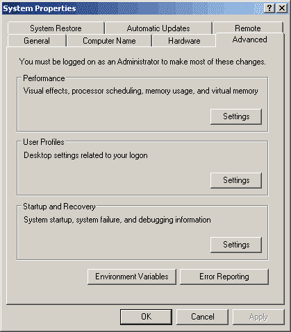
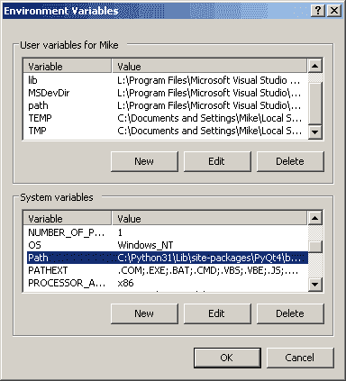
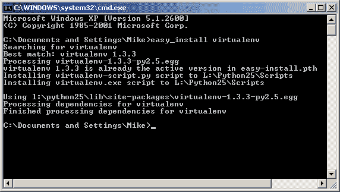
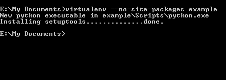
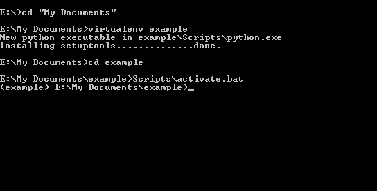
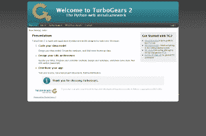

# TurboGears 2:在 Windows 上设置

> 原文：<https://www.blog.pythonlibrary.org/2011/08/14/turbogears-2-setting-up-on-windows/>

TurboGears 是几个可用的 Python web 框架之一。目前最受欢迎的是姜戈。在我工作的地方，我们选择了 TurboGears，因为它集成了支持组合键的 SQLAlchemy。那时，Django 不支持这个特性，我也不确定它是否支持。总之，我几乎完全在 Windows 平台上开发，并且发现 TurboGears 关于这个主题的文档有点令人困惑。所以我是这样做的。

*注意:在本教程中我们将使用 turbo gears 2.1*

## 入门指南

我们首先要确保 Python 设置正确。进入**开始- >运行**打开命令窗口，然后输入“cmd”并按下**回车**。尝试在那里键入“python”(不带引号)，然后按回车键。如果你看到了 Python 外壳，那么我们就成功了一半。如果没有，那么我们需要修改一些设置。

### 修改您的路径

在 Windows 上，我发现通过将我的 Python 路径和脚本文件夹的路径添加到我的路径中来修改我的路径设置很有帮助。你可以这样做:

1.  Right-Click "My Computer" and choose **Properties** (Windows XP) or you may have to go digging in Control Panel on Windows 7 and do a "Show All Control Panel Items" from the path bar and look for **System**. You should see something like this:

    

2.  Go to the **Advanced** tab and press the **Environmental Variable** button to see something like the following:

    

3.  这里你会看到两种类型的变量。底部是**系统变量**。向下滚动到标有**路径**的那一行，并在最后添加下面两行:；c:\ python 26；C:\Python26\Scripts(根据您的 Python 版本及其位置进行必要的调整)请注意，每个条目都由分号分隔，因此请确保您也这样做，否则将不起作用！

 **### 安装先决条件

完成后，我们需要确保您已经安装了 SetupTools。转到 Python 包索引并[下载](http://pypi.python.org/pypi/setuptools)如果你知道你还没有它，因为 SetupTools 将安装一个叫做 easy_install 的小脚本，这将使安装 TurboGears 变得轻而易举。只需滚动到页面的末尾，选择与您的 Python 版本相对应的 exe。你不能安装一个鸡蛋，除非你已经安装了这个，所以我不知道为什么他们有鸡蛋在那里开始。

完成后，打开一个新的命令窗口，尝试输入以下命令:easy_install。您应该会收到类似这样的错误:“错误:没有指定 URL、文件名或要求(参见- help)”。如果是这样，那么您已经安装了它，并且在您的路径上。干得好！

TurboGears 人员建议安装 virtualenv，以帮助您尽可能保持 Python 主安装(PyPI)的原始状态。当您需要试验不同版本的软件，并且不希望中断当前项目时，它也会有所帮助。这是如何工作的？嗯，virtualenv 在你的机器上为你创建了一个小的虚拟工作空间，在那里它放了一个 Python 的副本，并把所有的软件安装到那个虚拟的地方，供你使用。这是一个开发沙盒！既然您现在有了 easy_install，我们将使用它来安装。在命令窗口中，键入:easy_install virtualenv

这将导致 easy_install 出现在互联网上，并试图从 PyPI 下载和安装 virtualenv。它应该是这样的:

如果成功完成，那么我们就可以为我们的 TurboGears 安装创建一个虚拟环境了。将目录更改到您希望执行此操作的位置。在 Windows 7 上，如果你试图在你的文档或类似的收藏文件夹之外这样做，你可能会有安全问题，所以你应该坚持使用其中之一。对于本教程，我们将在**我的文档**中创建它。

一旦你在那里，输入如下:virtualenv - no-site-packages 示例

这将创建一个标记为“example”的文件夹，其中包含几个文件夹。您应该会在屏幕上看到以下内容:

- no-site-packages 命令将阻止虚拟环境从系统 Python 的 site-packages 文件夹中继承任何东西。现在，在命令窗口中将目录切换到您的示例文件夹中，并键入以下内容:Scripts\activate.bat(参见下面的屏幕截图)

## 安装和设置涡轮齿轮

现在你的虚拟环境是活跃的，并准备摇滚。您可以分辨出来，因为现在每一行都以您所在的文件夹的名称为前缀，在本例中是“example”。此时您可以安装 Turbogears，因为您的虚拟环境也安装了设置工具。但是，这次安装有点不同，因为我们将指定一个特定的 URL。键入以下内容(您可能想查看 TurboGears 网站，看看自撰写本文以来 URL 是否已更新):

 `easy_install.exe -i http://www.turbogears.org/2.1/downloads/current/index tg.devtools` 

根据你的电脑速度和你的连接，这将需要一段时间。TurboGears 是大量第三方 Python 包的混搭。你可以看着它安装，或者在等待的时候去喝一杯或者打一个电话。一旦完成，我们就快完成了。

注意:所有的包应该被安装到你的虚拟空间的 **lib** 文件夹中，而不是你默认的 Python 文件夹中。如果是后一种情况，你很可能没有激活虚拟环境

 **### 创建 TurboGears 工作空间

我们之前安装的一个包是 Python Paste。TurboGears 使用这个包来引导一个新的 TurboGears 应用程序。因此，在您激活的虚拟环境中，键入以下命令:

 `paster quickstart example` 

*注意:如果“example”文件夹的路径中有一个空格，您将收到一个需要安装 PyWin32 库的错误消息。非常讨厌。*

当你运行这个时，你需要回答 3 个问题。首先是给项目取什么名字。默认名称与文件夹名称相同。请注意，项目名称必须是小写的。然后它会问你是否愿意使用[樱井真子模板](http://www.makotemplates.org/)。它没有说的是，如果你选择否(这是默认的)，你将得到[石根模板](http://genshi.edgewall.org/)。这取决于你。据我所见，樱井真子看起来和感觉起来更“蟒蛇”，所以我会推荐它，除非你已经知道石根或类似石根的地方。最后一个问题是您是否需要身份验证，这将为您提供一个简单的管理界面，您可以登录到该界面，默认设置是“yes”。您可以尝试这些方法，或者只使用默认方法。

下一步是将目录更改为新的项目目录，然后在命令行中键入以下内容:

 `python setup.py develop` 

这将把您的项目添加到虚拟环境中，并下载一些可能对您的开发有用的包。我真的不知道这些对你有什么帮助，但是根据 [TurboGear 的文档](http://turbogears.org/2.1/docs/main/DownloadInstall.html)，这似乎是一种需求。

倒数第二步是在命令行窗口中输入以下内容:

 `paster setup-app development.ini` 

这将启动您的数据库，它基本上只是为您同意的安全性/身份验证创建和填充一些默认信息。如果您没有安装那些东西或者不想运行这一步，您不必安装。但是，除非您登录，否则您将无法登录。

最后，您需要键入以下内容:

 `paster serve development.ini` 

现在你将拥有一个运行在 [http://localhost:8080/(或 http://127.0.0.1:8080)](http://localhost:8080/ ) 上的全功能网站。如果您打开浏览器并导航到该页面，您应该会看到如下内容:

## 包扎

现在您应该知道如何安装和设置 TurboGears web 应用程序。做了那么多工作后，前途无量。你需要开始阅读文档，添加一点 javascript 和一点 CSS，你很快就会有一个很酷的网站。祝你好运，玩得开心！****